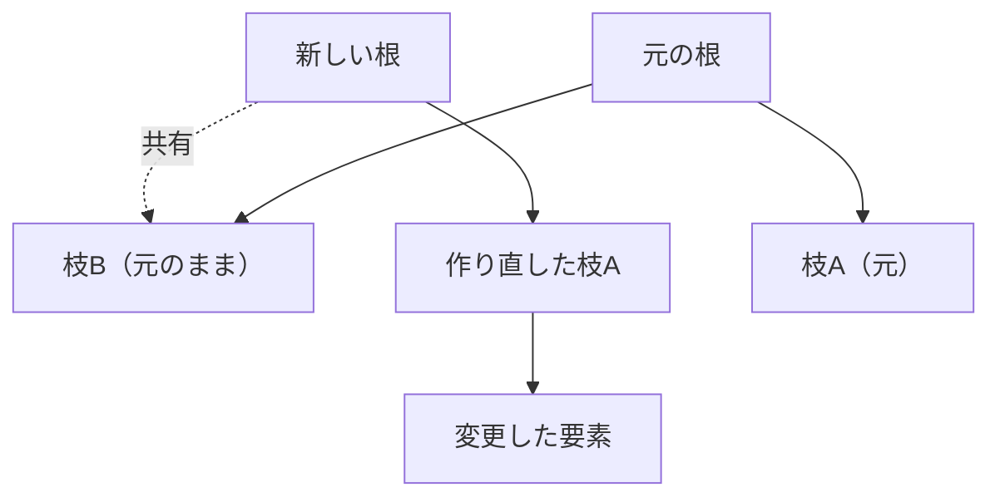

# 配列型：可変長の列を効率よく

## 配列の二つの顔

ほとんどの言語に「配列」と呼ばれる型がありますが、その実体は言語によって
かなり違います。大きく二つの系統があります。

- **固定長の連続配列**：メモリ上に要素を隙間なく並べたもの。C の配列が代表で、
  サイズは作るときに決め、後から変えられません。添字アクセスは
  「先頭アドレス + 添字 × 要素サイズ」の計算一発で O(1) です。
- **可変長配列**：Ruby の `Array`、Python の `list`、Java の `ArrayList` の
  ように、要素を追加するたびに自動で伸びる配列。

利用者がふだん使うのは後者の可変長配列です。しかしその内部では、前者の
連続配列が土台として働いています。この章では「固定長の連続メモリを使って、
どうやって可変長を実現するか」を中心に見ていきます。

```ruby
a = []
a << 1
a << 2
a << 3
p a   # => [1, 2, 3]   いくらでも追加できるように見える
```

`a << x` で要素を足すたびに配列が魔法のように伸びているように見えます。
この魔法の正体が、次節の「ならし計算量」です。

## 自動で伸びる配列：倍々戦略

連続配列はメモリ上に固定サイズの領域を確保するので、満杯になったら
それ以上は入りません。可変長配列は、満杯になった瞬間に**より大きな領域を
新しく確保し、中身を丸ごと引っ越す**ことで伸びます。

ここで重要なのが「どれだけ大きくするか」です。1 要素ずつ増やしていたら、
追加のたびに引っ越しが起き、N 個追加するのに O(N²) かかってしまいます。
そこで実用的な実装は、**満杯になったら容量を倍にする**という戦略を採ります。

```ruby
# 概念図：容量が満杯になったら 2 倍に拡張する可変長配列
class DynamicArray
  def initialize
    @store = Array.new(1)   # 内部の固定長バッファ（容量1から開始）
    @size  = 0              # 実際に使っている要素数
  end

  def push(value)
    if @size == @store.size       # 満杯になったら…
      bigger = Array.new(@store.size * 2)  # 2 倍の領域を確保
      @size.times { |i| bigger[i] = @store[i] }  # 中身を引っ越す
      @store = bigger
    end
    @store[@size] = value
    @size += 1
  end

  def [](i) = @store[i]
  attr_reader :size
end
```

「倍にする」のがなぜ効くのか。容量を倍々に増やすと、引っ越しは
たまにしか起きません。N 個追加するまでの引っ越し回数の合計を計算すると、
コピーされる要素数の総和は N + N/2 + N/4 + … < 2N となり、**全体で O(N)**、
つまり**1 要素あたり平均 O(1)** に収まります。

このように「ときどき重い操作があるが、ならせば軽い」という分析を
**ならし計算量**（amortized complexity、償却計算量）と呼びます
[](#cite:cormen2009)。可変長配列の `push` は、最悪では引っ越しで O(N)
かかるものの、ならせば O(1) というのが正しい理解です。

> [!NOTE]
> 拡張率は必ずしも 2 倍とは限りません。CRuby の `Array` や一部の実装は、
> メモリ断片化を抑えるために 1.5 倍前後など、もう少し控えめな倍率を
> 使うこともあります。倍率を小さくすると無駄なメモリは減りますが、
> 引っ越しの頻度は上がります。ここにも速度とメモリのトレードオフが
> 顔を出します。

## 動的型付け言語の配列は何でも入る

C の配列は「`int` の配列」「`double` の配列」のように、要素の型が一つに
決まっています。要素サイズが一定なので、添字計算が単純になるからです。
ところが Ruby や Python の配列には、整数も文字列もオブジェクトも、
**何でも混ぜて**入れられます。

```ruby
a = [1, "two", 3.0, :four, [5]]   # 全部バラバラの型
```

これをどう実装するのでしょうか。鍵は第4章で学んだ**値表現**です。
動的型付け言語では、あらゆる値を「ポインタまたは即値」という**同じ大きさ
（たとえば 8 バイト）の枠**で表します。整数は即値として、文字列やオブジェクトは
ポインタとして、いずれも 8 バイトに収まります。だから配列は中身の本当の型を
気にせず、「8 バイトの枠を並べた連続配列」として一様に扱えるのです。
要素サイズが一定なので、添字アクセスは型が混在していても O(1) のままです。

> [!TIP]
> この一様な表現には代償もあります。たとえば `[1.0, 2.0, 3.0]` のような
> 数値だけの配列でも、各要素はポインタ／即値の枠を経由するため、
> 数値計算ライブラリほどの密度では並びません。そこで数値計算特化の
> 配列（Ruby なら `NArray`、Python なら NumPy の `ndarray`）は、
> 型を固定して「生の `double` を隙間なく並べる」専用表現を別に用意します。
> 用途に応じて表現を選ぶ、という構図がここにもあります。

実装上の細かな最適化として、CRuby の `Array` には**埋め込み配列**の工夫も
あります。要素数が少ないうちは、配列オブジェクト自身が持つ小さな領域に
直接要素を置き、別領域を確保しません。第5章の短い文字列最適化と同じ
発想です。

## 書き換えに強い配列：永続データ構造

ここまでの可変長配列は、要素を追加・変更すると元の配列が**書き換わり**ます。
しかし関数型言語のように「データは作ったら変えない」方針（**不変性**）を
重視する世界では、別の要求が生まれます。「配列の 1 要素だけ変えた**新しい
配列**がほしい。でも元の配列も残しておきたい」という要求です。

素朴にやると、1 要素変えるたびに全体をコピーするので O(N) かかります。
これを賢く解決するのが**永続データ構造**（persistent data structure）です。
変更後も変更前のバージョンが生き続けるデータ構造で、その代表的な実装が
**ハッシュ配列マップトライ**（Hash Array Mapped Trie、略して **HAMT**）です
[](#cite:bagwell2001)。Clojure や Scala の不変ベクタは、この HAMT を
土台にしています。

HAMT の基本アイデアは、配列を**枝分かれの多い木**（典型的には 32 分木）で
表すことです。要素を一つ変更するときは、全体をコピーせず、**変更箇所から
根（木の頂点）までの経路にあるノードだけ**を作り直し、残りの大部分の枝は
元の木と**共有**します。



枝を共有することで、1 要素の変更が、配列全体ではなく木の高さぶん、
すなわち O(log n) のノード生成で済みます。32 分木なら木はとても浅くなる
（要素 10 億個でも高さ 6 程度）ので、実用上はほぼ一定時間に感じられます。
こうして「変更しても元が残る」性質と「そこそこの速度」を両立させるのが
永続データ構造の妙です。Bagwell はこの構造でハッシュ表もベクタも効率よく
実装できることを示しました [](#cite:bagwell2001)。

## 配列は他のデータ構造の土台でもある

配列は、それ自体が便利なだけでなく、**他のデータ構造を実装する土台**として
も主役です。本書ですでに登場した例を振り返ってみましょう。

- 第2章のハッシュ表は、バケットを並べた**配列**でした。
- 第3章の ID 管理は、「ID 番号 → 名前」を**配列**で引いていました。
- 第3章のバイトコードは、命令を並べた**配列**でした。
- 第4章の多倍長整数は、桁を並べた**配列**でした。

連続したメモリに要素を並べ、添字で O(1) に引ける —— この単純さと速さが、
配列をあらゆるデータ構造の基礎部品にしています。CPU のキャッシュは
「連続したメモリほど速く読める」性質を持つため、配列はハードウェアとも
相性が良いのです [](#cite:cormen2009)。

次の章では、配列と並ぶ二大コレクションのもう一方、添字ではなく**キー**で
引く**ハッシュ**を詳しく見ていきます。
