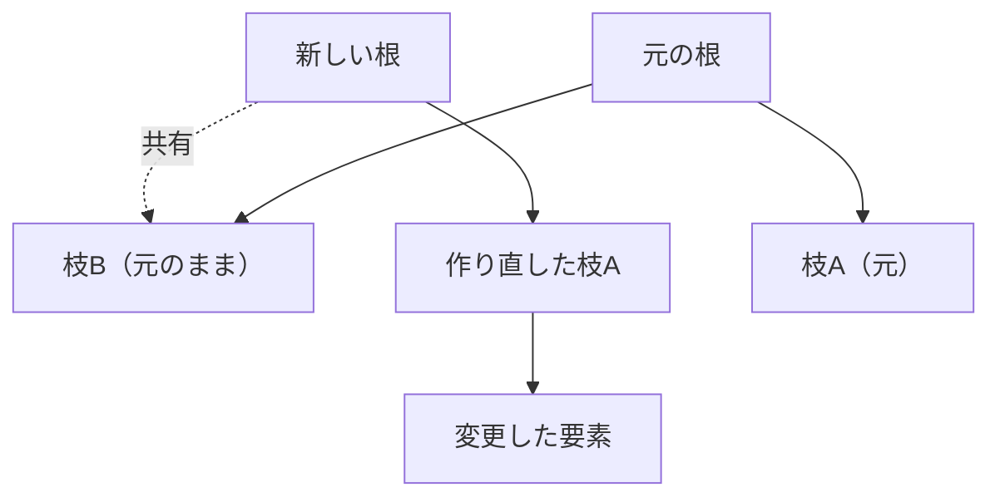

# 配列の表現：可変長の列を効率よく

## 配列の二つの顔

ほとんどの言語に「配列」と呼ばれる型がありますが、その実体は言語によって
かなり違います。大きく二つの系統があります。

- **固定長の連続配列**：メモリ上に要素を隙間なく並べたもの。C の配列が代表で、
  サイズは作るときに決め、後から変えられません。添字アクセスは
  「先頭アドレス + 添字 × 要素サイズ」の計算一発で O(1) です。
- **可変長配列**：Ruby の `Array`、Python の `list`、Java の `ArrayList`、
  C++ の `std::vector`、Rust の `Vec` のように、要素を追加するたびに
  自動で伸びる配列。

利用者がふだん使うのは後者の可変長配列です。しかしその内部では、前者の
連続配列が土台として働いています。この章では「固定長の連続メモリを使って、
どうやって可変長を実現するか」を中心に見ていきます。

```ruby
a = []
a << 1
a << 2
a << 3
p a   # => [1, 2, 3]   いくらでも追加できるように見える
```

`a << x` で要素を足すたびに配列が魔法のように伸びているように見えます。
この魔法の正体が、次節の「ならし計算量」です。

## 自動で伸びる配列：倍々戦略

連続配列はメモリ上に固定サイズの領域を確保するので、満杯になったら
それ以上は入りません。可変長配列は、満杯になった瞬間に**より大きな領域を
新しく確保し、中身を丸ごと引っ越す**ことで伸びます。

ここで重要なのが「どれだけ大きくするか」です。1 要素ずつ増やしていたら、
追加のたびに引っ越しが起き、N 個追加するのに O(N²) かかってしまいます。
そこで実用的な実装は、**満杯になったら容量を定数倍にする**という戦略を
採ります。

```ruby
# 概念図：容量が満杯になったら 2 倍に拡張する可変長配列
class DynamicArray
  def initialize
    @store = Array.new(1)   # 内部の固定長バッファ（容量1から開始）
    @size  = 0              # 実際に使っている要素数
  end

  def push(value)
    if @size == @store.size       # 満杯になったら…
      bigger = Array.new(@store.size * 2)  # 2 倍の領域を確保
      @size.times { |i| bigger[i] = @store[i] }  # 中身を引っ越す
      @store = bigger
    end
    @store[@size] = value
    @size += 1
  end

  def [](i) = @store[i]
  attr_reader :size
end
```

「倍にする」のがなぜ効くのか。容量を倍々に増やすと、引っ越しは
たまにしか起きません。N 個追加するまでの引っ越し回数の合計を計算すると、
コピーされる要素数の総和は N + N/2 + N/4 + … < 2N となり、**全体で O(N)**、
つまり**1 要素あたり平均 O(1)** に収まります。

このように「ときどき重い操作があるが、ならせば軽い」という分析を
**ならし計算量**（amortized complexity、償却計算量）と呼びます
[](#cite:cormen2009)。可変長配列の `push` は、最悪では引っ越しで O(N)
かかるものの、ならせば O(1) というのが正しい理解です。

実際の倍率は言語ごとに微妙に違い、それぞれの言い分があります。

| 実装 | 拡張率（およそ） |
|---|---|
| CRuby `Array`、Rust `Vec`、多くの C++ `std::vector` 実装 | 2 倍 |
| Java `ArrayList` | 1.5 倍 |
| CPython `list` | 約 1.125 倍＋固定分 |

倍率が大きいほど引っ越しは減りますが、使われない予約領域（無駄）が
増えます。CPython の控えめな倍率は「list は巨大になりがちで、メモリの
無駄が痛い」という判断、2 倍派は「引っ越し回数最優先」という判断です。
また 2 倍ちょうどだと「過去に解放した領域の合計が次の要求サイズに
わずかに届かない」ためメモリの再利用が利きにくい、という理由で
1.5 倍を好む流儀もあります。たった一つの定数にも、これだけの設計論が
詰まっているのです。

## 先頭からの削除：見かけの位置をずらす

可変長配列の末尾への追加・削除は速いのですが、**先頭**の要素を抜く
（`shift`）のは素朴には O(N) です。残りの全要素を 1 つずつ前へ詰める
必要があるからです。

CRuby はここに気の利いた工夫をしています。`shift` のとき、要素を
詰め直す代わりに「**配列の開始位置**」を 1 つ進めるだけにするのです。
バッファの先頭に使われない隙間ができますが、`shift` は O(1) になります。
キューとして配列を使う（先頭から取り出し、末尾に足す）コードは
珍しくないため、これは実用上効きます。

Python はこの工夫を `list` には入れず、**両端キュー専用の型**
`collections.deque` を別に提供する道を選びました。`deque` は固定長
ブロック（64 要素）を双方向に連結した構造で、両端の追加・削除が
O(1)、代わりに途中への添字アクセスは O(n) です。「一つの型を器用に
する」か「用途別の型を増やす」か —— 標準ライブラリの性格がよく出る
分かれ道です。

## スライスと共有：Go の配列、Ruby の配列

「文字列型」の章で見た部分文字列の共有と同じ話が、配列にもあります。

Go の**スライス**は `(ポインタ, 長さ, 容量)` の三つ組で、`a[2:5]` は
同じ土台配列を指す新しい三つ組を作るだけ、O(1) です。ただし共有して
いるがゆえに、**スライス越しの書き込みが元の配列にも見えます**。さらに
`append` は「容量が残っていれば共有中の土台に書き込み、足りなければ
新しい土台へ引っ越す」ため、**書き込みが他のスライスに見えたり見え
なかったりする**という、Go 学習者を最も悩ませる挙動が生まれます。
データ構造（共有の三つ組）を理解して初めて、言語の挙動が予測可能に
なる例です。

CRuby も大きな配列のコピーやスライスでは実体を共有し、どちらかが
書き換えようとした瞬間に複製する**コピーオンライト**を使います。
こちらは「書き換えたら必ず複製」なので、Go のような共有の漏れは
利用者に見えません。同じ共有でも、**見せる共有**（Go：性能の制御を
利用者に渡す）と**隠す共有**（Ruby：意味論を単純に保つ）という
思想の違いがあります。

## 動的型付け言語の配列は何でも入る

C の配列は「`int` の配列」「`double` の配列」のように、要素の型が一つに
決まっています。要素サイズが一定なので、添字計算が単純になるからです。
ところが Ruby や Python の配列には、整数も文字列もオブジェクトも、
**何でも混ぜて**入れられます。

```ruby
a = [1, "two", 3.0, :four, [5]]   # 全部バラバラの型
```

これをどう実装するのでしょうか。鍵は「値の表現」の章で学んだ
**一様な値表現**です。あらゆる値を「ポインタまたは即値」という同じ
大きさ（たとえば 8 バイト）の枠で表しているからこそ、配列は中身の
本当の型を気にせず、「8 バイトの枠を並べた連続配列」として一様に
扱えます。要素サイズが一定なので、添字アクセスは型が混在していても
O(1) のままです。

> [!TIP]
> この一様な表現には代償もあります。たとえば `[1.0, 2.0, 3.0]` のような
> 数値だけの配列でも、各要素はポインタ／即値の枠を経由するため、
> 数値計算ライブラリほどの密度では並びません。そこで数値計算特化の
> 配列（Ruby なら `NArray`、Python なら NumPy の `ndarray`）は、
> 型を固定して「生の `double` を隙間なく並べる」専用表現を別に用意します。
> NumPy の `ndarray` はさらに、次元ごとの**ストライド**（stride、
> 次の要素へ進むバイト数）を持つことで、転置や部分行列をコピーなしの
> ビューとして表現します。用途に応じて表現を選ぶ、という構図が
> ここにもあります。

## 中身に応じて表現を変える：要素種別と格納戦略

「何でも入る配列」と「型を固定した密な配列」の二択で終わらせず、
**処理系が自動で使い分ける**のが近年の高速処理系です。

V8（JavaScript）は、各配列に**要素種別**（elements kind）という内部
状態を持たせます [](#cite:bynens2017)。中身が小さい整数だけなら
SMI 専用の密な表現、浮動小数点数を含むなら**タグなしの生の double を
敷き詰めた**表現、それ以外が混ざったら汎用表現。さらに「穴あき
（holey、未代入の添字がある）かどうか」も区別します。種別は一方向に
しか変化しません —— 一度 double 配列に文字列を入れたら、汎用表現に
落ちたまま戻りません。だから JavaScript の高速化指南には「配列に
型の違うものを混ぜるな」「穴を開けるな」と書いてあるのです。これも
内部のデータ構造を知って初めて意味が分かる助言です。

PyPy（Python の高速処理系）も同様の**格納戦略**（storage strategy）を
持ち、整数だけのリストを生の整数の配列として持ちます。この手法の
効果は実証研究で確認されています [](#cite:bolz2013)。Lua に至っては、
そもそも配列という型がなく、唯一のコレクションである**テーブル**が
内部で「配列部とハッシュ部」に自動分割されます（「ハッシュ（辞書）型」の
章で詳述します）[](#cite:ierusalimschy2005)。

実装上の細かな最適化として、CRuby の `Array` には**埋め込み配列**の
工夫もあります。要素数が少ないうちは、配列オブジェクト自身が持つ
小さな領域に直接要素を置き、別領域を確保しません。「文字列型」の章の
短い文字列最適化と同じ発想です。

## タプル：長さが変わらないという情報

Python には `list` と並んで **タプル**（tuple、`(1, 2, 3)`）があります。
一見「変更できないリスト」ですが、データ構造としては「**長さが永久に
変わらない**」という前提が効いて、可変長のための予約領域も成長の
仕組みも不要、ヘッダ直後に要素を直接並べるだけの最小表現になります。
さらに不変なのでハッシュ表のキーにもできます。Erlang のタプル、
Scala や Rust のタプル（こちらはコンパイル時にレイアウトが決まる
構造体相当）も同様で、「変更しない」という約束がそのままメモリ効率に
変換されています。
**制約はデータ構造にとって財産である** —— タプルはその簡明な見本です。

## 書き換えに強い配列：永続データ構造

ここまでの可変長配列は、要素を追加・変更すると元の配列が**書き換わり**ます。
しかし関数型言語のように「データは作ったら変えない」方針（**不変性**）を
重視する世界では、別の要求が生まれます。「配列の 1 要素だけ変えた**新しい
配列**がほしい。でも元の配列も残しておきたい」という要求です。

素朴にやると、1 要素変えるたびに全体をコピーするので O(N) かかります。
これを賢く解決するのが**永続データ構造**（persistent data structure）です。
変更後も変更前のバージョンが生き続けるデータ構造で、その代表的な実装が
**ハッシュ配列マップトライ**（Hash Array Mapped Trie、略して **HAMT**）です
[](#cite:bagwell2001)。Clojure や Scala の不変ベクタは、この HAMT を
土台にしています。

HAMT の基本アイデアは、配列を**枝分かれの多い木**（典型的には 32 分木）で
表すことです。要素を一つ変更するときは、全体をコピーせず、**変更箇所から
根（木の頂点）までの経路にあるノードだけ**を作り直し、残りの大部分の枝は
元の木と**共有**します。



経路コピーは、見た目より簡単に実装できます（説明用に 4 分木）。

```ruby
# 経路コピーによる永続ベクタ（1 段 2 ビット＝4 分木、固定深さ）
BITS = 2
WIDTH = 1 << BITS

class PVec
  def initialize(depth, root) = (@depth = depth; @root = root)
  attr_reader :root

  def self.zeros(depth)             # 全要素 0 の木（4^depth 要素）
    node = 0
    depth.times { node = Array.new(WIDTH, node) }
    new(depth, node)
  end

  def [](i)                         # 添字のビットを上位から使って降りる
    node = @root
    ((@depth - 1) * BITS).step(0, -BITS) { |sh| node = node[(i >> sh) & (WIDTH - 1)] }
    node
  end

  def set(i, v)                     # 変更：根から葉までの経路だけ複製
    PVec.new(@depth, set_node(@root, @depth, i, v))
  end

  private def set_node(node, depth, i, v)
    return v if depth.zero?
    sh = (depth - 1) * BITS
    k = (i >> sh) & (WIDTH - 1)
    copy = node.dup                 # この段の 1 ノードだけ複製
    copy[k] = set_node(node[k], depth - 1, i, v)
    copy
  end
end

v1 = PVec.zeros(3)                  # 64 要素
v2 = v1.set(37, :x)
p [v1[37], v2[37]]                  # => [0, :x]  旧版は無傷
p v1.root[0].equal?(v2.root[0])     # => true  触れていない枝は丸ごと共有！
```

複製されるのは深さぶんの 3 ノードだけで、残りの枝は `equal?` が
示すとおり**同じ実体**です。枝を共有することで、1 要素の変更が、
配列全体ではなく木の高さぶん、すなわち O(log n) のノード生成で
済みます。32 分木なら木はとても浅くなる
（要素 10 億個でも高さ 6 程度）ので、実用上はほぼ一定時間に感じられます。
こうして「変更しても元が残る」性質と「そこそこの速度」を両立させるのが
永続データ構造の妙です。Bagwell はこの構造でハッシュ表もベクタも効率よく
実装できることを示しました [](#cite:bagwell2001)。

Clojure のベクタは実装上さらに、**末尾ブロックだけは木に入れず手元に
持つ**（tail optimization）ことで、最頻出の「末尾への追加」を木の
作り直しなしで処理します。弱点だった**連結**（二本の永続ベクタを
つなぐのは素朴には O(n)）も、各ノードの「ぴったり 32 分木」という
規律を少しゆるめて部分木サイズの表を持たせる **RRB 木**（Relaxed
Radix Balanced tree、Bagwell らによる後続研究）で O(log n) になり、
Scala の `Vector` などに採用されています。永続データ構造の理論的な土台 ——「ならし
計算量を遅延評価と組み合わせて保証する」一連の技法 —— は Okasaki の
教科書にまとまっています [](#cite:okasaki1998)。不変な木による共有は、
「構文木と中間表現」の章で見た red-green tree、「並行処理とデータ
構造」の章で見る並行プログラミングへと、本書で何度も再登場する
中心的なアイデアです。

## 配列は他のデータ構造の土台でもある

配列は、それ自体が便利なだけでなく、**他のデータ構造を実装する土台**として
も主役です。本書ですでに登場した例を振り返ってみましょう。

- [シンボルテーブルの章](symbol-table.md)のハッシュ表は、バケットを並べた**配列**でした。
- [識別子の章](identifier.md)の ID 管理は、「ID 番号 → 名前」を**配列**で引いていました。
- [構文木の章](syntax-tree.md)のバイトコード（そしてフラットな AST）は、**配列**でした。
- [数値の章](numbers.md)の多倍長整数は、桁（リム）を並べた**配列**でした。
- [メモリ管理の章](memory.md)のマークビットマップも、ビットの**配列**でした。

連続したメモリに要素を並べ、添字で O(1) に引ける —— この単純さと速さが、
配列をあらゆるデータ構造の基礎部品にしています。CPU のキャッシュは
「連続したメモリほど速く読める」性質を持つため、配列はハードウェアとも
相性が良いのです [](#cite:cormen2009)。

次の章では、この一次元の配列を多次元へ広げた **テンソル** ──
strides で多次元を一本のバッファに畳み、その上の計算を微分できる
グラフに残す、数値計算と機械学習の中心データ構造 ── を見ていきます。
