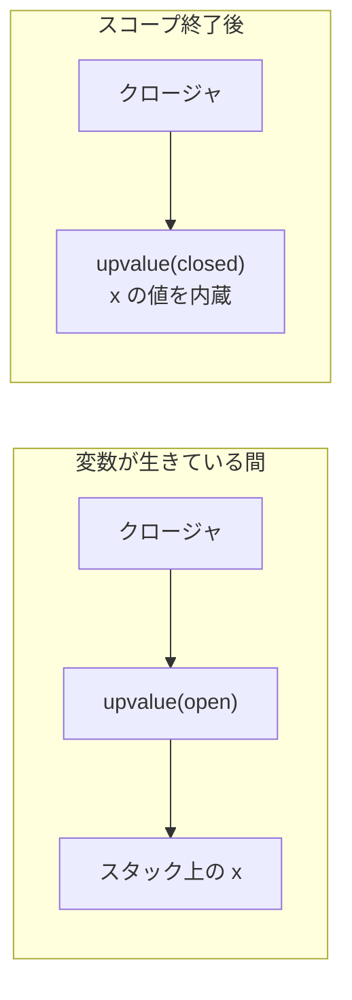

# クロージャと関数：環境を持ち歩く値

## 関数が値になるとき

現代の言語ではほぼ例外なく、関数を**値として**扱えます。変数に入れ、
引数で渡し、戻り値で返せる —— **第一級の関数**（first-class function）です。
Ruby のブロックやラムダ、JavaScript の関数、Python のラムダ、そして
関数型言語のすべての関数がそうです。

```ruby
add = ->(a, b) { a + b }   # 関数（ラムダ）を変数に入れる
p add.call(1, 2)           # => 3
p [1, 2, 3].map { |x| x * 2 }  # 関数（ブロック）を渡す
```

「関数が値になる」とは、データ構造の言葉で言えば**関数を表すオブジェクトが
存在する**ということです。その中身は何でしょうか。コードへのポインタ
だけでしょうか。実は、それだけでは足りません。「スタックとフレーム」の
章の最後に見た例をもう一度見てみます。

```ruby
def make_counter
  count = 0
  -> { count += 1 }    # ローカル変数 count を参照するラムダ
end

c1 = make_counter
c2 = make_counter
p c1.call   # => 1
p c1.call   # => 2
p c2.call   # => 1   （c2 は別の count を持っている！）
```

`make_counter` のフレームはとっくに消えたのに、`count` は生きています。
しかも `c1` と `c2` は**別々の** `count` を持っています。つまりこのラムダは、
コードだけでなく、**自分が生まれた場所の変数たち**を抱えて持ち歩いて
いるのです。この「コード＋生まれた環境」の組を**クロージャ**（closure、
閉包）と呼びます。本章はクロージャの「環境」がどんなデータ構造かを
解剖します。

## 環境の表現（1）：鎖でつなぐ

最も素朴な実装は、[構文木の章](syntax-tree.md)のツリーウォーク型インタプリタの延長です。
[シンボルテーブルの章](symbol-table.md)で作った「外側を指すリンク付きのスコープ表」
（環境）を、そのまま実行時に使います。

- 関数を呼ぶたびに、新しい環境（変数表）を作り、外側の環境へのリンクを
  持たせる
- クロージャを作るときは、「コード＋**いまの環境への参照**」を記録する
- クロージャを呼ぶときは、記録しておいた環境を外側として新しい環境を作る

```ruby
# 概念図：環境の鎖によるクロージャ
Closure = Struct.new(:params, :body, :env)   # env が「生まれた環境」

def call_closure(closure, args)
  env = Scope.new(closure.env)               # 生まれた環境を外側にして
  closure.params.zip(args) { |p_, a| env.define(p_, a) }
  evaluate(closure.body, env)                # 本体を評価する
end
```

この**環境の鎖**（environment chain）方式は、Scheme の意味論の
教科書的な説明そのものであり [](#cite:abelson1996)、JavaScript の仕様が
定める「レキシカル環境」のモデルもこれです。正しく、分かりやすい。
しかし遅い。変数を一つ読むのに鎖をたどってハッシュを引くのでは、
ネイティブコードの「レジスタ＋オフセット」に遠く及びません。

## 環境の表現（2）：スタックに置き、逃げる変数だけヒープへ

実用処理系の発想は逆です。「スタックとフレーム」の章で見たとおり、
ローカル変数は**フレーム上のスロット**に置くのが最速です。クロージャの
ために全部をヒープの環境に置いたら、クロージャを使わないコードまで
遅くなってしまいます。

そこでコンパイラは、変数を二種類に分類します。

- **逃げない変数**：クロージャに捕まらず、フレームの寿命と運命を
  共にする変数。→ いままで通りスタックのスロットに置く（速い）。
- **逃げる変数**（escaping variable）：クロージャに捕まって、フレームより
  長生きしうる変数。→ **ヒープに確保した環境**に置く。

この分類を**エスケープ解析**（escape analysis）と呼びます。Go の
コンパイラが「この変数はヒープに逃がす」と判断を下すのも、JVM の JIT が
「このオブジェクトは逃げないからスタックに置ける」と判断するのも、
同じ解析の表と裏です。

CRuby もこの線で動いています。ブロックがただちに呼ばれて終わる場合、
環境はスタック上のフレームのままです。しかしブロックが `Proc` として
持ち出される（逃げる）と、CRuby はその時点でフレームの環境部分を
**ヒープに昇格**させます。とりあえず速いスタックで始めて、逃げが
確定した瞬間に引っ越す —— 遅延した楽観的戦略です。

> [!WARNING]
> Ruby にはこの仕組みの存在を肌で感じられる API があります。
> `binding` は「いまの環境ぜんぶ」を `Binding` オブジェクトとして
> 取り出す機能で、これを保持するとそのスコープの**全ローカル変数**が
> ヒープに残り続けます。ログ用に `binding` を持ち回るライブラリが
> メモリを溜め込む、という事故は実際に起きます。クロージャが捕まえる
> 変数を最小にする（使う変数だけ別のローカルに移す）のは、データ構造を
> 意識した実践的なメモリ対策です。

## 環境の表現（3）：Lua の upvalue —— 開いて、閉じる

「スタックの速さ」と「逃げたあとの安全」を両立する設計として
有名なのが、Lua の **upvalue** です [](#cite:ierusalimschy2005)。

Lua のクロージャは、捕まえた変数ごとに upvalue という小さな箱を
持ちます。upvalue は二つの状態を取ります。

- **開いた状態**（open）：変数がまだスタック上で生きている間、
  upvalue は**スタックのその位置を指すポインタ**。読み書きは
  スタック直撃で速い。
- **閉じた状態**（closed）：変数のスコープが終わる瞬間、変数の値を
  **upvalue 自身の中へコピー**し、以後は upvalue が値の置き場所になる。



妙味は、同じ変数を捕まえた複数のクロージャが**同じ upvalue を共有**する
ことです。だからどのクロージャから書き換えても、他のクロージャに
見えます（共有された可変状態としてのクロージャ変数）。「逃げるかも
しれない変数」を一個ずつ箱に包み、スコープ終了時に箱ごと独立させる ——
変数単位のきめ細かいエスケープ処理です。動きを Ruby で再現して
みましょう。

```ruby
# Lua 流 upvalue（open → closed）の動きを再現する
class Upvalue
  def initialize(stack, index) = (@stack = stack; @index = index)  # open で誕生

  def value
    @stack ? @stack[@index] : @closed
  end

  def value=(v)
    if @stack then @stack[@index] = v else @closed = v end
  end

  def close!                     # スコープ終了：スタックから値を引き取る
    @closed = @stack[@index]
    @stack = nil
  end
end

stack = [10]                     # フレーム上のローカル変数 x のつもり
uv  = Upvalue.new(stack, 0)
inc = -> { uv.value += 1 }       # 二つのクロージャが同じ upvalue を共有
get = -> { uv.value }

inc.call
p stack[0]    # => 11  open の間はスタックを直接読み書き（速い）
uv.close!                        # ここでフレームが消えたことにする
stack[0] = 99                    # 元のスロットはもう無関係
inc.call
p get.call    # => 12  closed 後も、二つのクロージャは同じ箱を見続ける
```

実物の Lua はさらに、open な upvalue を「スタック位置の降順の
連結リスト」で管理し、同じ変数への upvalue を二重に作らない・
スコープ終了時にそこから先をまとめて閉じる、という管理を加えて
います [](#cite:ierusalimschy2005)。

## 何を捕まえるか：参照か、値か

ここまで「変数を捕まえる」と言ってきましたが、**何を**捕まえるかは
言語によって違い、観察可能な意味論の違いになります。

- **参照（変数そのもの）を捕まえる**：Ruby・JavaScript・Scheme・C#。
  クロージャ越しの代入が外側にも見えます（`make_counter` が動くのは
  このおかげ）。実装は前述のとおり、変数をヒープの箱に入れて共有します。
  Python もこの族で、捕まった変数は **cell** という 1 変数ぶんの箱に
  包まれます（ただし内側からの再代入には `nonlocal` 宣言が要ります）。
- **値（コピー）を捕まえる**：Java のラムダが捕まえられるのは
  「実質的に final」な変数だけ ―― つまり**変えられない値のコピー**です。
  箱の共有が発生しないので実装は軽く、「ラムダ越しに代入したつもりが
  反映されない」という混乱も仕様レベルで封じられます。
- **選ばせる**：C++ のラムダは `[=]`（コピー）か `[&]`（参照）かを
  プログラマが指定します。`[&]` で捕まえた変数が先に死ぬと未定義動作 ——
  エスケープ解析を人間がやる、C++ らしい設計です。Rust も同様に
  借用かムーブかを所有権システムの規則で決めます。

この違いが最も有名な形で噴き出すのが**ループ変数の捕獲問題**です。

```javascript
// JavaScript の古典的な罠
for (var i = 0; i < 3; i++) setTimeout(() => console.log(i));
// => 3, 3, 3   （var の i は「1個の変数」で、全クロージャが共有）

for (let i = 0; i < 3; i++) setTimeout(() => console.log(i));
// => 0, 1, 2   （let は反復のたびに「新しい変数」を作る）
```

`var` のループ変数は関数に 1 個しかなく、3 つのクロージャが同じ箱を
共有します。`let` は**反復ごとに新しい束縛（箱）を作る**と仕様で定め、
直観に合う挙動にしました。Go も同じ問題を抱えていて、1.22 でループ
変数の意味論を「反復ごとに新しい変数」へ**言語仕様ごと変更**しました。
「クロージャが捕まえる箱がいくつあるか」という純粋にデータ構造的な
問いが、言語仕様の改訂にまで届いた例です。

## フラットクロージャ：環境を平らに潰す

環境の鎖方式には、もう一つの問題があります。内側のクロージャが
外側の外側の変数を使うと、鎖をたどる段数が増えること、そして
**鎖が生きている限り、使っていない変数まで芋づる式に生き残る**ことです。

これを解決するのが**フラットクロージャ**（flat closure）です。クロージャ
生成時に、**実際に使う変数だけ**を選んでクロージャ自身のレコードに
直接並べます [](#cite:cardelli1984)。変数アクセスは「自分のレコードの
n 番目」の一発になり、余計な変数を生かしてしまうこともありません。
代償は、クロージャ生成時のコピーコストと、可変な変数の扱い（共有が
必要な変数は、やはり箱に包んでから並べる必要があります）。関数型言語の
コンパイラ（Standard ML、OCaml、GHC など）の**クロージャ変換**
（closure conversion）は、おおむねこの方向の変換です。

ちなみに、こうして出来上がるフラットクロージャのレコード ——
「コードへのポインタ＋使う値を並べた構造体」—— は、[オブジェクトの章](objects.md)で
見た「vtable へのポインタ＋インスタンス変数を並べた構造体」と
**同じ形**をしています。「クロージャは貧者のオブジェクト、オブジェクトは
貧者のクロージャ」という古い格言は、データ構造のレベルでは文字通りの
事実なのです。

## メソッドも値になる：束縛メソッド

オブジェクト指向言語では「レシーバ付きのメソッド」も値にできます。
Python の `obj.method` は、評価されるたびに**束縛メソッド**（bound
method）—— `self` と関数本体の 2 ポインタからなる小さなオブジェクト ——
を生成します。属性参照のたびにアロケーションが走るこの設計は長年の
性能課題で、CPython 3.11 は「直後に呼ばれるだけの `obj.method()`」を
束縛メソッドを作らずに済ませる特殊化命令を導入しました。Ruby の
`obj.method(:name)` も同様の `Method` オブジェクトを作ります。
「コード＋環境」のクロージャと「コード＋self」の束縛メソッドは、
ここでも同じ構造の親戚です。

## 継続：フレームの列まるごとを値にする

クロージャは「環境」を値にしました。さらに過激に、「**残りの計算
ぜんぶ**」—— つまりコールスタックのフレームの列そのもの —— を値に
する機能があります。**継続**（continuation）、Scheme の `call/cc` です。

継続を呼び出すと、保存しておいたスタックの状態へ**いつでも・何度でも**
巻き戻せます。実装戦略は主に、(1) 取得時にスタックを丸ごとコピーして
おき、起動時に書き戻す方式（CRuby の `callcc` がこれで、重い
操作です）、(2) そもそもフレームをヒープの連結リストとして確保し、
コピー不要にする方式（Scheme 処理系の一部。全プログラムが遅くなる
代わりに継続はタダ同然）、(3) コンパイル時に**継続渡し形式**（CPS）へ
変換してしまう方式、に分かれます。例外・ジェネレータ・コルーチン・
バックトラックは、どれも継続の制限版として説明できます ——「フレームの
列を値として扱えるか」という一点が、これほど多くの言語機能の源泉に
なっているのです。

## ジェネレータ：フレームを保存して中断する

「スタックとフレーム」の章で予告した、**スタックレスコルーチン**の
データ構造を見ましょう。Python のジェネレータ [](#cite:pep255) が
好例です。

```python
def gen():
    x = 0
    while True:
        x += 1
        yield x        # ここで実行を中断して値を返す

g = gen()
print(next(g))  # => 1  （x=1 の状態で中断中）
print(next(g))  # => 2  （再開 → 1周 → また中断）
```

ジェネレータオブジェクトの実体は、**フレームの保存容器**です。`yield` の
時点で、フレーム（ローカル変数 `x`、命令位置、値スタックの中身）を
オブジェクト内に保存して呼び出し元へ戻る。`next` で再開するときは、
保存したフレームをスタックに戻して続きから実行する。Python がフレームを
ヒープのオブジェクトとして扱う設計（[フレームの章](frames.md)）が、ここで効いて
います。Ruby の `Enumerator` も外部イテレータとして使うときは同様の
中断・再開を行います（実装は Fiber、つまりスタックフル方式です）。

## async/await：フレームの保存をコンパイル時に済ませる

`await` の表面構文はどの言語もよく似ていますが、その下のデータ構造は
二系統に分かれます。Python の `async def` や JavaScript の async 関数は
**ジェネレータと同じ機構**の上に作られています。`await` は実質
「入れ子になった `yield`」で、中断のたびにフレームを保存する
**実行時**方式です。一方 C# や Rust は、フレームの保存・復元という
実行時の仕事を**コンパイル時の仕事**に変換してしまいました。何が
起きるのか、コンパイラになったつもりで手で変換してみましょう。
題材はこの擬似コードです。

```python
async def fetch_sum():
    a = await fetch("a.example")   # 中断点 1
    b = await fetch("b.example")   # 中断点 2
    return a + b
```

この関数の実行は、await を境に三つの区間に切れます。(1) 先頭から
中断点 1 まで、(2) `a` を受け取ってから中断点 2 まで、(3) `b` を
受け取ってから `return` まで。であれば、「いまどの区間まで進んだか」
という印さえ覚えておけば、フレームを丸ごと保存しなくても続きを
実行できるはずです。これが**状態機械**（state machine）への変換です。

```ruby
# fetch_sum をコンパイラになったつもりで手で状態機械に変換する
class FetchSum
  Await = Struct.new(:url)    # 「この取得を待ちたい」という中断の合図
  Done  = Struct.new(:value)  # 完了

  def initialize = @state = :start

  def resume(result = nil)    # result は待っていた await の結果
    case @state
    when :start
      @state = :wait_a
      Await.new("a.example")     # 区間 1 を実行し、中断点 1 で止まる
    when :wait_a
      @a = result                # a は中断点 2 をまたぐので保存
      @state = :wait_b
      Await.new("b.example")     # 区間 2 を実行し、中断点 2 で止まる
    when :wait_b
      @state = :done
      Done.new(@a + result)      # b は中断点をまたがないので保存不要
    end
  end
end

task = FetchSum.new
step = task.resume
while step.is_a?(FetchSum::Await)
  result = step.url.length   # 本物はイベントループに登録して他のタスクへ
  step = task.resume(result)
end
p step.value  # => 18
```

関数の本体は「現在の状態で分岐して、次の中断点まで実行する」一個の
`resume` メソッドに書き換えられ、ローカル変数は**選別の上で**
インスタンス変数へ「巻き上げ」られました。C# のコンパイラが async
メソッドにやっているのは、ほぼ文字どおりこの変換です（生成された
状態機械の `MoveNext` メソッドを呼ぶたびに続きが進みます）。

注目してほしいのは変数の選別です。`a` は中断点 2 をまたいで生きる
ので `@a` として保存されますが、`b` は受け取った直後に使い切られる
ので保存されません。「**await 地点をまたいで生きる変数だけ**を
構造体に割り付ける」—— 使われる自由変数を解析して必要なものだけを
レコードに並べる、フラットクロージャとまったく同じ解析です。本章の
道具立てが、そのまま再登場しています。

Rust はさらに、この状態機械を **enum** として生成します。

```rust
// コンパイラが async fn fetch_sum() から生成するものの概念図
enum FetchSum {
    Start,                                // 開始前：何も持たない
    WaitA { fut_a: FetchFuture },         // 中断点 1 で待機中
    WaitB { a: u32, fut_b: FetchFuture }, // 中断点 2 で待機中（a を保持）
    Done,
}
```

各ヴァリアントが持つのは「その中断点で生きている変数」だけで、
enum 全体のサイズは最大のヴァリアントで決まります。しかも await して
いる相手（内側の Future）は、ヴァリアントの中に**値として埋め込まれ**、
async 関数が async 関数を呼ぶ入れ子は構造体の入れ子に潰れます。
つまり、この非同期処理ぜんぶでメモリが最大いくら要るかが、
**コンパイル時にひとつの構造体のサイズとして確定**するのです。
スタックフルのファイバが 1 本ごとに KB〜MB 級のスタック領域を予約
するのに対し、こちらは数十〜数百バイトの構造体ひとつ。「百万本の
並行タスク」という世界は、このデータ構造の差に支えられています。

> [!NOTE]
> 「フレームをふつうの構造体にする」選択の副作用は、Rust の型
> システムに二つ刻まれています。一つは**再帰**。async 関数が自分
> 自身を await すると、構造体が自分自身を直接含むことになって
> サイズが定まらず、コンパイルエラーになります（連結リストのノードが
> 「次」をポインタ経由で指すのと同じ理由で、`Box` の間接参照が
> 要ります）。もう一つは**自己参照**。ローカル変数への参照を await を
> またいで持ち越すと、構造体のあるフィールドが同じ構造体の別の
> フィールドを指す**自己参照構造体**が生まれます。これをムーブ
> （実体は memcpy）すると参照だけが古い番地を指して壊れるため、
> Rust は「一度動き出した Future はもう動かさない」という約束を
> `Pin` という型で表明させます。async コードで誰もが出会う `Pin` の
> 謎は、「フレームを構造体で表す」というデータ構造の選択の、直接の
> 帰結なのです。

フレームの保存・復元という実行時の仕事を、構造体への変数割り付けと
いうコンパイル時の仕事に変換する —— クロージャ変換の親玉のような
変換であり、「フレームとは何か」を考え抜いた末の一つの到達点と
言えます。

## まとめ：コードと状態の包み方

本章で見たデータ構造を並べてみます。

| 包むもの | 構造 |
|---|---|
| クロージャ | コード＋環境（鎖／箱の集合／フラットなレコード） |
| upvalue | 変数 1 個の箱（開いた状態と閉じた状態） |
| 束縛メソッド | コード＋self |
| 継続 | フレームの列まるごと |
| ジェネレータ | 中断中のフレーム 1 枚 |
| async の Future | 中断中のフレーム（Python/JS）か、状態機械の構造体（C#/Rust、コンパイラ生成） |

すべて「**コードと、それが必要とする状態を、どう束ねて持ち歩くか**」の
変奏です。そしてその状態の置き場所をめぐって、スタックとヒープ、
コピーと共有、実行時とコンパイル時のあいだで、各言語がそれぞれの
均衡点を選んでいます。

次の章では、この「計算を値として持ち歩く」発想を極限まで進めた言語 ——
**遅延評価**の Haskell の世界に踏み込みます。クロージャの親戚である
**サンク**が主役です。
