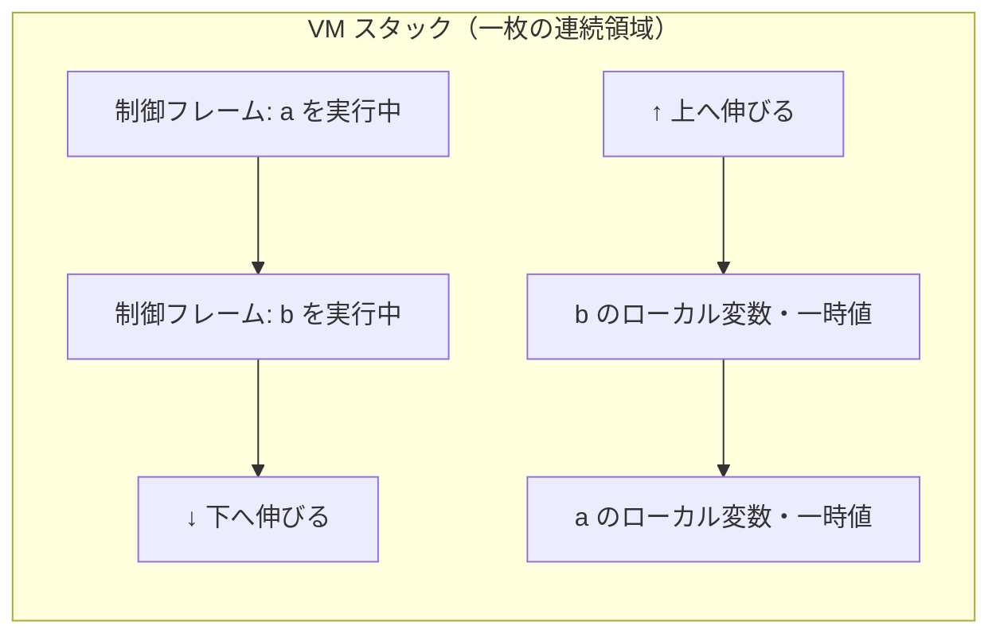

# スタックとフレーム：呼び出しを支える構造

## 関数呼び出しに必要なもの

プログラムの実行は、関数（メソッド）呼び出しの連続です。`a` が `b` を呼び、
`b` が `c` を呼ぶ。`c` が終われば `b` の続きに戻り、`b` が終われば `a` に
戻る。この「あとで戻ってくる」を実現するために、処理系は呼び出しのたびに
次の情報を覚えておく必要があります。

- **戻り先**：呼び出し元のどこから実行を再開するか
- **引数**：呼び出し側から渡された値
- **ローカル変数**：その関数の中だけで使う変数の置き場所
- **計算の途中結果**：式を評価している最中の一時的な値

この一回の呼び出しぶんの情報のまとまりを**フレーム**（frame）、または
**活性レコード**（activation record）と呼びます [](#cite:aho2006)。
そして「最後に呼んだ関数から先に戻る」という後入れ先出しの性質から、
フレームの置き場所として**スタック**が選ばれます。これが**コールスタック**
（call stack、呼び出しスタック）です。

```ruby
def a = b() + 1
def b = c() * 2
def c = 10

a()
# 実行中のある瞬間、スタックには a, b, c のフレームが積まれている
# c が返ると c のフレームが捨てられ、b の「* 2」の続きから再開する
```

例外発生時に表示される**バックトレース**（backtrace、エラーに至る呼び出し
履歴）は、まさにこのコールスタックを上から順に印字したものです。

## ネイティブスタック：CPU が直接支援する

C や Rust のようなネイティブコンパイル言語では、コールスタックは
OS が用意した連続メモリ領域で、CPU が**スタックポインタ**（SP、スタックの
先端を指すレジスタ）と専用命令（call / return）で直接支援します。
フレームのレイアウト（引数を何番目に置くか、どのレジスタで渡すか）は
**呼び出し規約**（calling convention）として決められており、コンパイラは
各ローカル変数を「フレーム先頭から何バイト目」という**固定オフセット**に
割り付けます。変数アクセスはレジスタ＋定数オフセットのロード一発です。

ここで「シンボルテーブル」の章の話がつながります。コンパイル時に
名前をオフセット（番号）へ解決してしまえば、実行時には名前は不要に
なる —— ネイティブコードのフレームは、その究極形です。

## 仮想機械のスタック：CRuby の二層構造

バイトコードを実行する仮想機械（VM）も、自前のスタックを持ちます。
CRuby（YARV）を例に、実用 VM のスタックがどんな構造かを見てみましょう。

CRuby の各スレッドは一枚の **VM スタック**領域を持ち、そこに二種類の
データが同居します。

1. **値スタック**：バイトコードが計算の途中結果を積む領域。
   「構文木と中間表現」の章で見た `push 3 / push 4 / mul` の
   スタックです。ローカル変数の置き場所もここに確保されます。
2. **制御フレーム**（control frame）：呼び出し一回ごとの管理情報。
   実行中の命令位置（PC）、値スタックの先端（SP）、実行中のメソッド
   （命令列への参照）、`self`、ローカル変数領域への参照などを
   ひとまとめにした小さな構造体です。

CRuby は一枚の領域の**両端からこの二つを伸ばし**ます。値スタックは
底から上へ、制御フレームの列は天井から下へ。ぶつかったらスタック
あふれです。一枚の確保で二つのスタックを賄う、メモリ効率のよい配置です。



ローカル変数の読み書きは、フレームが持つ基準位置（CRuby では **EP**、
environment pointer と呼びます）からの**番号指定**で行います。
コンパイル時に「変数 `x` はこのメソッドの 0 番」と決めてあるので
（「シンボルテーブル」の章で見た局所変数表の出番です）、実行時は
`EP[0]` のような添字アクセスだけ。ここでも名前は番号に変わっています。

```ruby
# CRuby のバイトコードでローカル変数が番号になっている様子
puts RubyVM::InstructionSequence.compile(<<~RUBY).disasm
  x = 10
  y = x + 1
RUBY
# getlocal x@0 / setlocal y@1 のような「名前@番号」が見える
```

## ヒープに置かれるフレーム：Python の選択

フレームは必ずスタックに置かれるとは限りません。CPython は長らく、
フレームを**ヒープ上のオブジェクト**（`PyFrameObject`）として確保して
きました。フレームがふつうのオブジェクトであれば、デバッガから
`sys._getframe()` で覗いたり、ジェネレータ（後述）のために「実行を
中断したフレーム」を保存したりするのが簡単になるからです。

代償は速度です。関数を呼ぶたびにヒープ確保が走るのは高くつきます。
そこで CPython 3.11 は、フレームの実体を**連続したメモリ領域に積む内部
構造**に改め、`PyFrameObject` はデバッガ等から要求されたときだけ遅延
生成する方式に変えました。これは 3.11 の大幅な高速化の柱の一つです。
「全部オブジェクトにすると柔軟だが遅い。スタックに置くと速いが硬い。
ならば**ふだんはスタック、必要なときだけオブジェクト化**」——
本書で何度も見る二段構えが、ここにも現れています。

## 例外処理：どこまで巻き戻すかを知る

`raise`（例外送出）が起きたとき、処理系は「いちばん近い `rescue` は
どこか」を知り、そこまでスタックのフレームを**巻き戻し**（unwind）
しなければなりません。これにもデータ構造の設計判断があります。

代表的なのが**例外表**（exception table）方式です。コンパイル時に、
命令列ごとに「この範囲（開始〜終了の命令位置）で例外が起きたら、
この位置のハンドラへ跳べ」という表を作っておきます。JVM のクラス
ファイルにはメソッドごとの例外表が格納されており
[](#cite:lindholm2014)、CRuby もバイトコード（ISeq）ごとに同様の
catch table を持ちます。

```
# 例外表の概念図：命令範囲 → ハンドラ位置
範囲 [0008, 0024)  種類 rescue   ハンドラ 0031
範囲 [0008, 0024)  種類 ensure   ハンドラ 0040
```

この方式の利点は、**例外が起きない限りコストがゼロ**なことです。
`begin` に入るときに何の準備もしません。例外が起きたときだけ、
フレームを一枚ずつ遡りながら表を引きます。例外は稀だという前提に
最適化しているので「ゼロコスト例外」と呼ばれ、C++ や Java、そして
CPython も 3.11 からこの方式です（それ以前の CPython は `try` に
入るたびにハンドラ情報をスタックに積んでいました）。

> [!NOTE]
> 逆に、C の `setjmp`/`longjmp` のように「`begin` の時点で実行状態を
> 保存しておき、例外時に一気に跳ぶ」方式もあります。送出は速いものの、
> 保存のコストが例外を使わない場合にもかかります。例外を「稀な異常」と
> 見るか「ふつうの制御構造」と見るかで、適するデータ構造が変わるのです。

## スタックあふれとの戦い

スタックは有限です。再帰が深すぎると**スタックオーバーフロー**
（stack overflow、スタックあふれ）が起きます。処理系はこれを検出して、
クラッシュではなく例外（Ruby なら `SystemStackError`）にしなければ
なりません。検出方法は主に二つあります。

- **ガードページ**：スタック領域の端にアクセス禁止のページを置き、
  踏んだら OS のシグナルで検出する。検査コストはゼロですが、シグナル
  ハンドラから安全に復帰するのは難しい技術です。
- **明示的な検査**：関数呼び出しのたびに「残りはあと何バイトか」を
  検査する。確実ですが、全呼び出しに検査コストがかかります。

CPython はフレームを自前管理しているので、単純に**フレーム数を数えて**
上限（`sys.setrecursionlimit`）で例外を投げます。数えるだけなら
データ構造は要りません —— フレームを自前で持つ設計の余録です。

## 伸び縮みするスタック：Go のゴルーチン

スレッドのスタックは伝統的に「最初に大きめ（数 MB）を予約する」もの
でした。しかし Go のように**何十万もの軽量スレッド（ゴルーチン）**を
作る言語では、1 本に数 MB は払えません。Go はゴルーチンのスタックを
**数 KB から始めて、足りなくなったら伸ばす**設計にしました。

初期の Go は、スタックを鎖状に継ぎ足す**分割スタック**（segmented
stack）でしたが、ループの中で境界をまたぐと「伸ばして縮めて」を
繰り返して激遅になる問題（hot split）があり、現在は**連続スタックの
引っ越し方式**です。足りなくなったら倍の大きさの領域を確保して
中身を丸ごとコピーし、**スタック内を指していたポインタをすべて
書き換え**ます。可変長配列の「倍々で引っ越す」戦略（「配列型」の章）を
スタックに適用した形ですが、ポインタの書き換えのためには「スタックの
どこにポインタがあるか」を正確に知る必要があり、コンパイラが生成する
**スタックマップ**（stack map、各時点のポインタ位置の表）が支えています。

## 末尾呼び出し：フレームを積まないという約束

スタックの設計には、言語仕様に昇格した最適化もあります。**末尾
呼び出し最適化**（tail call optimization、TCO）です。関数の**最後の
動作**が別の関数の呼び出しであるとき（末尾呼び出し）、呼び出し元の
フレームはもう使われません。ならば新しいフレームを**積む**のでは
なく、いまのフレームを**置き換えて**しまえばよい —— 実装としては、
引数を現在のフレームのスロットに書き込み、call ではなく jump で
飛ぶだけです。

```scheme
;; Scheme：末尾再帰のループは、フレームを 1 枚しか使わない
(define (loop n acc)
  (if (= n 0) acc
      (loop (- n 1) (+ acc n))))   ; 末尾呼び出し → ジャンプにコンパイル
(loop 1000000 0)                    ; スタックは溢れない
```

Scheme はこれを**仕様で保証**します（proper tail call）。再帰が
唯一のループ手段である言語では、TCO は最適化ではなく**ループの
実装そのもの**だからです。一方、Python と Ruby は意図的に採用して
いません。フレームを潰すと**バックトレースから呼び出し履歴が
消える**ため、デバッグ性を優先したのです（Ruby は VM のオプション
としては持っています）。JavaScript は ES2015 で仕様に入れたものの、
同じ理由で主要エンジンの多くが実装を拒み、仕様と現実が割れたまま ——
「スタックとは何の記録か」（実行の続きか、歴史のログか）という
解釈の違いが、言語コミュニティを二分した例です。

## コルーチンとファイバ：スタックを付け替える

「関数の実行を途中で**中断**して、あとで**再開**したい」という要求が
あります。Ruby の `Fiber`、Lua のコルーチン、Python のジェネレータが
代表です。中断・再開を実現する戦略は、スタックの扱いで二系統に
分かれます。

- **スタックフル**（stackful）：コルーチンごとに**専用のスタックを
  丸ごと**持ち、切り替え時にスタックポインタごと付け替える方式。
  Ruby の `Fiber` や Lua のコルーチンがこれで、コルーチンの中の
  深い呼び出しの途中からでも中断できます。代償は、コルーチン 1 本
  ごとのスタック領域です。
- **スタックレス**（stackless）：中断できるのは関数の本体だけと制限し、
  その**フレーム 1 枚だけをヒープに保存**する方式。Python の
  ジェネレータは、中断時にフレームオブジェクトへ実行状態（命令位置と
  ローカル変数）をしまい込み、再開時に戻します。軽量ですが、呼び出しの
  奥からは中断できません（だから Python では深い場所から `yield`
  できないのです）。

```ruby
# Ruby の Fiber はスタックフル：深い呼び出しの中からでも中断できる
def deep(n, fiber_aware)
  return Fiber.yield(:from_deep) if n == 0
  deep(n - 1, fiber_aware)
end

f = Fiber.new { deep(10, true); :done }
p f.resume   # => :from_deep   再帰 10 段の奥から中断してきた
p f.resume   # => :done
```

この対比は「クロージャと関数」の章（ジェネレータと async/await）で
もう一度登場します。C# や Rust の async/await は、コンパイラがフレームを
**状態機械の構造体に変換してしまう**ことで、スタックレスの制限を
言語側の変換で乗り越える設計です。

## フレームが逃げ出すとき

最後に、次章以降への伏線を張っておきます。スタックのフレームは関数が
返ると消えます。ところが言語には、**消えたはずのフレームの中身を
あとから使う**機能があります。

```ruby
def make_counter
  count = 0
  -> { count += 1 }   # ローカル変数 count を「持ち出す」ラムダ
end

c = make_counter      # make_counter のフレームはもう消えたはずなのに…
p c.call   # => 1
p c.call   # => 2     # count は生きている！
```

この `count` のように、フレームより長生きする変数を**逃げ出す**
（escape）変数と呼びます。処理系は、逃げ出す変数をスタックではなく
ヒープに移す必要があります。誰が・いつ・どうやって移すのか —— それが
**クロージャ**の実装問題であり、「クロージャと関数」の章の主題です。
また、ヒープに移った変数を「いつ捨ててよいか」を決めるのが、次章の
**ガベージコレクション**です。

スタックとフレームは、地味ながら処理系の背骨です。固定オフセットの
ネイティブフレーム、二層構造の VM スタック、ヒープ化されたフレーム、
引っ越すスタック、付け替えるスタック —— 「呼び出しを覚えておく」という
一つの目的に、これだけ多様なデータ構造が生まれています。
