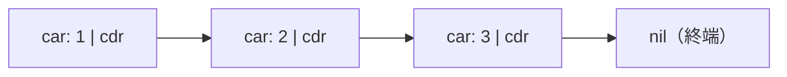

# コレクションの世界を広げるリストとタプルと集合

## 60年生きるconsセル

配列とハッシュの陰に隠れがちですが、プログラミング言語史上もっとも
長寿のコレクションは**連結リスト**（linked list）、それも Lisp が
1958 年に生んだ **cons セル**（cons cell）によるリストです
[](#cite:mccarthy1960)。

cons セルは、たった二つの参照を持つ箱です。慣習的に、先頭の値を
指す側を **car**、残りを指す側を **cdr** と呼びます（この奇妙な名前は、
最初の実装に使われた IBM 704 のレジスタ名の名残です）。cdr が次の
セルを指すように数珠つなぎにすると、リストになります。



```ruby
# cons セルと、それによるリスト
Cons = Struct.new(:car, :cdr)

list = Cons.new(1, Cons.new(2, Cons.new(3, nil)))

def sum(cell) = cell ? cell.car + sum(cell.cdr) : 0
p sum(list)   # => 6
```

Lisp や Haskell、OCaml、Erlang、Scala といった関数型の系譜では、
今日でもこのリストが基本のコレクションです。配列ではなくリストが
選ばれ続けるのには、はっきりした理由があります。

## なぜ関数型言語はリストを愛するのか

理由は**永続性**（persistence）です。リストの先頭に要素を足す操作
（cons）を考えてください。

```ruby
list2 = Cons.new(0, list)   # list の先頭に 0 を足した「新しいリスト」
```

このとき `list` は**まったく変更されていません**。`list2` は新しい
セルを 1 個作り、その cdr で既存の `list` を共有しているだけです。
つまり cons セルのリストは、

- 先頭への追加が O(1)
- 元のリストも壊れず残る（永続）
- 複数のリストが後ろ部分（tail）を共有できる

という性質を、何の工夫もなしに満たします。[配列の章](arrays.md)で見た HAMT が
木構造を駆使してようやく獲得した「変更しても元が残る」性質を、リストは
生まれつき持っているのです。「データを書き換えない」関数型言語にとって、
これ以上に自然な構造はありません。

Erlang や Haskell のパターンマッチ `[head | tail]` は、cons セルの
car と cdr をそのまま分解する操作です。言語の文法とデータ構造が
一対一に対応している例で、Erlang の仮想機械 BEAM が cons セルに専用の
タグを割り当てている（「値の表現」の章）のも、この中心性ゆえです
[](#cite:stenman2024)。

> [!CAUTION]
> 良いことばかりではありません。リストの弱点は**ランダムアクセス**
> （n 番目の要素を見るのに O(n)）と、**キャッシュ効率**です。セルは
> ヒープのあちこちに散らばるため、たどるたびにキャッシュミスが起き
> がちです。「先頭からの逐次処理が大半で、ランダムアクセスは稀」という
> 関数型プログラミングの使い方が、リストの弱点を踏まないようにできて
> いる、と言うほうが正確かもしれません。

## iolist と差分リスト

リストの「共有してつなぐ」性質を活かした、実戦的な技法を二つ紹介します。

**Erlang の iolist** は、「文字列の断片を、木構造のままネストした
リストとして持つ」表現です。文字列の連結が必要な場面で、Erlang
プログラマは連結しません。`["Hello", [", ", "World"], "!"]` のように
入れ子のリストを作るだけにして、最終的な出力（ソケットへの書き出し
など）の段階で、I/O 層が木をたどりながら断片を順に書き出します。
平坦化を最後まで遅らせる、ロープ（[文字列の章](strings.md)）の思想の Erlang 版です。

**差分リスト**（difference list）は、「リストの末尾への追加が O(n)」と
いう問題への関数型らしい答えです。リストそのものの代わりに
「末尾に何かを受け取って完成品を返す関数」を持ち回ります。
Haskell で文字列出力に使われる `ShowS`（`String -> String` 型）が
その実例で、関数合成で「追記」を O(1) に積み上げ、最後に一度だけ
実行して実体化します。**データの代わりに関数をデータ構造として使う**。
この発想は「遅延評価」の章でさらに扱います。

## 純粋関数型のキューと両端キュー

リストは先頭しか速くないので、**キュー**（queue、先入れ先出し）を
作るには工夫が要ります。有名なのが二本のリストでキューを作る
バンカーズキュー（banker's queue）です [](#cite:okasaki1998)。

- **前リスト**：取り出し用。先頭から pop する。
- **後リスト**：追加用。先頭に push する（つまり逆順に積まれる）。
- 前リストが空になったら、後リストを一度だけ反転して前リストにする。

反転は O(n) ですが、各要素は「積まれて、反転で運ばれて、取り出される」
の高々 3 回しか触られないので、ならせば O(1) です。

```ruby
# 二本の不変リストでキュー（配列を不変リストの代用にした最小実装）
class PureQueue
  def initialize(front = [], back = [])
    @front, @back = front, back
  end

  def push(x) = PureQueue.new(@front, [x] + @back)  # 後リストの先頭に積む

  def pop                       # [取り出した値, 新しいキュー] を返す
    if @front.empty?
      f = @back.reverse         # 前が尽きたときだけ、一度だけ反転
      [f.first, PureQueue.new(f.drop(1), [])]
    else
      [@front.first, PureQueue.new(@front.drop(1), @back)]
    end
  end
end

q = PureQueue.new.push(1).push(2).push(3)
v, q = q.pop; p v   # => 1   先入れ先出しになっている
v, _ = q.pop; p v   # => 2   どの時点の q も壊れず残る（永続）
```

可変な配列もポインタの付け替えもなしに、不変リストだけで効率的な
キューができる。Okasaki の教科書はこうした「純粋関数型データ
構造」の宝庫で、遅延評価とならし計算量の理論的な接続まで論じて
います [](#cite:okasaki1998)。

両端とも速い**両端キュー**（deque）になると、各言語の解はさまざまです。
Python の `collections.deque` は固定長ブロックの双方向連結（配列型の
章）、Haskell の `Data.Sequence` は**フィンガーツリー**（finger tree）と
いう「両端に指をかけた木」で、両端の操作がならし O(1)、連結や分割まで
O(log n) でこなす万能選手です [](#cite:hinze2006)。

## タプルとレコード

Python の `(1, "a")`、Erlang の `{ok, Value}`、Rust の `(i32, String)`
のような**タプル**（tuple、組）は、「**要素数が固定**」という制約を
持つ代わりに、最小のメモリ（ヘッダ＋要素を直接並べる）で済みます。
[配列の章](arrays.md)で見たとおり、成長の仕組みが一切不要だからです。

タプルの要素に名前を付けたものが**レコード**（record）や構造体です。
ここで思い出してほしいのが、[シンボルテーブルの章](symbol-table.md)の「名前は早い段階で
番号に消す」原則です。静的型付け言語の構造体アクセス `p.x` は、
コンパイル時に「先頭から 8 バイト目」という固定オフセットに解決
され、実行時には名前が存在しません。動的型付け言語のレコード（Ruby の
`Struct` や Python の `namedtuple`）は、名前→位置の対応表を**クラス側に
一枚だけ**持ち、インスタンスは値の配列だけを持ちます。これは
[オブジェクトの章](objects.md)で扱う「オブジェクトの実装」の縮図そのものです。

## 集合の三つの実装系統

**集合**（set）は「ある値が含まれるか」だけに関心を持つコレクションです。
実装は大きく三系統あり、要求次第で選ばれます。

**ハッシュ集合**：ハッシュ表の「値」を捨てて、キーだけにしたものです。
Ruby の `Set` は内部に `Hash` を持つ素直な実装、CPython の `set` は
dict とは別に専用のオープンアドレス表を持ちます。検索・追加は平均 O(1)、
順序の保証はありません。

**順序付き集合（平衡探索木）**：C++ の `std::set`、Java の `TreeSet` は
**赤黒木**（red-black tree、挿入・削除のたびに回転操作で高さを
O(log n) に保つ二分探索木）で実装されます。全操作が O(log n) に
なる代わりに、整列順での反復と範囲検索（「10 以上 20 未満の
要素を列挙」）ができます。ハッシュにはどうしてもできない芸当です。
平衡木の世界はそれ自体が一章に値するので、次の「平衡木」の章で
たっぷり扱います。

**ビット集合**：要素が小さな整数（あるいは整数に番号付けできるもの）に
限られるなら、**整数のビット列そのもの**を集合にできます。i 番目の
ビットが 1 なら「i が含まれる」。和集合は OR、積集合は AND と、
集合演算が CPU の 1 命令になります。Java の `EnumSet` は列挙型の
集合をこの方式で実装しており、コンパイラの内部でも「生きている
変数の集合」などの解析（[構文木の章](syntax-tree.md)で触れた CFG 上のデータフロー解析）が
ビット集合の演算として実装されます。

```ruby
# Ruby で整数をビット集合として使う
set = 0
set |= (1 << 3)          # 3 を追加
set |= (1 << 7)          # 7 を追加
p set & (1 << 3) != 0    # => true  3 を含む？
p set | 0b10000000       # 和集合は OR 一発
```

> [!TIP]
> 三系統の使い分けはそのまま面接問題になるほど典型的です。
> 「順序も範囲も要らない」→ ハッシュ集合。「整列・範囲検索が要る」→
> 平衡木。「要素が密な小整数」→ ビット集合。**問いの形がデータ構造を
> 決める**、本書で何度も見てきた構図です。

なお、[シンボルテーブルの章](symbol-table.md)で出てきた**スキップリスト**も「整列を保つ」
一族です [](#cite:pugh1990)。乱数で「高速道路」を何層も架けた連結リストで、
平衡木と同じ O(log n) を、回転操作なしのシンプルな実装で達成します。
Java の並行コレクション `ConcurrentSkipListMap` が平衡木ではなく
スキップリストを選んだのは、**ロックなしの並行操作と相性が良い**から
です（並行性の話は「並行処理とデータ構造」の章で扱います）。

## コレクションの設計空間

第II部のここまでで、言語が提供するコレクションの主要メンバーが
出そろいました。まず操作ごとの計算量を一望します（n は要素数。
「—」はその構造の土俵ではない操作）。

| 構造 | 添字 i | 先頭挿入 | 末尾挿入 | キー検索 | 整列順反復 | 永続性 |
|---|---|---|---|---|---|---|
| 可変配列 | O(1) | O(n)※ | ならし O(1) | — | — | × |
| cons リスト | O(i) | **O(1)** | O(n) | — | — | **○**（尾の共有） |
| 両端キュー (deque) | O(n)〜O(1) | O(1) | O(1) | — | — | × |
| ハッシュ表 | — | — | ならし O(1)（挿入） | 平均 **O(1)** | ×（挿入順は可） | × |
| 平衡木 | O(log n)※2 | — | O(log n)（挿入） | O(log n) | **○** | ○（経路コピー） |
| HAMT・永続ベクタ | O(log n) | — | O(log n) | O(log n) | × | **○** |
| フィンガーツリー | O(log n) | ならし O(1) | ならし O(1) | — | ○ | **○** |

※ CRuby の `shift` は開始位置をずらして O(1)（[配列の章](arrays.md)）。
※2 部分木サイズを持つ順序統計木の場合（[平衡木の章](trees.md)）。

改めて並べると、設計空間の軸が見えてきます。

- **アクセスパターン**：添字（配列）／キー（ハッシュ・木）／
  先頭から順（リスト）／両端（deque）／含むか否か（集合）
- **可変か永続か**：その場で書き換える（配列・ハッシュ表）／
  共有しながら新版を作る（cons リスト・HAMT・フィンガーツリー）
- **順序の約束**：挿入順（Ruby Hash）／整列順（赤黒木）／
  無保証どころか毎回ランダム（Go map）

言語に「どのコレクションが組み込みであるか」は、その言語が何を
大事にしているかの自己紹介でもあります。Lisp はリスト、Lua はテーブル
一種類、Python は list と dict と tuple と set、Haskell はリストと
不変 Map。次の章では、この表で何度も顔を出した「整列順」の主役、
**平衡木**を腰を据えて見ていきます。
