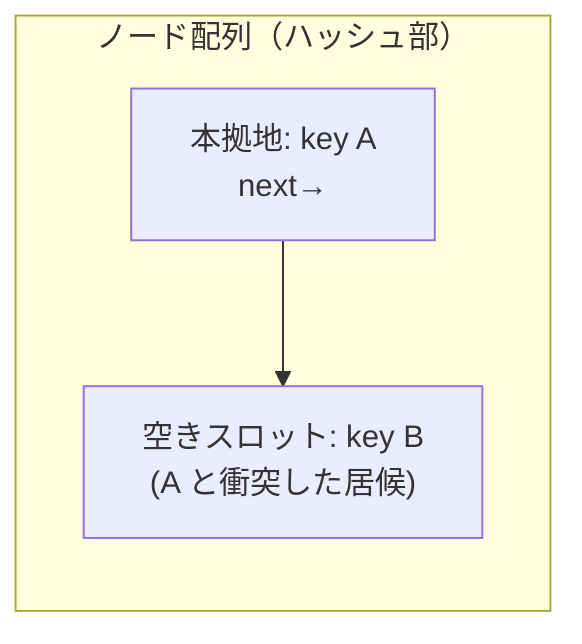

# すべてがテーブルである Lua

Tcl が「すべては文字列」、APL が「すべては配列」だったように、Lua にも
一枚岩の世界観があります。Lua のデータ構造は、実質**テーブル（table）
ただ一つ**です。配列も、辞書も、オブジェクトも、モジュールも、集合も、
さらにはグローバル変数を収める名前空間さえ、すべて同じテーブルで
表されます。「一つの容れ物で何でも」を貫いたとき、その容れ物の中身は
どう設計されるのか。本章はその一点を掘ります。実装の細部は、Lua 5.0 の
作者たち自身による解説 [](#cite:ierusalimschy2005) が一次資料です。

## 一つの容れ物ですべてをまかなう

Lua のテーブルは、キーから値への連想配列です。キーには nil 以外の
どんな値も使え、整数キー `t[1]`、文字列キー `t["name"]`、他のテーブルや
関数すらキーにできます。これだけ聞けば「[ハッシュの章](hashes.md)で見た辞書」と
同じですが、Lua はこの一つの型に、ほかの言語なら別々の型に分ける役割を
すべて背負わせます。

- **配列**：`t[1], t[2], t[3]` と整数キーで使う。
- **辞書／レコード**：`t["x"]` あるいは糖衣構文 `t.x` で使う。
- **集合**：要素をキーにし値を `true` にする（`t[v] = true`）。
- **オブジェクト**：フィールドをキーに持ち、メソッドも関数値として
  キーに収める（後述のメタテーブルで仕上げる）。
- **名前空間／モジュール**：`math.sin` は「テーブル `math` のキー
  `"sin"`」にすぎない。

極めつけは、**グローバル変数そのものがテーブルの要素**だという点です。
Lua でグローバル `x` を読むことは、ある特別なテーブル（5.1 までの `_G`、
5.2 以降は環境 `_ENV`）のキー `"x"` を引くことと同義です。シンボル
テーブルの章で「名前を引く表」を処理系の内部構造として見ましたが、Lua は
それを**言語のただ一つのデータ型で兼ねて、利用者の手にも渡している**
わけです。一種類を磨き上げれば言語全体が速くなる。この一点賭けが、Lua の
設計を貫いています。

## 一つの table の中の配列部とハッシュ部

「配列も辞書も同じテーブル」と言いましたが、素朴に全部をハッシュ表で
持つと、`t[1], t[2], …` のような連続した整数キーの列がもったいない。
キーが `1,2,3,…` と分かっているなら、ハッシュを計算して鎖をたどるより、
ただの配列に詰めて添字でアクセスするほうが速く、メモリも密です
（[配列の章](arrays.md)・[ハッシュの章](hashes.md)で見たとおりです）。

そこで Lua のテーブルは、内部で**二つの部分**を持ちます
[](#cite:ierusalimschy2005)。

- **配列部（array part）**：キー `1..n` の値を、添字そのままで並べた
  連続配列。整数キーの密な範囲をここが受け持つ。
- **ハッシュ部（hash part）**：それ以外のキー（文字列、まばらな整数、
  テーブルなど）を収めるハッシュ表。

```ruby
# 概念図：一つの table が array 部と hash 部を併せ持つ
class LuaTable
  def initialize
    @array = []     # キー 1..n を添字 0.. に詰める（密な整数キー用）
    @hash  = {}     # それ以外のキー用
  end

  def get(k)
    if k.is_a?(Integer) && k >= 1 && k <= @array.size
      @array[k - 1]               # 配列部：添字一発
    else
      @hash[k]                    # ハッシュ部：ハッシュして引く
    end
  end
end
```

利用者からは一枚のテーブルに見えますが、`t[1] = "a"` は配列部へ、
`t.name = "x"` はハッシュ部へ、と裏で振り分けられます。即値とヒープ、
埋め込み文字列とロープと、本書が繰り返し見てきた「一つの型に見せて、
中で二つの表現を使い分ける」パターンが、ここにも現れています。

## 二つの部の大きさを決め直すリハッシュ

二つの部を持つと、新しい問いが生まれます。**配列部はどこまでの
整数キーを受け持つべきか**。`t[1]` だけがあるテーブルに配列部を 1000 個
用意したら無駄ですし、逆に `t[1]..t[1000]` を全部ハッシュ部に入れたら
遅い。しかもキーは実行中に増減します。

Lua は、テーブルがいっぱいになって新しいキーを挿せなくなったとき
**リハッシュ（rehash）** を行い、その時点の全キーを数え直して二つの部の
大きさを決め直します [](#cite:ierusalimschy2005)。配列部の大きさ `n` は、
**`1..n` の整数キーのうち半分以上が実際に使われている**ような最大の
`n`（2 のべき）に選ばれます。「半分は埋まっていること」を条件にするのは、
配列部が穴だらけ（メモリの無駄）になるのを防ぎつつ、密な整数キーは
できるだけ配列部に載せたいからです。可変長配列の倍々リサイズ（配列型の
章）と同じく、ならせば挿入 1 回あたりの償却コストは定数に収まります。

> [!NOTE]
> この「使われ方を見て配列部とハッシュ部の境界を引き直す」適応は、
> [オブジェクトの章](objects.md)のシェイプや、[JIT の章](jit.md)のフィードバックと同じ
> 「観測してから最適な表現を選ぶ」発想の親戚です。静的に決め打ちせず、
> 実際のキーの分布に合わせて構造を作り替えるわけです。

## 長さを「境界」として返す `#` の落とし穴

配列部とハッシュ部の分離は、Lua の有名な癖を生みます。テーブルの長さを
返す `#t` 演算子の振る舞いです。

Lua は `#t` を「**境界（border）**を一つ返すもの」と定義します。境界とは、
`t[n] ~= nil` かつ `t[n+1] == nil` を満たす `n` のことです。穴のない
**シーケンス**（`t[1]..t[n]` がすべて非 nil で `t[n+1]` が nil）なら境界は
ただ一つで、それが素直に長さになります。ところが穴があると、境界は
複数あり得て、`#t` はそのうち**どれを返してもよい**のです。

```lua
-- Lua: 穴のあるテーブルの長さは「どれかの境界」── 一意ではない
t = {10, 20, 30}     -- t[1..3]、#t は 3
t[5] = 50            -- t[4] は nil（穴）
print(#t)            -- 3 かもしれないし 5 かもしれない（実装・履歴依存）
```

これはバグではなく、内部表現が表に漏れた結果です。`#t` は配列部を二分探索
して境界を探すため、配列部の末尾が埋まっているかどうかで答えが変わります
[](#cite:ierusalimschy2005)。[値の表現の章](values.md)で見た「Java の `Integer`
キャッシュが `==` に漏れる」のと同じく、**データ構造の都合が言語の観察
可能な振る舞いに漏れた**例です。Lua のマニュアルが「長さ演算子は
シーケンスに対してのみ定義される」と但し書きを付けるのは、この境界の
あいまいさを認めているからです。

## 本拠地と居候によるハッシュ部の衝突解決

ハッシュ部の中身も、[ハッシュの章](hashes.md)で見たのとは少し違う、Lua 独特の工夫が
あります。各キーには、ハッシュ値から決まる**本拠地（main position）**が
あります。新しいキーを入れようとして本拠地が空いていればそこに置く。
ふさがっていたらどうするか。ここで Lua は、チェイン法のように鎖を
別領域に伸ばすのではなく、**ノード配列の中の空きスロットを使い回します**
[](#cite:ierusalimschy2005)。

衝突したとき、いまその本拠地に居座っているノードが「**自分の本拠地に
正しくいる**」のか「**たまたま居候している**」のかで対応を変えます。

- 居座っているのが居候なら、そいつを空きスロットへ追い出して、本拠地を
  新しいキーに明け渡す。
- 居座っているのが本来の住人なら、新しいキーのほうが空きスロットへ移り、
  住人の `next` リンクからその空きスロットへ鎖をつなぐ。



鎖は配列の外ではなく配列内の空きスロットへ `next` でつながるので、
ノードごとの追加のメモリ確保が要りません。一定サイズのノード配列が
埋まりきって空きが尽きたら、先述のリハッシュでテーブル全体を作り直します。
「鎖を別に持たず、同じ配列の空きを間借りする」この方式は、組み込み用途で
メモリと確保回数を切り詰めたい Lua の事情にかなっています。

## テーブルにテーブルで意味を足すメタテーブル

ここまでは「データの容れ物」としてのテーブルでした。Lua はもう一段、
テーブルに**振る舞い**を持たせる仕組みを、やはりテーブルで実現します。
**メタテーブル（metatable）** です。あるテーブルにメタテーブルを結びつけ、
その中の特別なキー（メタメソッド）に関数や別のテーブルを入れておくと、
通常の操作が「外れた」ときにそれが呼ばれます。

- `__index`：キーが見つからないときの読み出しの肩代わり。値が
  テーブルなら**そのテーブルを次に探す**。これが継承の連鎖になる。
- `__newindex`：存在しないキーへの書き込みの肩代わり（読み取り専用
  テーブルやプロキシを作れる）。
- `__add`・`__eq`・`__call` など：演算子や呼び出しの再定義。

[オブジェクトの章](objects.md)で見たメソッド探索を思い出してください。Lua では
「インスタンス」も「クラス」もただのテーブルで、インスタンスの
メタテーブルの `__index` にクラスのテーブルを指させると、`obj.method` が
インスタンスに無ければクラスを探す、という探索が、テーブルの連鎖
だけで実現します。クラスのメタテーブルの `__index` をさらに親クラスへ
向ければ、多段の継承になります。**専用のオブジェクト機構を言語に組み込まず、
テーブル＋メタテーブルだけで OOP を後付けできる**わけです。

```lua
-- メタテーブルの __index でメソッド探索（＝継承）を作る
Animal = {}
Animal.__index = Animal
function Animal.new(name) 
  return setmetatable({name = name}, Animal)   -- インスタンスもただのテーブル
end
function Animal:speak() return self.name .. " makes a sound" end

a = Animal.new("cat")
print(a:speak())   -- a に speak が無い→ __index=Animal を探して発見
```

> [!TIP]
> 「言語にクラス構文を入れる」のではなく「一つのデータ構造に探索の
> フックを一個足す」だけで OOP が生える。これは、機構を増やさずに
> 表現力を上げる設計の好例です。代償として、メソッド探索のたびに
> `__index` の連鎖をたどるコストがかかるため、性能を要する実装
> （LuaJIT など）はこの探索をインラインキャッシュ（[オブジェクトの章](objects.md)）で
> 短絡します。「素朴で一般的な機構」と「速いキャッシュ」の二段構えは、
> ここでも健在です。

## 系譜と教訓

Lua のテーブルは、「データ構造を一種類に絞る」ことの利点と代償を、
どちらも純粋な形で見せてくれます。

- **一種類への集約**は、PHP の万能配列（PHP・Perl の章）と同じ思想の
  別解です。PHP の配列が「挿入順を保つ単一の順序付きハッシュ」で
  押し通したのに対し、Lua は「配列部＋ハッシュ部」の二層に割って、
  密な整数キーの性能を確保しました。同じ「一つで全部」でも、内部の
  割り方が違います。
- **適応的な表現切り替え**（リハッシュによる配列部／ハッシュ部の決定）は、
  V8 が配列の中身に応じて要素種別を切り替えるのと収斂しています。
  使われ方を観測して表現を選ぶ、という主流の発想を、Lua は単一の型の
  内側でやっているのです。
- **メタテーブルによる機構の後付け**は、「最小の核に、拡張のフックを
  一つ」という組み込み言語ならではの割り切りです。小さく保ちたいから
  こそ、OOP すら言語機能ではなくテーブルの応用で済ませた。
- 代償は `#` のあいまいさに代表される「**内部構造が意味論に漏れる**」
  こと。一種類で兼ねるほど、その一種類の実装の癖が言語の隅々に顔を出します。

Lua が証明したのは、**徹底的に磨いた一つのデータ構造は、多くの専用型に
匹敵する**ということです。組み込み言語として無数のアプリケーションに
載り、ゲームエンジンや Redis の拡張、ネットワーク機器の設定言語として
生き続けているのは、この「一枚のテーブルの速さ」あってのことでした。
「いろいろなデータ構造を knowing 使い分ける」という本書の主題に対し、Lua は
「一つを極めて使い回す」という反対側からの答えを示しています。そして
その一つの内側には、本書で見てきた配列、ハッシュ、適応的リサイズ、探索
キャッシュの工夫が、ぜんぶ詰まっていたのです。

個性派言語の旅の最後に、「一つの構造で全部」をさらに突き詰めた言語を
訪ねます。Lua が一枚のテーブルでデータをまかなったのに対し、次章の
**Lisp** は、一つの構造（S 式）で**プログラムそのものまで**表してしまう、
コードとデータの境界を消した言語です。
