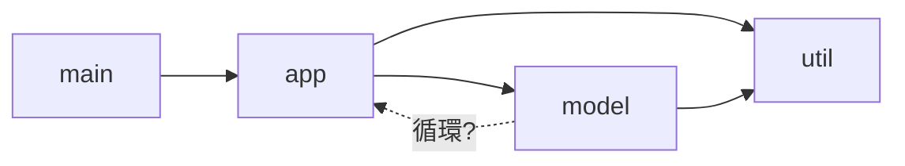

# モジュールとロード：プログラムを組み立てる表とグラフ

ここまで本書は、一枚のソースコードが処理系の中を流れていく様子を
見てきました。しかし現実のプログラムは一枚では済みません。数百から
数千のファイルに分かれ、ライブラリを呼び、ライブラリはまた別の
ライブラリを呼びます。処理系は実行しながら（あるいはコンパイルの
前段で）、**プログラム自身を部品から組み立てる**仕事をしているのです。

この仕事を支えるデータ構造は、実は本書でおなじみの顔ぶれです。
「どこから探すか」を覚える**探索路**（配列）、「もう読んだか」を
覚える**読み込み済み表**（集合）、「どの順で読むか」を決める
**依存グラフ**、そして「読んだ結果を次回に持ち越す」**コードキャッシュ**。
本章では、`require` や `import` の一行の裏で、これらがどう組み合わさって
いるのかを見ていきます。

## require の中身：探索路と読み込み済み表

Ruby の `require "json"` が何をしているか、エッセンスを Ruby 自身で
書いてみます。

```ruby
LOAD_PATH = ["./lib", "./vendor"]   # 探索路：ディレクトリの配列
LOADED    = {}    # 絶対パス => true  読み込み済み表
LOADING   = {}    # 絶対パス => true  いま読み込み中（循環検出用）

def my_require(feature)
  path = LOAD_PATH.map { |d| File.expand_path("#{feature}.rb", d) }
                  .find { |f| File.exist?(f) } or raise LoadError, feature
  return false if LOADED[path]    # もう読んだ：何もしない
  return false if LOADING[path]   # いま読んでいる最中：循環している
  LOADING[path] = true
  begin
    # 本物はここで 字句解析→構文解析→コンパイル→実行 が走る
    eval(File.read(path), TOPLEVEL_BINDING, path)
    LOADED[path] = true
  ensure
    LOADING.delete(path)
  end
  true
end
```

三つの表がそれぞれ仕事をしています。**探索路**は名前をファイルに
解決し（`$LOAD_PATH`）、**読み込み済み表**は同じファイルの二重実行を
防ぎ（`$LOADED_FEATURES`）、**読み込み中表**は循環を検出します。
Python では `sys.path` と `sys.modules`、Node.js（CommonJS）では
ディレクトリ探索と `require.cache` が同じ役割です。

CRuby の実物は、利用者にはただのグローバルな配列として見えますが、
内部には性能のための索引が仕込まれています。

- **展開済み探索路のキャッシュ**：`$LOAD_PATH` の各要素を絶対パスに
  展開した結果を保持し、配列が変更されたときだけ作り直します。
  require のたびに展開し直すのを避けるためです。
- **読み込み済み表の索引**：`$LOADED_FEATURES` は配列なので、素朴には
  「もう読んだか」の判定が線形走査になります。実際かつての CRuby は
  require のたびに走査していて、数千ファイルを読み込む Rails
  アプリケーションの起動が O(N²) になる問題がありました。現在は
  「機能名の末尾部分 → 配列内の位置」を引くハッシュの索引を内部に持ち、
  判定は O(1) です。配列が外から書き換えられたら索引は作り直されます。
- **読み込み中表**：同一スレッドからの循環 require は `false` を返して
  素通しし、**別の**スレッドが同じファイルを require したときは
  先行スレッドの完了を待たせます。重複防止の表が、並行制御の表も
  兼ねているのです。

> [!NOTE]
> RubyGems は `Kernel#require` を**差し替えて**います。素の探索で
> LoadError になったら、gem のデータベースから該当 gem を探して
> 探索路に追加（activate）し、もう一度試す —— 「表を引いて、外れたら
> 表を増やして引き直す」二段構えです。`gem` コマンドが管理する
> 「gem 名 → バージョン → ファイル一覧」のメタデータも、結局は
> ディスク上に置かれた索引です。

## 循環依存：プログラムはグラフである

`require`・`import` の関係を矢印にすると、プログラム全体は**有向グラフ**に
なります。



問題は**閉路**（循環依存）です。`app` が `model` を読み込み、`model` が
`app` を読み込み返したら、どちらを先に実行すればよいのか。各言語の
答えは見事に分かれていて、それぞれのロード機構のデータ構造を映し出します。

- **Ruby**：読み込み中表に当たった require は `false` を返して
  先へ進みます。結果、循環の相手の定数が「まだ」定義されておらず、
  あとで NameError になることがあります。
- **Python**：モジュールオブジェクトを**本体の実行前に** `sys.modules` へ
  登録します。循環した相手からは**作りかけのモジュール**が見えるため、
  `import a` は通るのに `from a import f` は落ちる、という有名な
  振る舞いになります。
- **Node.js（CommonJS）**：Python と同型で、循環の相手には**その時点
  までに代入された `exports`** が渡ります。
- **JavaScript（ES Modules）**：実行の前に、グラフ全体を**構築**
  （パース）→**リンク**（import と export の変数を配線）→**評価**の
  三相に分けます。循環があっても配線は完了できるので、評価順の問題は
  「まだ初期化されていない変数に触れたら ReferenceError」という、
  変数の TDZ と同じ規則に還元されます。
- **Go**：循環 import は**コンパイルエラー**です。グラフが DAG
  （閉路のない有向グラフ）であることを言語仕様が強制し、パッケージの
  初期化（パッケージ変数と `init` 関数）は依存される側から順に、
  つまり**トポロジカル順**に走ります。

「依存される側から順に」を決めるトポロジカルソートは、深さ優先探索で
素直に書けます。訪問状態を三色で塗り分けると、循環検出も同時に
できます。

```ruby
DEPS = {
  "main"  => ["app"],
  "app"   => ["util", "model"],
  "model" => ["util"],
  "util"  => [],
}

def load_order(deps)
  color = Hash.new(:white)   # white: 未訪問 / gray: 訪問中 / black: 完了
  order = []
  visit = lambda do |node, path|
    case color[node]
    when :black then return   # 処理済み：何もしない
    when :gray                # 訪問中に再訪 ＝ 閉路を踏んだ
      raise "circular dependency: #{(path + [node]).join(' -> ')}"
    end
    color[node] = :gray
    deps[node].each { |dep| visit.(dep, path + [node]) }
    color[node] = :black
    order << node             # 依存が全部済んでから自分を並べる
  end
  deps.each_key { |n| visit.(n, []) }
  order
end

p load_order(DEPS)   # => ["util", "model", "app", "main"]
```

`gray`（訪問中）への再訪が循環の証拠、というのが要点です。先ほどの
ミニ require の「読み込み中表」は、実はこの三色のうち gray の集合を
管理していたのだ、と見ることができます。Ruby や Python は閉路を
実行時に gray の表で検出して**ごまかし**、Go はコンパイル時に
このソートを行って閉路を**拒否する** —— 同じグラフアルゴリズムの、
適用時期と厳しさの違いです。

## 遅延ロード：使われるまで読まない

数千ファイルのアプリケーションでも、一回の実行で実際に使われるのは
一部です。なら、**使われた瞬間に読めばよい**のではないか。この発想を
支えるのが、表に置かれた「付箋」です。

Ruby の `autoload` は、定数表のエントリに「中身はまだ無いが、
このファイルを読めば現れるはず」という印を置きます。

```ruby
autoload :CSV, "csv"   # 定数表に「CSV → ファイル csv の付箋」を登録
# ... この時点では csv.rb は読まれていない ...
CSV                    # 定数の参照が付箋を踏む → require "csv" が走る
```

定数の探索（オブジェクト型の章で見た二軸の探索）が autoload の付箋を
踏むと、処理系はその場で require を実行し、改めて定数を引き直します。
別のスレッドが読み込み途中の定数に触れた場合は、完了まで待たされます。
「表を引いたら、値の代わりに**値の作り方**が入っていた」—— 遅延評価の
章で見たサンクの、定数表版だと言えます。

Rails のオートローダ **Zeitwerk** [](#cite:noria2019) は、これを規約で
大規模化したものです。`my_app/user_profile.rb` というパスと
`MyApp::UserProfile` という定数名を**機械的に相互変換できる**よう命名を
強制し、ディレクトリを走査して全定数の autoload を一括登録します。
パスと名前の対応表を人間が書く代わりに、**対応を計算で出せるよう
キーの側を設計する** —— シンボルテーブルの章の完全ハッシュと同じ、
「表の消去」の一形態です。

静的型の世界では、Java のクラスローディングが遅延ロードの古参です。
クラスは**最初に使われたとき**に初めてロード・検証・初期化され、
コンパイル済みクラスファイルの定数プール（識別子の章）に並ぶ他クラスへの
**シンボリック参照**が、遅延解決の単位になります。クラスローダは
親子の木を成し、探索はまず親に**委譲**されます（探索路が配列ではなく
木になった形です）。さらに JVM ではクラスの同一性が「名前」ではなく
**「名前とロードしたローダの組」**で決まるため、同名のクラスを別ローダで
複数共存させられます。アプリケーションサーバが複数アプリを同居させる
基盤は、この「表の多重化」にあります。

## コードキャッシュ：解析の結果を持ち越す

ロードのコストの大半は、ファイル I/O ではなく**字句解析・構文解析・
コンパイル**です。そして同じファイルは何度実行しても同じバイトコードに
なるのですから、結果を直列化（直列化の章）して持ち越したくなります。

- **Python** は最初の import 時にバイトコードを `__pycache__/*.pyc` へ
  書き出します [](#cite:warsaw2010)。ファイル先頭にはマジックナンバー
  （バイトコード形式のバージョン）と、ソースの更新時刻・サイズが入り、
  これが**キャッシュの鍵**としてソースの変更を検出します。のちに
  更新時刻ではなく**ソースの内容ハッシュ**を使うモードも追加されました
  [](#cite:peterson2017)。ビルドのたびに mtime が変わって
  キャッシュが無効化される、再現可能ビルドの要請からです。
- **CRuby** はバイトコード（ISeq）の直列化機構
  `RubyVM::InstructionSequence#to_binary` を持ちます。利用例の
  代表が **Bootsnap** [](#cite:bootsnap) で、これを使って (a) 探索路の
  解決結果と (b) コンパイル済み ISeq を、パスと更新時刻・サイズを
  鍵にキャッシュします（Rails が既定で同梱しています）。
- **V8** もスクリプトのコンパイル結果を直列化する**コードキャッシュ**を
  持ち、ブラウザは訪問済みページのスクリプトを、Node.js は
  `vm.Script` の `cachedData` として利用できます。
- **Go** のビルドキャッシュは一歩進んで、鍵が**入力内容のハッシュ**
  （内容アドレス方式）です。時刻に頼らないため、同じ入力なら
  いつどこでビルドしても同じ鍵でヒットします。

どの設計でも本質は**鍵の設計**です。「ソースが変わったのに古い
キャッシュを使う」事故と「変わっていないのに作り直す」無駄の間で、
更新時刻・サイズ・内容ハッシュのどれを鍵に混ぜるかを選んでいます。
ハッシュの章で見た「何を約束するかが決まると構造が決まる」が、
ここでは「何を変更とみなすかが決まると鍵が決まる」という形で
現れています。

> [!NOTE]
> 同じ構造は OS にもあります。動的リンカ（`ld.so`）は
> `LD_LIBRARY_PATH` という**探索路**を歩き、ロード済み共有ライブラリの
> **表**を持ち、関数のシンボル解決を**最初の呼び出しまで遅延**します
> （PLT/GOT と呼ばれる、呼び出しを一段間接化する表の仕掛けです）。
> シンボルテーブルの章で見た「バイナリの中の表」が、実行時には
> 探索路・ロード済み表・遅延解決の付箋として動き出すのです。
> 言語処理系のローダは、OS のローダの相似形だと言えます。

## 動かしたまま入れ替える

最後に、読み込んだコードを**実行を止めずに差し替える**話です。
大げさに聞こえますが、実は毎日やっています。REPL でメソッドを定義し直す、
あれです。メソッドの再定義とはメソッド表（オブジェクト型の章）の
上書きであり、そのとき処理系は、古い定義を前提に作られたインライン
キャッシュや JIT コード（JIT の章の依存性の表）を無効化して回ります。
「書き換え可能な表＋無効化の台帳」が、ホットリロードの最小構成です。

Zeitwerk のリロードは、これをモジュール単位に広げたものです。自分が
autoload で定義した定数を**台帳に記録**しておき、リロード時には
`remove_const` で定数表から名前を消して、付箋を貼り直します。
「アンロード」という操作の実体は、**表から名前を消すこと**なのです
（消された旧オブジェクトの回収は、もちろん GC の仕事です）。

その極北が、並行処理の章で見た Erlang のホットコードロードです。
BEAM はモジュールごとに**現行版と旧版の二世代**のコードを保持し
[](#cite:stenman2024)、実行中のプロセスを旧版の上で走らせ続けたまま、
新しい呼び出しだけを新版へ向けます。コードそのものを世代付きの表で
管理する —— 「プログラム＝書き換え可能なデータ構造」という本章の
視点の、最も徹底した実装です。

## まとめ：ロードを支える構造たち

本章の道具立てを並べます。

| 構造 | 役割 | 例 |
|---|---|---|
| 探索路（配列・木） | 名前 → ファイルの解決 | `$LOAD_PATH`、`sys.path`、クラスローダの親委譲 |
| 読み込み済み表（集合） | 二重実行の防止 | `$LOADED_FEATURES`（＋内部索引）、`sys.modules`、`require.cache` |
| 読み込み中表（gray 集合） | 循環・並行の検出 | CRuby の loading table |
| 依存グラフ＋トポロジカル順 | 初期化順序の決定 | Go の `init`、ESM のリンク |
| 付箋付きの表（サンク） | 遅延ロード | `autoload`、JVM のシンボリック参照 |
| コードキャッシュ（直列化＋鍵） | 解析結果の再利用 | `.pyc`、Bootsnap、V8 code cache |
| 世代付きコード表 | 無停止の差し替え | BEAM の現行版／旧版 |

一行の `require` の裏に、配列・集合・グラフ・サンク・直列化と、
第I部で見てきた構造が総出演していました。プログラムを動かす機械で
あるだけでなく、**プログラム自身を組み立て、差し替え続ける機械**で
ある —— これが処理系のもう一つの顔です。

これで第I部は完結です。第II部では視点を利用者側に移し、言語が
提供するデータ型たちの実装を見ていきます。第I部で見た値の表現、
キャッシュ、投機といった道具立てが、そこかしこで再登場するはずです。
