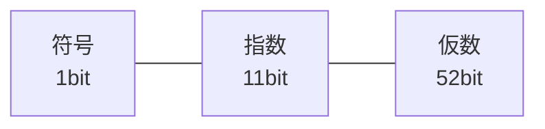

# 数値型：整数と小数の表現

## すべての値はオブジェクト、でも整数は速くしたい

多くの動的型付け言語、とくに Ruby では「すべての値はオブジェクトである」と
いう原則があります。`1` も `"hello"` も `[1, 2, 3]` も、メソッドを持った
オブジェクトです。しかし、これを素直に実装すると深刻な問題が起きます。
整数 `1` のためにいちいちメモリを確保してオブジェクトを作っていたら、
`for i in 1..1000000` のようなループが致命的に遅くなってしまうのです。

整数は処理系で最も頻繁に登場する値です。配列の添字、ループのカウンタ、
計算の中間結果 —— あらゆる場所に現れます。だから処理系は、整数を
**オブジェクトのように見せかけつつ、実体はメモリを確保しない**という
巧妙な手を使います。それが本節のテーマ、**タグ付き表現**です。

## タグ付き整数（Fixnum）：ポインタに値を埋め込む

Ruby を含む多くの処理系では、値は基本的に**ポインタ**（メモリ上の
オブジェクトの番地）として持ち運ばれます。ポインタは整数です。そして、
オブジェクトはメモリ上でたいてい 8 バイト境界などに配置されるため、
**ポインタの下位数ビットは常に 0** になります。この「いつも 0 のビット」が、
情報を埋め込む隙間になります [](#cite:gudeman1993)。

そこで、第3章の識別子で見たのと同じ発想を使います。値の下位ビットを
**タグ**（種類の印）として使い、

- 下位ビットが `0` なら、これは本物のポインタ（ヒープ上のオブジェクト）
- 下位ビットが `1` なら、残りのビットがそのまま整数の値

と決めるのです。下位 1 ビットをタグに使うなら、整数の値は元の数を 1 ビット
左にずらし、最下位に `1` を立てて表します。

```ruby
# 概念図：下位 1 ビットをタグにした整数表現（CRuby の Fixnum と同じ発想）
def to_fixnum(n)  = (n << 1) | 1   # 値を 1 ビット左シフトして最下位に 1
def fixnum?(v)    = (v & 1) == 1   # 最下位が 1 なら埋め込み整数
def from_fixnum(v) = v >> 1        # 1 ビット右シフトで元の値に戻す

three = to_fixnum(3)
p three            # => 7   (3 を 2倍して +1: 0b111)
p fixnum?(three)   # => true
p from_fixnum(three) # => 3
```

このように、**ヒープ（自由に確保できるメモリ領域）にオブジェクトを作らず、
値そのものをポインタの位置に埋め込んでしまう**表現を、Ruby では
**即値**（immediate value）と呼びます。CRuby ではこの埋め込み整数を歴史的に
**Fixnum** と呼んできました。整数の足し算は、タグの分を補正したうえで
ただの整数加算をするだけで済み、オブジェクト生成は一切起きません。

> [!NOTE]
> 同じ手は整数以外にも使われます。CRuby では `nil`・`true`・`false`・
> シンボルなども、専用のビットパターンを持つ即値として表現されています。
> これらの値の比較や受け渡しに、メモリアクセスが一切要らないのが利点です。
> 値の種類をビットで区別するこの設計は、動的型付け言語の値表現として
> 古くから整理されてきました [](#cite:gudeman1993)。

## 多倍長整数（Bignum）：桁あふれを超えて

タグ付き整数には限界があります。下位ビットをタグに使うぶん、表現できる
範囲が CPU の語長より少し狭くなります。64 ビット環境なら、おおよそ
±4×10^18 くらいまでです。ではそれを超えたら？ たとえば
`2 ** 100`（2 の 100 乗）のような巨大な数はどう扱うのでしょうか。

```ruby
p 2 ** 100   # => 1267650600228229401496703205376
p (2 ** 100).class  # => Integer
```

Ruby はこれを平然と計算します。即値で表せない大きさになると、処理系は
自動的に**多倍長整数**（arbitrary-precision integer、任意精度整数）へ
切り替えます。CRuby ではこれを歴史的に **Bignum** と呼びます。
多倍長整数は、数を**配列**として表します。私たちが筆算で大きな数を
桁ごとに扱うのとまったく同じ発想です。

```ruby
# 概念図：大きな整数を「基数 10000 の桁の配列」で表す
class BigInt
  BASE = 10000               # 1要素に4桁ぶんを格納する

  def initialize(digits)
    @digits = digits         # 下位の桁から順に並べる（リトルエンディアン）
  end

  # 筆算の足し算：下の桁から繰り上がりを伝えていく
  def +(other)
    result = []
    carry = 0
    [@digits.size, other.digits.size].max.times do |i|
      sum = (@digits[i] || 0) + (other.digits[i] || 0) + carry
      result << sum % BASE     # この桁に残る分
      carry = sum / BASE       # 上の桁への繰り上がり
    end
    result << carry if carry > 0
    BigInt.new(result)
  end

  attr_reader :digits
end
```

ポイントは、一つの配列要素に一桁（0〜9）ではなく、CPU が一度に扱える
大きさ（たとえば 32 ビットぶん、上の例では簡略化して 4 桁ぶん）をまとめて
詰め込むことです。こうして「桁ごとの繰り上がりを伝えながら足す／掛ける」
という小学校の筆算のアルゴリズムを実装します。掛け算を素朴にやると
桁数 n に対して O(n²) かかりますが、巨大な数では高速化のために
**カラツバ法**や**高速フーリエ変換（FFT）を用いた乗算**が使われます。
こうした多倍長計算のアルゴリズムは Knuth が詳細に論じています
[](#cite:knuth1997)。

> [!TIP]
> Ruby では `Fixnum`/`Bignum` の境目を利用者が意識する必要はありません。
> どちらも `Integer` クラスとして見え、計算結果が大きくなれば処理系が
> 自動で多倍長表現へ移ります（実際 Ruby 2.4 で `Fixnum` と `Bignum` は
> `Integer` に統合されました）。**速い即値**と**無限の桁**を、利用者からは
> 一枚の `Integer` に見せる —— これがデータ構造の切り替えを隠す好例です。

## 浮動小数点数：限られたビットで小数を表す

整数だけでは小数（`3.14` や `0.1`）を扱えません。そこで登場するのが
**浮動小数点数**（floating-point number）です。Ruby の `Float` をはじめ、
ほとんどの言語の小数は **IEEE 754** という国際標準に従って表現されます
[](#cite:ieee754)。

IEEE 754 の倍精度（double、64 ビット）は、数を次の三つの部分に分けて
表します。科学で使う「仮数 × 10 の指数乗」（例：`6.02 × 10²³`）の、
2 進数版だと考えてください。

- **符号**（sign、1 ビット）：正か負か
- **指数**（exponent、11 ビット）：小数点の位置（何ビットずらすか）
- **仮数**（mantissa／significand、52 ビット）：有効数字にあたる部分



この方式の利点は、ごく小さい数からごく大きい数までを一定のビット数で
表せること（だから小数点が「浮動」する、と言います）。欠点は、
**有限のビットしかない以上、表せない数がある**ことです。とくに私たちが
10 進で簡単に書ける `0.1` は、2 進では循環小数になり、正確には表せません。

```ruby
p 0.1 + 0.2          # => 0.30000000000000004
p 0.1 + 0.2 == 0.3   # => false
```

これはバグではなく、有限ビット表現の必然です。`0.1` も `0.2` も
最も近い表現可能な値に丸められており、その誤差が足し算で表に出ています。

> [!WARNING]
> 浮動小数点数を `==` で比較するのは避けましょう。お金の計算のように
> 厳密さが必要な場面では、`Float` ではなく、後述の `Rational`（有理数）や
> `BigDecimal`（10進固定小数）といった、誤差の出ない表現を使います。

## 数を正しく印字するという難問

意外に思うかもしれませんが、「浮動小数点数を文字列にして表示する」ことは、
それ自体が研究対象になるほど難しい問題です。内部のビット列が表す厳密な値は
`0.1000000000000000055511151231257827021181583404541015625…` のような
長い数ですが、私たちは `0.1` と表示してほしい。

つまり処理系は、**元の値に戻せる範囲で、できるだけ短い10進表記**を
選ばなければなりません。短すぎると別の値になってしまい、長すぎると
読みにくい。この「正しく、かつ最短に印字する」アルゴリズムは Steele と
White によって確立され、現在の言語処理系の数値出力の基礎になっています
[](#cite:steele1990)。`p 0.1` がきちんと `0.1` と出るのは、その成果の
おかげなのです。

## 数の種類はもっとある

整数と浮動小数点数は数値型の代表ですが、言語によってはさらに多彩な
数値表現を提供します。いずれも「正確さ」と「速さ」のトレードオフの中で、
別々のデータ構造として実装されています。

- **有理数**（`Rational`）：`1/3` を「分子 1、分母 3」の整数の組として
  保持し、誤差なく計算します。`Rational(1,3) * 3 == 1` が成り立ちます。
- **複素数**（`Complex`）：実部と虚部の二つの数の組として表します。
- **10進小数**（`BigDecimal`）：金額計算向けに、10 進の桁を多倍長で
  保持し、`0.1 + 0.2` を厳密に `0.3` にできます。

```ruby
require 'bigdecimal'
p Rational(1, 3) * 3                          # => (1/1)  誤差なし
p BigDecimal("0.1") + BigDecimal("0.2")       # => 0.3e0  厳密
```

どの数値型も、「数をどんなデータ構造で持つか」という一つの設計判断の
表れです。即値の整数、配列としての多倍長整数、ビット分割の浮動小数点数、
整数の組としての有理数 —— 用途に応じて表現を選ぶ、という本書を貫く
テーマがここにもはっきり現れています。

次の章では、数と並んで基本的な型でありながら、実装の奥が深い**文字列**を
扱います。
