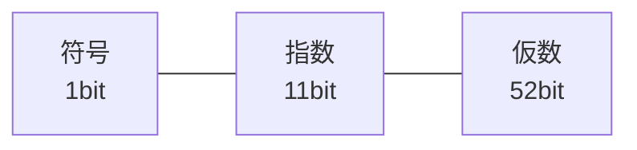

# 数値型：整数と小数の表現

## すべての値はオブジェクト、でも整数は速くしたい

多くの動的型付け言語、とくに Ruby では「すべての値はオブジェクトである」と
いう原則があります。`1` も `"hello"` も `[1, 2, 3]` も、メソッドを持った
オブジェクトです。しかし、これを素直に実装すると深刻な問題が起きます。
整数 `1` のためにいちいちメモリを確保してオブジェクトを作っていたら、
`for i in 1..1000000` のようなループが致命的に遅くなってしまうのです。

整数は処理系で最も頻繁に登場する値です。配列の添字、ループのカウンタ、
計算の中間結果 —— あらゆる場所に現れます。だから処理系は、整数を
**オブジェクトのように見せかけつつ、実体はメモリを確保しない**という
巧妙な手を使います。「値の表現」の章で見た**タグ付き表現**です。

## タグ付き整数（Fixnum）：ポインタに値を埋め込む

復習を兼ねて、整数に即して見直しましょう。CRuby では値は基本的に
**ポインタ**として持ち運ばれ、オブジェクトが 8 バイト境界に配置される
ことから、**ポインタの下位ビットは常に 0** になります。この隙間を
タグに使い [](#cite:gudeman1993)、

- 下位ビットが `0` なら、これは本物のポインタ（ヒープ上のオブジェクト）
- 下位ビットが `1` なら、残りのビットがそのまま整数の値

と決めます。整数の値は元の数を 1 ビット左にずらし、最下位に `1` を
立てて表します。

```ruby
# 概念図：下位 1 ビットをタグにした整数表現（CRuby の Fixnum と同じ発想）
def to_fixnum(n)  = (n << 1) | 1   # 値を 1 ビット左シフトして最下位に 1
def fixnum?(v)    = (v & 1) == 1   # 最下位が 1 なら埋め込み整数
def from_fixnum(v) = v >> 1        # 1 ビット右シフトで元の値に戻す

three = to_fixnum(3)
p three            # => 7   (3 を 2倍して +1: 0b111)
p fixnum?(three)   # => true
p from_fixnum(three) # => 3
```

ヒープにオブジェクトを作らず、値そのものをポインタの位置に埋め込む
**即値**表現です。CRuby ではこの埋め込み整数を歴史的に **Fixnum** と
呼んできました。足し算の実装も気持ちよくできています。タグ付きの
まま `a + b - 1` を計算すると、それがちょうど和のタグ付き表現に
なるのです（`(2x+1) + (2y+1) - 1 = 2(x+y)+1`）。タグの付け外しすら
省けるわけで、即値整数の演算は機械語数命令で完結します。

タグ方式は言語ごとに少しずつ違います。OCaml も最下位ビット 1 を整数に
使い `int` は 63 ビット、V8（JavaScript）は逆に最下位ビット 0 を
小整数（SMI）に割り当てます。最下位 0 を整数にすると、加減算で
タグ補正が一切不要になり、さらに「タグ付き整数を 2 倍する」ことが
「ポインタ用の添字スケーリング」と兼用できるなどの細かな利点が
あります。1 ビットの割り当てにも設計があるのです。

## 小さい整数は作り置きする：CPython と Java

タグ付き整数を使わない処理系は、別の緩和策を採ります。CPython の
整数はすべてヒープ上のオブジェクトですが、**-5 から 256 までの整数
オブジェクトを起動時に作り置き**し、その範囲の値が要るときは常に同じ
オブジェクトを返します。小さい整数は圧倒的に頻出するので、これだけでも
アロケーションをかなり減らせます。

Java のオートボクシング（`Integer.valueOf`）も -128〜127 を
キャッシュします。「値の表現」の章で見たとおり、この最適化は
`Integer` の `==` 比較がキャッシュ範囲内でだけ成功するという罠として
言語の表面に漏れ出しています。**表現の最適化が意味論に漏れる**例として、
二つの言語で同じ形の落とし穴があるのは興味深いところです。

```python
# Python（CPython）での例：is は同一性の比較
a = 256; b = 256
print(a is b)     # True  （作り置きの共有オブジェクト）
a = 257; b = 257
print(a is b)     # False になりうる（実装・文脈依存）
```

## 多倍長整数（Bignum）：桁あふれを超えて

タグ付き整数には限界があります。下位ビットをタグに使うぶん、表現できる
範囲が CPU の語長より少し狭くなります。64 ビット環境なら、おおよそ
±4.6×10^18 くらいまでです。ではそれを超えたら？ たとえば
`2 ** 100`（2 の 100 乗）のような巨大な数はどう扱うのでしょうか。

```ruby
p 2 ** 100   # => 1267650600228229401496703205376
p (2 ** 100).class  # => Integer
```

Ruby はこれを平然と計算します。即値で表せない大きさになると、処理系は
自動的に**多倍長整数**（arbitrary-precision integer、任意精度整数）へ
切り替えます。CRuby ではこれを歴史的に **Bignum** と呼びます。
多倍長整数は、数を**配列**として表します。私たちが筆算で大きな数を
桁ごとに扱うのとまったく同じ発想です。

```ruby
# 概念図：大きな整数を「基数 10000 の桁の配列」で表す
class BigInt
  BASE = 10000               # 1要素に4桁ぶんを格納する

  def initialize(digits)
    @digits = digits         # 下位の桁から順に並べる（リトルエンディアン）
  end

  # 筆算の足し算：下の桁から繰り上がりを伝えていく
  def +(other)
    result = []
    carry = 0
    [@digits.size, other.digits.size].max.times do |i|
      sum = (@digits[i] || 0) + (other.digits[i] || 0) + carry
      result << sum % BASE     # この桁に残る分
      carry = sum / BASE       # 上の桁への繰り上がり
    end
    result << carry if carry > 0
    BigInt.new(result)
  end

  attr_reader :digits
end
```

実際の処理系では、一つの配列要素（**リム**、limb と呼びます）に
CPU が一度に扱える大きさを詰め込みます。CRuby のリム（BDIGIT）は
通常 32 ビット、CPython は 1 リムに 30 ビットずつ格納します。
リムを語長いっぱいの 64 ビットにしないのは、**掛け算の途中結果**
（リム同士の積は最大でリム 2 個ぶんの幅になる）を素直に扱える幅を
残しておくためです。筆算アルゴリズムの都合が、データ構造の 1 要素の
幅を決めているわけです。

掛け算を素朴にやると桁数 n に対して O(n²) かかりますが、巨大な数では
**カラツバ法**（O(n^1.58)）や **FFT（高速フーリエ変換）系の乗算**が
使われます。こうした多倍長計算のアルゴリズムは Knuth が詳細に論じて
います [](#cite:knuth1997)。CRuby は一定以上大きな数の乗算を、多倍長
演算の専門ライブラリ GMP に委ねることもできます。

> [!TIP]
> Ruby では `Fixnum`/`Bignum` の境目を利用者が意識する必要はありません。
> どちらも `Integer` クラスとして見え、計算結果が大きくなれば処理系が
> 自動で多倍長表現へ移ります（実際 Ruby 2.4 で `Fixnum` と `Bignum` は
> `Integer` に統合されました）。**速い即値**と**無限の桁**を、利用者からは
> 一枚の `Integer` に見せる —— これがデータ構造の切り替えを隠す好例です。

## あふれの検出：切り替えの瞬間

「あふれたら自動で Bignum へ」と言うのは簡単ですが、**あふれたことを
どう検出する**のでしょうか。CPU の加算命令は、結果が表現範囲を超えると
**オーバーフローフラグ**を立てます。C コンパイラの組み込み関数
（`__builtin_add_overflow` など）を使うと、このフラグを 1 命令で検査
できます。CRuby の整数加算は「即値同士なら、タグ付きのまま足して
あふれを検査、あふれたら Bignum を作って計算し直す」という流れです。

静的型付け言語は逆に、「あふれたらどうするか」を型と仕様で決めます。
C の符号付き整数のあふれは**未定義動作**（何が起きてもよい）、Java は
**ラップアラウンド**（型幅を法とする剰余に巻き戻る —— 32 ビットの
`int` なら 2^32、64 ビットの `long` なら 2^64）、Rust はデバッグ
ビルドで**パニック**（即座にエラー停止）しリリースビルドでラップ、
さらに `checked_add`（あふれたら `None`）や `saturating_add`（上限で
頭打ち）を選べます。「整数」という一つの型の裏に、あふれという例外
事象の設計がこれだけぶら下がっているのです。

## 浮動小数点数：限られたビットで小数を表す

整数だけでは小数（`3.14` や `0.1`）を扱えません。そこで登場するのが
**浮動小数点数**（floating-point number）です。Ruby の `Float` をはじめ、
ほとんどの言語の小数は **IEEE 754** という国際標準に従って表現されます
[](#cite:ieee754)。

IEEE 754 の倍精度（double、64 ビット）は、数を次の三つの部分に分けて
表します。科学で使う「仮数 × 10 の指数乗」（例：`6.02 × 10²³`）の、
2 進数版だと考えてください。

- **符号**（sign、1 ビット）：正か負か
- **指数**（exponent、11 ビット）：小数点の位置（何ビットずらすか）
- **仮数**（mantissa／significand、52 ビット）：有効数字にあたる部分



この方式の利点は、ごく小さい数からごく大きい数までを一定のビット数で
表せること（だから小数点が「浮動」する、と言います）。欠点は、
**有限のビットしかない以上、表せない数がある**ことです。とくに私たちが
10 進で簡単に書ける `0.1` は、2 進では循環小数になり、正確には表せません。

```ruby
p 0.1 + 0.2          # => 0.30000000000000004
p 0.1 + 0.2 == 0.3   # => false
```

これはバグではなく、有限ビット表現の必然です。`0.1` も `0.2` も
最も近い表現可能な値に丸められており、その誤差が足し算で表に出ています。

なお、ビット幅の配分は 64 ビット一種類ではありません。単精度
（32 ビット：指数 8・仮数 23）のほか、機械学習の時代になって
**16 ビットの浮動小数点数**が二系統広まりました。IEEE の半精度
**float16**（指数 5・仮数 10）と、Google 由来の **bfloat16**
（指数 8・仮数 7 —— 単精度から仮数を切り落としただけ）です。
bfloat16 は精度を大胆に捨てて**表現範囲（指数）を単精度と同じ**に
保つ配分で、「学習は誤差に強いが、オーバーフローには弱い」という
ニューラルネットの性質に合わせた設計です。同じ 16 ビットでも
指数と仮数の配分で性格がまるで変わる —— IEEE 754 の三分割が
パラメタ化された設計空間であることがよく分かります。

> [!WARNING]
> 浮動小数点数を `==` で比較するのは避けましょう。お金の計算のように
> 厳密さが必要な場面では、`Float` ではなく、後述の `Rational`（有理数）や
> `BigDecimal`（10進固定小数）といった、誤差の出ない表現を使います。

浮動小数点数をどう持ち運ぶかは「値の表現」の章で見たとおり、処理系の
腕の見せどころです。CRuby は Flonum（ビット回転による即値化）、
JavaScript 系エンジンは NaN ボクシング、CPython は常にボックス化。
そして JavaScript は仕様上、数値型が**倍精度浮動小数点数しかない**
言語です。整数に見える `42` も実体は double で、整数として正確に
表せるのは ±2^53 まで。それを超える整数のために、後から `BigInt` という
独立した多倍長整数型が言語に追加されました（`42n` のように書きます）。
「整数と小数を統一した」設計の代償が 20 年越しで現れた例です。

## 数を正しく印字するという難問

意外に思うかもしれませんが、「浮動小数点数を文字列にして表示する」ことは、
それ自体が研究対象になるほど難しい問題です。内部のビット列が表す厳密な値は
`0.1000000000000000055511151231257827021181583404541015625…` のような
長い数ですが、私たちは `0.1` と表示してほしい。

つまり処理系は、**元の値に戻せる範囲で、できるだけ短い10進表記**を
選ばなければなりません。短すぎると別の値になってしまい、長すぎると
読みにくい。この「正しく、かつ最短に印字する」アルゴリズムは Steele と
White によって確立されました [](#cite:steele1990)。長らくこの方式
（とその子孫である Dragon4）は多倍長計算を必要として遅かったのですが、
2010 年の **Grisu** が固定精度の整数演算だけで大半のケースを処理できる
ことを示し [](#cite:loitsch2010)、2018 年の **Ryū** がさらに単純で速い
変換を実現しました [](#cite:adams2018)。`p 0.1` がきちんと `0.1` と
出る裏には、半世紀におよぶアルゴリズムの系譜があるのです。

## 数の種類はもっとある

整数と浮動小数点数は数値型の代表ですが、言語によってはさらに多彩な
数値表現を提供します。いずれも「正確さ」と「速さ」のトレードオフの中で、
別々のデータ構造として実装されています。

- **有理数**（`Rational`）：`1/3` を「分子 1、分母 3」の整数の組として
  保持し、誤差なく計算します。`Rational(1,3) * 3 == 1` が成り立ちます。
  計算のたびに約分（最大公約数の計算）が走るため遅く、分子・分母が
  多倍長整数に育ちやすいのが代償です。
- **複素数**（`Complex`）：実部と虚部の二つの数の組として表します。
- **10進小数**：金額計算向けに、10 進の桁を保持して `0.1 + 0.2` を
  厳密に `0.3` にできる表現です。Ruby の `BigDecimal` は「符号・
  指数・10進の桁の配列」という構造で任意精度、C# は 128 ビット固定の
  `decimal` 型を言語組み込みで持ちます。IEEE 754 にも 2008 年版から
  10 進浮動小数点数（decimal64 など）が定義されています
  [](#cite:ieee754)。
- **固定幅の整数ファミリー**：C・Rust・Go などは `i8`/`u16`/`i32`/
  `u64` のようにビット幅と符号の有無で型を分けます。表現は CPU の
  整数そのもので、データ構造としての工夫は薄い代わりに、配列に
  敷き詰めたときの密度（「配列型」の章）で効いてきます。

```ruby
require 'bigdecimal'
p Rational(1, 3) * 3                          # => (1/1)  誤差なし
p BigDecimal("0.1") + BigDecimal("0.2")       # => 0.3e0  厳密
```

どの数値型も、「数をどんなデータ構造で持つか」という一つの設計判断の
表れです。即値の整数、配列としての多倍長整数、ビット分割の浮動小数点数、
整数の組としての有理数 —— 用途に応じて表現を選ぶ、という本書を貫く
テーマがここにもはっきり現れています。

次の章では、数と並んで基本的な型でありながら、実装の奥がさらに深い
**文字列**を扱います。
