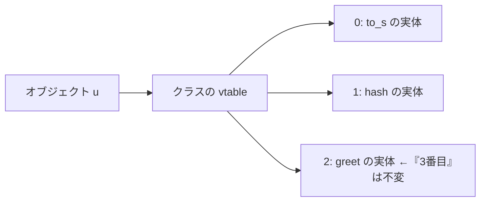

# オブジェクト型：インスタンス変数とメソッド探索

## オブジェクトとは何を持つものか

オブジェクト指向言語のオブジェクトは、おおよそ二つのものを束ねた存在です。

- **状態**：そのオブジェクト固有のデータ。**インスタンス変数**
  （instance variable、Ruby なら `@name` や `@age`）として保持されます。
- **振る舞い**：そのオブジェクトに対して呼べる**メソッド**。

```ruby
class User
  def initialize(name, age)
    @name = name   # インスタンス変数
    @age  = age
  end
  def greet = "Hi, I'm #{@name}"   # メソッド
end

u = User.new("Alice", 30)
p u.greet   # => "Hi, I'm Alice"
```

処理系はこの `u` というオブジェクトを、メモリ上でどう表現すればよいでしょうか。
「インスタンス変数の集まり」と「メソッドの集まり」を、それぞれどう持つか。
この二つの問いが、本章の主題です。素朴な答えと、実用処理系が使う賢い答えを
順に見ていきます。

## 基準点：静的型付け言語のオブジェクト

まず、答えが最も簡単な場合から始めます。C++ や Java のような静的型付け
言語では、クラス定義からインスタンス変数の顔ぶれが**コンパイル時に
確定**します。だからオブジェクトは C の構造体と同じく、**各変数を固定
オフセットに並べたメモリ块**にできます。`u.age` は「`u` の先頭から
16 バイト目を読む」という機械語 1 命令です。

メソッド呼び出しはどうでしょう。`u.greet()` の `greet` がどの実装を
指すかが実行時のクラスで変わる（**動的ディスパッチ**、dynamic dispatch）
場合、C++ や Java はクラスごとに**仮想関数表**（virtual method table、
**vtable**）を持ちます。メソッドごとに表の中の**位置が固定**されている
のが急所です。`greet` が「表の 3 番目」だとコンパイル時に決まるので、
呼び出しは「オブジェクト → クラスの vtable → 3 番目を読んで跳ぶ」の
わずか数命令で済みます [](#cite:driesen1996)。



つまり静的型付け言語では、変数アクセスもメソッド探索も「**名前 →
番号**」の解決がコンパイル時に完了しています（シンボルテーブルの章の
原則どおりです）。本章の残りは、この解決が実行時まで持ち越される
動的型付け言語が、いかにして静的言語並みの速度に迫るかという物語です。

> [!NOTE]
> vtable にも限界があります。位置の固定は「単一継承の鎖」でしか
> 成立しません。Java の**インタフェース**は任意のクラスに混ざるため
> 位置を固定できず、`invokeinterface` は表の探索を伴います
> [](#cite:lindholm2014)。Go のインタフェースは、「型×インタフェース」の
> 組み合わせごとにメソッド表（**itab**）を実行時に構築してキャッシュ
> する方式で、インタフェース値は `(itab, データ)` の 2 ワードです。
> 多重の軸が入った瞬間、静的言語ですら表の設計に苦心するのです。

## 素朴な実装：オブジェクトはハッシュ

動的型付け言語に戻ります。最も単純な実装は、オブジェクトを**ハッシュ**
そのものにすることです。インスタンス変数の名前をキー、その値をバリューに
します。JavaScript のオブジェクトは、意味的にはまさにこのモデル
（プロパティ名から値への辞書）ですし、Python のオブジェクトも素朴には
属性辞書 `__dict__` を持ちます。

```ruby
# 概念図：オブジェクトをハッシュで表す
u = { "name" => "Alice", "age" => 30 }
p u["name"]   # => "Alice"
```

この実装は柔軟です。後からいくらでも変数を足せますし、実装も簡単です。
ところが重大な弱点があります。**遅く、メモリを食う**のです。
インスタンス変数を一つ読むたびにハッシュ計算と衝突処理が走り、しかも
同じクラスのオブジェクトが何百万個あれば、その全部が「`"name"`、`"age"`」
という**同じキー文字列**を各自のハッシュ表に重複して抱えることになります。

> [!NOTE]
> 考えてみると、同じクラスから作ったオブジェクトは**みな同じ顔ぶれの
> インスタンス変数**を持ちます。`User` のインスタンスはどれも `@name` と
> `@age` を持つ。だったら「どの変数がどこにあるか」という**地図**は
> オブジェクトごとに持たず、**みんなで一枚を共有**すればよいはずです。
> この発想が、次節の核心です。

## 賢い実装：形（シェイプ）を共有する

そこで実用の処理系は、オブジェクトの状態を**二つに分離**します。

1. **値だけを詰めた配列**：各オブジェクトは、インスタンス変数の**値**だけを
   配列に順番に並べて持ちます。`["Alice", 30]` のように、名前は持ちません。
2. **形の情報**：「`@name` は 0 番目、`@age` は 1 番目」という**変数名から
   配列位置への対応表**。これを同じ形のオブジェクトすべてで共有します。

この「形の情報」は、処理系によって**マップ**（map）、**隠しクラス**
（hidden class）、**シェイプ**（shape、形）などと呼ばれます。発明は
プロトタイプベース言語 SELF の実装にさかのぼり、Chambers らが「同じ構造の
オブジェクトでマップを共有する」手法を確立しました [](#cite:chambers1989)。
V8 をはじめとする JavaScript エンジンの隠しクラスはこの直系で、
Ruby 3.2 も **Object Shapes** という名でこの仕組みを取り入れています
[](#cite:seaton2021)[](#cite:issroff2022)。

```mermaid
graph TD
    subgraph オブジェクトたち（値だけ持つ）
      O1["u1: ['Alice', 30]"]
      O2["u2: ['Bob', 25]"]
    end
    subgraph 共有される形（シェイプ）
      S["@name → 0<br/>@age → 1"]
    end
    O1 -.参照.-> S
    O2 -.参照.-> S
```

こうすると、`u.age` の読み出しは「シェイプを見て `@age` が 1 番目と分かり、
値の配列の 1 番目を取る」だけになります。配列の添字アクセスは O(1) で、
ハッシュ計算も文字列比較も要りません。しかもキー名はシェイプに一度だけ
置けばよく、何百万個のオブジェクトがあっても名前は重複しません。
**速さ**と**省メモリ**を同時に得られるわけです。動的言語のオブジェクトが、
静的言語の「固定オフセットの構造体」に実行時に漸近していく、と
見ることもできます。

興味深いことに、Python も同じ問題に部分的な解を二つ持っています。
一つは `__slots__`：クラスに変数名を宣言すると `__dict__` が消え、
値は固定オフセットに置かれます（いわば**手動シェイプ**です）。もう一つは
**キー共有辞書**（key-sharing dict）[](#cite:pep412)：同じクラスの
インスタンスの `__dict__` 同士で「キーとハッシュ値の表」を共有し、
各インスタンスは値の配列だけを持ちます。ハッシュの章で見たコンパクト
辞書の「索引＋エントリ」分解が、ここでシェイプとほぼ同じものに
合流しているのです。

## 形は変わる：シェイプの遷移

インスタンス変数は、`initialize` の中で順々に代入されます。すると
オブジェクトの「形」は、変数が増えるたびに**変化**していきます。処理系は
この変化を、シェイプからシェイプへの**遷移**（transition）として記録します。

```ruby
class User
  def initialize(name, age)
    @name = name   # ここでオブジェクトは「@name だけの形」になる
    @age  = age    # ここで「@name と @age を持つ形」へ遷移する
  end
end
```

「変数を持たない形」から「`@name` を足した形」へ、さらに「`@age` を足した形」へ。
この遷移の連なりを処理系は木として覚えておき、**同じ順序で同じ変数を足した
オブジェクトは、まったく同じ最終シェイプにたどり着く**ようにします。だから
`User` のインスタンスはみな一枚のシェイプを共有できるのです
[](#cite:seaton2021)。

> [!TIP]
> この仕組みには、利用者向けの教訓があります。**インスタンス変数は
> いつも同じ順序で初期化する**ほうが、処理系がシェイプを共有しやすく、
> 速くなります。条件によって設定する変数が変わると、オブジェクトごとに
> 別々のシェイプができてしまい（シェイプの分岐）、最適化が効きにくく
> なります。`initialize` で全インスタンス変数を必ず初期化するのが
> 良い習慣とされるのは、この理由もあります [](#cite:issroff2022)。
> JavaScript でも「コンストラクタの外でプロパティを足すな」と
> 言われるのは同じ事情です。

シェイプと遷移は、ここまでの説明をそのまま写すだけで実装できます。

```ruby
# シェイプ遷移の最小実装
class Shape
  def initialize(parent = nil, name = nil)
    @fields = parent ? parent.fields.merge(name => parent.fields.size) : {}
    @transitions = {}    # 変数名 => 遷移先シェイプ（ここが共有の要）
  end
  attr_reader :fields

  def index_of(name) = @fields[name]

  def transition(name)             # 「name を足した形」へ
    @transitions[name] ||= Shape.new(self, name)   # 同じ遷移は一度だけ作る
  end
end

ROOT_SHAPE = Shape.new             # 「変数を持たない形」（木の根）

class ShapedObject
  def initialize = (@shape = ROOT_SHAPE; @values = [])

  def set_ivar(name, value)
    unless (i = @shape.index_of(name))
      @shape = @shape.transition(name)   # 未知の変数 → 形が遷移する
      i = @shape.index_of(name)
    end
    @values[i] = value             # 値は名前なしの配列に置くだけ
  end

  def get_ivar(name)
    (i = @shape.index_of(name)) && @values[i]
  end
  attr_reader :shape
end

u1 = ShapedObject.new
u1.set_ivar(:@name, "Alice"); u1.set_ivar(:@age, 30)
u2 = ShapedObject.new
u2.set_ivar(:@name, "Bob");   u2.set_ivar(:@age, 25)

p u1.shape.equal?(u2.shape)   # => true  同じ順で足したので同じ形を共有
p u1.get_ivar(:@age)          # => 30    実体は @values[1] の配列アクセス
```

`@transitions` のキャッシュ（`||=`）が共有のすべてです。これを
外すと、オブジェクトごとに別のシェイプができてしまい、メモリも
インラインキャッシュ（次節）も台無しになります。逆に、変数を
足す**順序**が違うオブジェクトは `transition` の経路が分かれ、
別のシェイプに育つ —— 先の TIP の「いつも同じ順序で初期化せよ」が、
この 1 行から導かれることも確かめられます。

## メソッドはどこにある：メソッド探索

状態（インスタンス変数）の次は、振る舞い（メソッド）です。`u.greet` を
呼ぶとき、処理系は「`greet` というメソッドの実体はどこか」を探します。
これを**メソッド探索**（method lookup／dispatch）と呼びます。

メソッドはオブジェクトごとではなく**クラス**に属します。そして探索は、
そのクラスから親クラスへとさかのぼる**継承の鎖**をたどります。Ruby なら
`User` → `Object` → `BasicObject` という順です。各クラスは自分のメソッドを
（名前 → メソッド実体の）ハッシュ表 ——**メソッドテーブル**として持って
います。

```ruby
# 概念図：継承の鎖をたどってメソッドを探す
def find_method(klass, name)
  while klass
    table = klass.method_table     # クラスごとのメソッド表
    return table[name] if table.key?(name)
    klass = klass.superclass       # 見つからなければ親へ
  end
  raise NoMethodError, name
end
```

単純な一本道に見えますが、現実の言語はここに豊かな（厄介な）構造を
持ち込みます。

- **Ruby のモジュール**：`include M` すると、CRuby は M のメソッド表を
  共有する**プロキシ用の内部クラス**（T_ICLASS）を作り、継承の鎖の
  途中に挿し込みます。鎖という一次元の構造を保ったまま多重の混入を
  実現する、データ構造上の発明です（`prepend` は鎖の手前側への挿入）。
  また、特定の 1 オブジェクトだけにメソッドを生やす**特異メソッド**の
  ためには、そのオブジェクト専用の**特異クラス**を作って鎖の先頭に
  挿します。「鎖への挿入」一つで多くの言語機能が説明できるのです。
- **Python の多重継承**：親が複数あると「どの順で探すか」自体が
  問題になります。Python は **C3 線形化**というアルゴリズム
  [](#cite:barrett1996) で、菱形継承（同じ祖先に二経路で届く形）でも
  一貫した**メソッド解決順序**（MRO）を計算し、クラスに配列として
  キャッシュします。探索は結局「配列を順に見る」に戻るわけです。
- **JavaScript**：クラスではなく**プロトタイプチェーン**（オブジェクト
  自身が「探索を委譲する先のオブジェクト」を指す鎖）をたどります。
  オブジェクトの鎖とクラスの鎖という違いはあれど、「自分になければ
  親を見る」構造はシンボルテーブルのスコープチェーンと同型です。

> [!NOTE]
> Ruby には、メソッドとは**別の探索規則**を持つ名前がもう一種類
> あります。定数（`Foo::Bar` の類）です。定数の探索は**二軸**で、
> まず**レキシカルスコープ**（その参照が書かれた場所を囲む
> `module`/`class` の入れ子。CRuby 内部では cref と呼ばれる連結
> リスト）を内から外へたどり、見つからなければ次に**継承の鎖**を
> たどります。同じ `FOO` という参照でも「どこに書かれたか」で
> 結果が変わるのはこのためです。シンボルテーブルの章のスコープ
> チェーン（コンパイル時の構造）が、Ruby では定数のために実行時
> まで生き残っている、と言うこともできます。当然これも遅いので、
> CRuby は呼び出し箇所ごとに**定数用インラインキャッシュ**を持ち、
> かつては「世界のどこかで定数が定義されたら全キャッシュ無効化」
> でしたが、3.2 から定数のパス単位の無効化に細分化されました ——
> 次節以降のキャッシュと無効化の議論の、もう一つの実例です。

この探索は、毎回鎖をたどると遅くなります。`greet` を 100 万回呼べば、
100 万回チェーンをたどることになりかねません。ここでも「ならばキャッシュ
しよう」という発想が効いてきます。

## メソッド探索を速くする：インラインキャッシュ

`u.greet` という**同じ呼び出し箇所**は、たいてい**同じクラスのオブジェクト**に
対して何度も実行されます。ループの中の `u.greet` なら、`u` はいつも `User`
でしょう。だったら一度探索した結果を、その呼び出し箇所のすぐ脇に
覚えておけばよい。これが**インラインキャッシュ**（inline cache）です。
Smalltalk-80 の実装で Deutsch と Schiffman が導入した、息の長い技法です
[](#cite:deutsch1984)。

```ruby
# 概念図：呼び出し箇所ごとに「前回のクラスと結果」を覚える
class CallSite
  def initialize
    @cached_class  = nil
    @cached_method = nil
  end

  def call(receiver, name)
    klass = receiver.class
    if klass == @cached_class          # 前回と同じクラスなら…
      @cached_method                   # 探索を丸ごと省略（キャッシュヒット）
    else
      @cached_class  = klass           # 違えば探索し直してキャッシュ更新
      @cached_method = find_method(klass, name)
    end
  end
end
```

呼び出し箇所に「前回はこのクラスで、メソッドはこれだった」と書き留めて
おき、次回も同じクラスなら継承の鎖をたどらずに即答します。`@cached_class`
が前回と一致するかの確認（**ガード**、guard と呼びます）一回で、探索の
全工程を飛ばせるのです。CRuby はバイトコードの呼び出し命令ごとに、
CPython も 3.11 以降は命令列に埋め込んだキャッシュ領域で、同じことを
しています。

ここでシェイプが効いてきます。インスタンス変数アクセスも
メソッド探索も、結局は「このオブジェクトのクラス（やシェイプ）は前回と
同じか？」というガードに帰着します。シェイプが同じなら `@age` は同じ位置に
あり、クラスが同じなら `greet` は同じ実体です。**形を共有しているからこそ、
このキャッシュが成立する**のです。

## キャッシュはいつ腐るか：無効化という裏面

キャッシュには、教科書があまり語らない裏面があります。**無効化**
（invalidation）です。動的言語ではメソッドを実行中に再定義できます
（モンキーパッチ）。その瞬間、世界中の呼び出し箇所に散らばった
キャッシュが**全部嘘になる**のです。

素朴で確実な対策は、**世代番号**（serial number）です。メソッド定義が
変わるたびに番号を進め、キャッシュには「番号がこのときの結果」と
記録しておく。ガードで番号も照合すれば、古いキャッシュは自然に
失効します。問題はこの番号の**粒度**です。処理系全体で 1 個の番号にすると、
どこかの誰かが何かを再定義しただけで全キャッシュが失効します（実際
かつての CRuby はグローバルな番号を使っており、一部のライブラリの
読み込みが全体を遅くする問題がありました。現在はクラス単位などへ
細分化されています）。CPython も型オブジェクトごとに version tag を
持ち、3.11 の高速化はこれを土台にしています。

**「何を、どの単位で、いつ無効化するか」はキャッシュというデータ構造の
本体と同じくらい重要な設計**です。この問題は、定数のキャッシュ、JIT
コンパイルしたコードの無効化（脱最適化）まで、処理系のあらゆる階層で
繰り返されます。

## 軸を増やす：多重ディスパッチ

ここまでのメソッド探索は、**レシーバ一つの型**で実装を選んで
いました（単一ディスパッチ）。しかし `衝突(円, 四角)` のように、
**複数の引数の型の組み合わせ**で実装を選びたい場面があります。
これを言語機能にしたのが**多重ディスパッチ**（multiple dispatch）で、
古くは CLOS（Common Lisp Object System）の総称関数、現代では
**Julia** が言語の中核に据えています [](#cite:bezanson2017)。

データ構造の挑戦は、探索のキーが「クラス 1 個」から「**型のタプル**」に
変わることです。Julia の総称関数は、定義された全メソッドを
**シグネチャ（型タプル）の表**として持ち、呼び出し時には引数の
型タプルに対して「適用可能なシグネチャのうち最も特定的なもの」を
選びます。型には部分型関係（`Int <: Number`）があるので、これは
単なる表引きではなく**半順序の中の最小元探索**で、曖昧（どちらが
特定的とも言えない二つの候補が残る）ならエラーです。

まともにやれば高価なこの探索を、Julia は二段のキャッシュで日常から
追放しています。第一に、呼び出し箇所と型タプルごとの**ディスパッチ
キャッシュ**（本章のインラインキャッシュの型タプル版）。第二に、
JIT の章の言葉で言えば究極の投機 —— 型タプルごとにメソッド本体を
**まるごと特殊化コンパイル**してキャッシュします（`f(Int, Float64)`
版、`f(Int, Int)` 版…）。単相化（値の表現の章）を実行時に行って
いるわけで、メソッドの組み合わせ爆発と引き換えに、数値計算で
C 並みの速度を出します。CLOS の実装が 1980 年代に開発した
effective method のキャッシュ戦略が、型推論と JIT を得て開花した
姿と言えます。

> [!NOTE]
> 「新しいメソッド定義が、すでにコンパイル済みの特殊化を無効に
> する」問題も型タプルの世界では深刻になります。Julia は「この
> 特殊化はどのメソッド表の状態に依存したか」を world age という
> 世代番号で管理します —— 本章で見た無効化の設計が、多重
> ディスパッチでは言語の意味論（いつ再定義が見えるか）にまで
> 昇格している例です。

## 多態に対応する：ポリモーフィックインラインキャッシュ

呼び出し箇所がいつも一種類のクラスとは限りません。`shape.area` のような
呼び出しが、あるときは `Circle`、あるときは `Square` を相手にすることも
あります（これを**多態**、polymorphism と呼びます）。単純なインライン
キャッシュは前回の一件しか覚えないので、相手が毎回入れ替わると
キャッシュが無駄になり、毎回探索し直す羽目になります。

そこで、**呼び出し箇所に複数のクラスと結果を覚えておく**拡張が考えられ
ました。これを**ポリモーフィックインラインキャッシュ**（Polymorphic
Inline Cache、略して **PIC**）と呼びます。Hölzle らが SELF 向けに提案した
技法です [](#cite:holzle1991)。

```ruby
# 概念図：複数のクラスと結果を覚えておく（PIC）
class PolymorphicCallSite
  def initialize = @entries = {}   # クラス => メソッド実体

  def call(receiver, name)
    klass = receiver.class
    @entries[klass] ||= find_method(klass, name)  # 未知のクラスだけ探索
  end
end
```

`Circle` でも `Square` でも、一度探索すればそのクラスぶんの結果が貯まり、
以後は探索なしで答えられます。実装では覚える件数を数件（典型的には
4〜8）に制限し、それを超えて多種多様なクラスが来る呼び出し箇所
（**メガモーフィック**な箇所と呼びます）は、あきらめて共有の大きな
キャッシュ表や毎回探索に切り替えます。

さらに、PIC に貯まった「この箇所にはこの数種類のクラスが来る」という
情報は、後段の最適化コンパイラ（JIT）にとって貴重なヒントになります。
よく来るクラスのメソッドを呼び出し箇所へ**直接埋め込む**（インライン
展開する）ことで、メソッド呼び出しそのものを消し去れるからです
[](#cite:holzle1991)。「実行を観測するデータ構造」が「最適化の判断材料」に
化ける —— 現代の JIT（V8、JVM、YJIT）の根幹は、SELF の時代のこの発見の
延長線上にあります。

> [!IMPORTANT]
> シェイプとインラインキャッシュは、現代の動的言語処理系の
> 高速化を支える二本柱です。ともに「**同じ構造のものは繰り返し現れる**」
> という経験則に賭けたデータ構造の工夫であり、その賭けが当たるからこそ、
> Ruby や JavaScript のような動的言語が実用的な速度で動くのです。

オブジェクトの実装は、これまでの章で学んだ部品 —— 構造体と vtable
（静的な極）、ハッシュ（動的な極）、シェイプという形の共有、配列への
値の格納、そしてキャッシュとその無効化 —— の総合芸術でした。
次の章では、オブジェクトと双対の関係にある、もう一つの「振る舞いを
束ねた値」—— **クロージャ**を解剖します。
