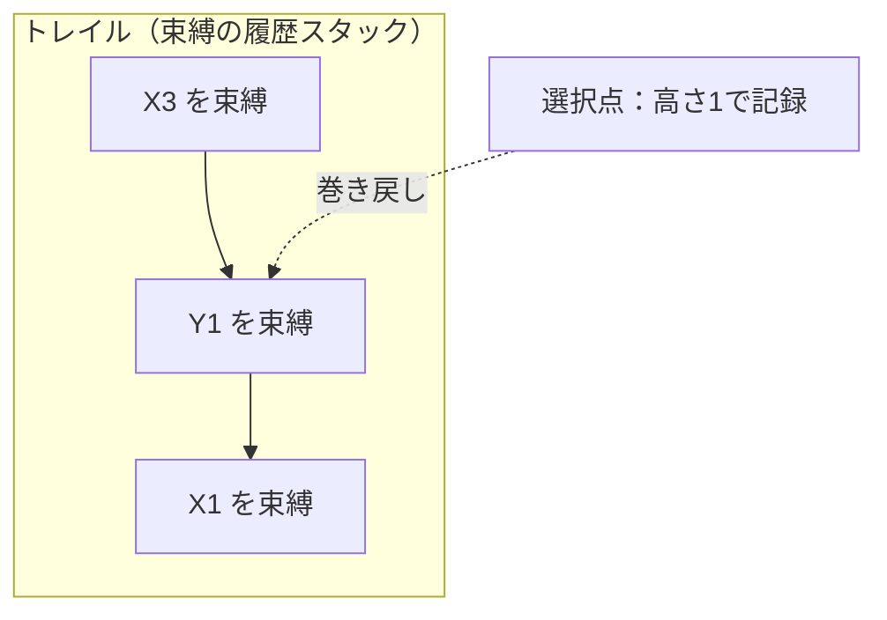

# 単一化とバックトラックの機械

## 変数は「箱」ではない

論理型言語 Prolog の変数は、命令型言語の「値を入れる箱」では
ありません。**論理変数**（logic variable）、つまり「まだ何者でもないが、
いずれ何かと等しくなる」存在です。プログラムは「事実」と「規則」の
集まりで、実行とは問い合わせを満たす変数の値を探索することです。

```prolog
parent(tom, bob).            % 事実：tom は bob の親
parent(bob, ann).
grandparent(X, Z) :- parent(X, Y), parent(Y, Z).   % 規則

?- grandparent(tom, Who).    % 問い：tom の孫は？
Who = ann.
```

この実行モデルを支えるデータ構造が、本章の主役である**単一化**
（unification）の項表現と、**トレイル**（trail）です。どちらも
主流言語の内部に転生している重要な構造です。

## 項の表現と自分を指すセル

Prolog のデータはすべて**項**（term）です。定数（`tom`）、変数
（`X`）、複合項（`point(1, 2)` のような関手＋引数）。実装では、
複合項は「関手名・引数の数・引数たち」を並べたレコード、つまり
[構文木の章](syntax-tree.md)で見たノードと同じものです（[識別子の章](identifier.md)で見たとおり、
関手名はインターンされたアトムです）。

特徴的なのは**変数の表現**です。未束縛の変数は、慣習的に
**自分自身を指すセル**として表します。

```ruby
# 概念図：論理変数。未束縛なら自分を指し、束縛されたら相手を指す
class LogicVar
  def initialize = @ref = self          # 最初は自分を指す＝未束縛

  def bound? = !@ref.equal?(self)
  def bind(term) = @ref = term
  def unbind = @ref = self              # 巻き戻し用（後述のトレイルが使う）

  def deref                              # ポインタの鎖を末端までたどる
    v = self
    v = v.instance_variable_get(:@ref) while v.is_a?(LogicVar) && v.bound?
    v
  end
end
```

変数を束縛するとは「自分以外を指すようにポインタを書き換える」こと、
変数の中身を見るとは「ポインタの鎖を末端まで**たどる**（dereference）」
ことです。変数が変数に束縛されることもあるので、鎖は何段にも
なりえます。

## 双方向のパターンマッチ

**単一化**は「二つの項を等しくできるか？ できるなら変数をどう
束縛すればよいか？」を求める操作です。

```prolog
?- point(X, 2) = point(1, Y).
X = 1, Y = 2.                  % 両側の変数が「同時に」決まる
```

代入でもパターンマッチでもなく、双方向であることに注意して
ください。左右どちらの変数も束縛されえます。アルゴリズムは再帰的で
単純です。

1. 両方をたどって（deref）末端を見る
2. どちらかが未束縛変数なら、相手に束縛して成功
3. 両方とも定数なら、同じなら成功
4. 両方とも複合項なら、関手と引数の数が同じことを確認し、
   引数同士を順に単一化

```ruby
Compound = Struct.new(:functor, :args)   # 複合項 point(1, 2) など

def bind!(var, term, trail)
  var.bind(term)
  trail << var          # あとで取り消せるよう足跡を残す（次節）
  true
end

def walk(t) = t.is_a?(LogicVar) ? t.deref : t   # 変数だけ鎖をたどる

def unify(a, b, trail)
  a, b = walk(a), walk(b)
  return true if a.equal?(b)
  return bind!(a, b, trail) if a.is_a?(LogicVar)   # 変数なら束縛
  return bind!(b, a, trail) if b.is_a?(LogicVar)
  return a == b unless a.is_a?(Compound) && b.is_a?(Compound)
  a.functor == b.functor && a.args.size == b.args.size &&
    a.args.zip(b.args).all? { |x, y| unify(x, y, trail) }
end

x, y = LogicVar.new, LogicVar.new
trail = []
p unify(Compound.new(:point, [x, 2]), Compound.new(:point, [1, y]), trail)
p [x.deref, y.deref]   # => [1, 2]  両側の変数が同時に決まった
```

> [!NOTE]
> 教科書的な単一化には**出現検査**（occurs check、「X を X 自身を
> 含む項と単一化しようとしていないか」の検査）が含まれますが、
> 検査は高くつくため、ほとんどの Prolog 処理系は**既定では省略**
> します。その結果、循環した項（自分を含む木！）が作れてしまい
> ます。正しさと速さの古典的なトレードオフです。

単一化は Prolog の専売特許ではありません。静的型付け言語の型推論
（Hindley-Milner 型システム。OCaml や Haskell が `let f x = x + 1` の
型を宣言なしで決められる仕組み）の中核は、**型を項とみなした単一化**
です。「`'a -> 'a` と `int -> 'b` を単一化して `'a = int, 'b = int`」。
型変数は論理変数そのものであり、型推論器の内部には本章の
deref の鎖が実際に住んでいます。

## トレイルと取り消せる代入

`grandparent(tom, Who)` の探索では、規則や事実の候補を順に試します。
途中まで単一化が進んでから失敗したら、別の候補をやり直します。
[正規表現の章](regexp.md)で見たバックトラックです（歴史的には Prolog のほうが
先輩です）。

ここで問題が生じます。やり直すためには、失敗した試行で行った
変数束縛を、すべて元に戻さなければなりません。どの変数を束縛した
かを覚えておく構造が**トレイル**（trail、足跡）です。

- 変数を束縛するたびに、その変数をトレイル（スタック）に積む
- 選択肢の分かれ目（**選択点**、choice point）では、そのときの
  トレイルの高さを記録しておく
- バックトラック時は、トレイルを記録した高さまで巻き戻しながら、
  積まれていた変数を未束縛（自分指し）に戻す



巻き戻しまで含めた探索は、こう動きます。

```ruby
# 選択点とトレイル：失敗したら束縛を巻き戻して次の候補を試す
x = LogicVar.new
goal = Compound.new(:color, [x])
candidates = [Compound.new(:color, [:red]),
              Compound.new(:color, [:green])]

trail = []
found = nil
candidates.each do |head|
  mark = trail.size                        # 選択点：足跡の高さを記録
  if unify(goal, head, trail) && x.deref == :green  # 追加条件で失敗させる
    found = x.deref
    break
  end
  trail.pop.unbind while trail.size > mark # ★ 失敗：mark まで巻き戻す
end
p found      # => :green   red への束縛は取り消されてから green を試した
```

1 候補目で `x` はいったん `:red` に束縛されますが、続く条件で失敗し、
トレイルの巻き戻しで**未束縛に戻ってから** 2 候補目に進みます。
この `mark` までの巻き戻しが、Prolog の別解探索（`;`）や正規表現の
バックトラックの一回ぶんに相当します。

つまり Prolog 処理系は、**「取り消し可能な代入」をデータ構造として
実装している**のです。[スタックとフレームの章](frames.md)で見た「実行状態の保存と
復元」の、変数束縛版と言えます。データベースのトランザクションの
undo ログ、エディタの undo スタックと同じ発想が、言語の評価器の
心臓部に置かれています。Prolog の最大の見どころです。

## 論理をバイトコードにする WAM

初期の Prolog はインタプリタでしたが、Warren が 1983 年に設計した
**WAM**（Warren Abstract Machine）[](#cite:warren1983) は、Prolog
プログラムを専用の抽象機械の命令列にコンパイルする道を開きました。
[構文木の章](syntax-tree.md)の「言語専用の仮想機械を設計する」方法論の、最も美しい
成果の一つです。

WAM の命令は `get_structure point/2, A1`（引数レジスタ 1 を
`point/2` と単一化せよ）のように、単一化の手順そのものを命令に
分解したものです。さらに実用処理系は**第一引数インデックス**
（first-argument indexing）という最適化を持ちます。同名の規則が
100 個あっても、第一引数の関手や定数でハッシュ表を引いて候補を
数個に絞るのです。論理型言語の探索の足元にも、やはり[ハッシュの章](hashes.md)の
表が敷かれています。

## プログラム自体がデータベース

Prolog では、実行中に `assert`/`retract` で事実や規則を追加・削除
できます。プログラムとは「節（clause）のデータベース」であり、
実行中に書き換わる可変のデータ構造なのです。[オブジェクトの章](objects.md)で見た
「メソッド再定義によるキャッシュ無効化」と同じ問題（実行中の述語の
節集合が変わったらどうするか）を、Prolog は ISO 標準の「論理的
更新ビュー」（実行開始時点のスナップショットを見続ける）という
規則で解決しています。**コードの集合をスナップショット意味論付きの
データベースとして扱う**わけで、[並行処理の章](concurrency.md)で見た「不変スナップ
ショット＋差し替え」の先駆です。

## 系譜と教訓

- **論理変数と単一化**は、型推論（HM）、制約ソルバ、Datalog
  （データベース問い合わせ・静的解析エンジン）、miniKanren
  （Clojure などに埋め込まれる関係プログラミング）へ
- **トレイルによる取り消し可能な状態**は、SAT ソルバや制約充足の
  バックトラック探索、STM（ソフトウェアトランザクショナルメモリ）の
  undo ログへ
- **節データベースと第一引数インデックス**は、ルールエンジンや
  パターンマッチのコンパイル（[構文木の章](syntax-tree.md)の決定木）へ

「変数とは何か」「代入とは何か」を問い直した言語の答えが、
これだけ広く主流の道具に染み込んでいます。次の章では、「オブジェクト
とは何か」を問い直した言語、Smalltalk を訪ねます。
