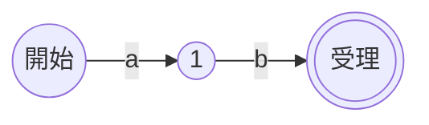

# 特殊な型：時間と正規表現

最終章では、これまでの汎用的なコレクションとは毛色の違う、個性的な
二つの型を取り上げます。一見ありふれた**時間型**と、内部に小さな機械を
宿す**正規表現型**です。どちらも「素朴に作ると破綻する」点で、データ構造の
設計の面白さがよく表れています。

## 時間型：時刻を一本の数直線で表す

「現在時刻」や「日付」を扱う時間型は、多くの言語に備わっています。
これをどう表現すればよいでしょうか。素朴には「年・月・日・時・分・秒」を
それぞれフィールドに持つ構造体を思いつきます。しかしこの表現は、計算が
ひどく面倒です。「3 日後」を求めるのに月またぎや月末の日数（28〜31 日）、
うるう年を場合分けしなければなりません。

そこで多くの処理系は、時刻を**ある基準時点からの経過時間**、すなわち
**一本の数**として表します。広く使われる基準は「**1970 年 1 月 1 日
0 時 0 分 0 秒（協定世界時）**」で、ここからの経過秒数を **Unix 時刻**
（Unix time、エポック秒）と呼びます。

```ruby
require 'time'
t = Time.now
p t.to_i           # => 経過秒数（例: 1717804800）
p (t + 3 * 86400)  # => 3日後（86400 = 1日の秒数を足すだけ）
```

時刻を一本の整数（または小数）にしてしまえば、時刻の差は引き算、
未来・過去の計算は足し算・引き算で済みます。「3 日後」は
`86400 × 3` 秒を足すだけ。月またぎもうるう年も、内部表現の上では
意識する必要がありません。**複雑な構造を単純な数に押し込めることで、
計算を簡単にする**——これが時間型の基本戦略です。

> [!CAUTION]
> 経過秒数を表す整数の桁が足りないと、ある時点で桁あふれ（オーバーフロー）
> して時刻が壊れます。32 ビット符号付き整数で秒を数えるシステムは、
> 2038 年 1 月に表現範囲を超えてしまう **2038 年問題**を抱えます。
> 現代の処理系は 64 ビット整数を使うため、当面この心配はありません。
> 第4章で見た「整数の表現範囲」が、時間型の寿命を直接左右するのです。

ただし、「人間に見せる時刻」は数直線だけでは足りません。同じ Unix 時刻でも、
東京では朝、ロンドンでは真夜中です。そこで時間型は、内部の経過秒数とは別に
**タイムゾーン**（時間帯）の情報を持ち、表示のときだけ「年月日時分秒」へ
変換します。**内部は基準からの数、表示は人間向けの暦**という二層構造に
なっているのです。うるう秒や夏時間といった現実の暦の複雑さも、この
変換層が引き受けます。

## 正規表現型：型の中に機械を持つ

最後に、本書で最も変わった型を紹介します。**正規表現**（regular
expression）です。`/\d+/`（1 文字以上の数字）のようなパターンで文字列を
検索・照合する道具で、ほぼすべての言語に組み込まれています。

```ruby
p "order-42" =~ /\d+/        # => 6   （数字が 6 文字目から始まる）
p "2026-06-08".scan(/\d+/)   # => ["2026", "06", "08"]
```

正規表現が特殊なのは、`/\d+/` という**パターンそれ自体が小さなプログラム**
だという点です。処理系は正規表現を、ただの文字列としてではなく、
**文字列を照合するための小さな機械**へとコンパイルします。これは第1章で見た
「ソースコードを実行可能な形に変換する」という処理系の営みの、ミニチュア版
なのです。

その「機械」の正体が**有限オートマトン**（finite automaton、有限状態機械)
です。有限オートマトンは、いくつかの**状態**と、入力の文字に応じて状態から
状態へ移る**遷移**からなります。たとえば「`ab` で始まる」を照合する機械は、
こう描けます。



開始状態から `a` を読むと状態 1 へ、続けて `b` を読むと**受理状態**
（マッチ成功を表す状態）へ進みます。文字列を 1 文字ずつ読みながら状態を
移していき、受理状態に到達できればマッチ、というわけです。

## 二種類のオートマトンと、組み立てかた

オートマトンには二系統あります。

- **NFA**（非決定性有限オートマトン）：ある状態から、同じ文字で複数の
  遷移先がありうる、あるいは文字を読まずに移れる遷移を持つもの。
  「非決定性」とは「次にどこへ行くか一通りに決まらない」という意味です。
- **DFA**（決定性有限オートマトン）：どの状態でも、ある文字に対する
  遷移先がちょうど一つに決まるもの。

正規表現を機械に変換する古典的な方法が、Thompson による **NFA の構成法**
です [](#cite:thompson1968)。連接・選択（`|`）・繰り返し（`*`）といった
正規表現の各部品を、それぞれ対応する小さな NFA の部品に変換し、それらを
**つなぎ合わせて**一つの NFA を組み立てます。第3章の構文木で見た
「部品から再帰的に全体を組む」考え方と同じ構図です。

```ruby
# Thompson 構成法のイメージ：状態と遷移を表すノードをつなぐ
State = Struct.new(:transitions, :accepting)  # transitions: 文字 => 次状態

# a を 1 文字読む最小の NFA を作る
def literal_nfa(char)
  accept = State.new({}, true)
  start  = State.new({ char => accept }, false)
  [start, accept]   # 開始状態と受理状態の組を返す
end
```

NFA は素直に組み立てられますが、「次にどこへ行くか決まらない」ため、
実行時には**ありうる状態の集合を同時に追いかける**必要があります。
DFA は遷移が一意なので状態を一つ追うだけで速い反面、状態数が爆発しやすい。
そこで実装は、NFA をそのまま並行追跡する方式や、必要になった DFA の状態を
実行中に作る方式（オンザフライの部分集合構成）など、両者を組み合わせます
[](#cite:cox2007)。

## なぜ「正しい」実装が大切か

正規表現の実装には、性能上の落とし穴があります。多くの言語の正規表現
エンジンは、オートマトンではなく**バックトラック**（後戻り）方式を採って
います。これはマッチに失敗するたびに別の可能性を試し直す方式で、`\1` の
ような後方参照など強力な機能を実現できる一方、入力次第で試行回数が
**指数関数的**に爆発することがあります。

```ruby
# 危険な例：a がたくさん並ぶと、バックトラック方式では激遅になりうる
# /(a+)+$/ に "aaaa...aaab" を与えると、組み合わせ爆発で固まる
# （※ 実際に試すときは入力を短くすること）
```

このように、悪意ある入力で正規表現エンジンを停止させる攻撃を
**ReDoS**（Regular expression Denial of Service、正規表現を使った
サービス妨害）と呼びます。Russ Cox は、Thompson のオートマトン方式なら
こうした爆発が起きず、入力長に比例した**線形時間**で照合できることを
あらためて示し、その重要性を広く知らしめました [](#cite:cox2007)。
RE2 や Go・Rust の標準正規表現は、この線形時間を保証する設計を採って
います。

> [!WARNING]
> 外部から来る文字列（ユーザー入力など）に正規表現を適用するときは、
> ReDoS に注意してください。複雑なパターンと長い入力の組み合わせで
> 処理が固まる危険があります。安全性が要るなら、線形時間を保証する
> エンジンを選ぶか、パターンの複雑さを制限するのが定石です。
> 「どのオートマトンで実装されているか」が、そのまま安全性に直結します。

正規表現型は、「型の内部に小さな処理系（パターン → オートマトンの
コンパイラと、それを動かす実行器）が埋め込まれている」という、本書の
締めくくりにふさわしい題材でした。データ構造の選択（NFA か DFA か、
バックトラックかオートマトンか）が、機能・速度・安全性のすべてを
左右することが、ここにも鮮やかに表れています。

## おわりに

本書では、言語処理系を**支える**データ構造（シンボルテーブル、識別子の
管理、構文木）と、言語が**提供する**データ構造（数値、文字列、配列、
ハッシュ、オブジェクト、時間、正規表現）を、実装に踏み込んで眺めてきました。

全体を貫く教訓は、おそらく次の一文に尽きます ——
**「同じデータ構造はひとつではなく、要求に応じて表現を選び、ときに切り替え、
ときにキャッシュする」**。即値とヒープオブジェクト、連続配列とロープ、
可変ハッシュと永続ハッシュ、NFA と DFA。処理系の設計とは、こうした
表現の選択の積み重ねなのです。ここを出発点に、ぜひ実際の処理系の
ソースコードを覗いてみてください。本書で見た構造が、きっと姿を現すはずです。
さらに学ぶための道しるべを、付録にまとめました。
