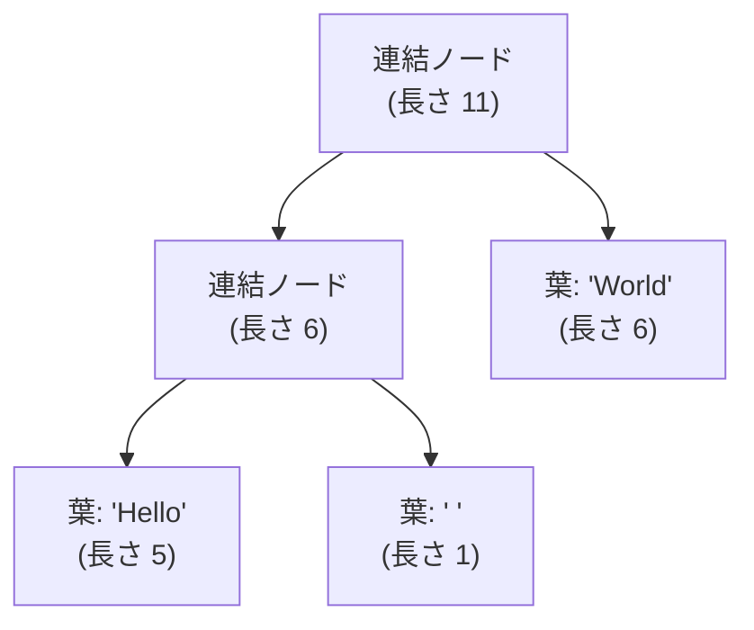

# 文字の列をどう持つか

## 文字列はバイトの列である

文字列は「文字が並んだもの」ですが、コンピュータのメモリには文字そのものは
入りません。入るのは数（バイト）です。したがって文字列は、内部的には
**バイトの配列**として表現されます。最も素朴な実装は、文字コードを並べた
配列に長さを添えたものです。

```ruby
# 概念図：文字列を「バイト配列＋長さ」で表す
class MyString
  def initialize(bytes)
    @bytes  = bytes          # 整数（バイト値）の配列
    @length = bytes.size
  end

  def byte_at(i) = @bytes[i]
  attr_reader :length
end

s = MyString.new("ABC".bytes)   # => [65, 66, 67]
p s.length    # => 3
p s.byte_at(0) # => 65  ('A' の文字コード)
```

C 言語の文字列は、これに「終端を表す `\0` バイトで終わる」という規約を
加えたものです。長さを持たないこの設計は、長さを知るのに O(n) の走査が
要る、途中に `\0` を含められない、終端の書き忘れがセキュリティ脆弱性に
直結する、と三重苦であり、後発の言語はほぼすべて「長さを別に持つ」方式を
選んでいます。Rust の文字列が `(ポインタ, 長さ, 容量)` の三つ組である
ように、現代の文字列の骨格は「バイト列＋長さ」です。この土台を
押さえると、文字列処理の難しさの正体が見えてきます。それは
**「1文字」とは何か**という問いです。

## Unicode と符号化

英語だけなら話は簡単で、1 バイト＝1 文字とみなせます（ASCII）。しかし
世界には数万種類の文字があり、1 バイト（256 通り）にはとても収まりません。
そこで、世界中の文字に通し番号を与える国際標準 **Unicode** が定められて
います [](#cite:unicode2023)。この通し番号を**コードポイント**
（code point）と呼びます。たとえば「あ」は U+3042、「🍣」は U+1F363 です。

問題は、このコードポイントをバイトの列にどう変換するかです。この変換規則を
**文字符号化方式**（character encoding）と呼び、複数の方式があります。
現在最も広く使われるのが **UTF-8** で、1 文字を 1〜4 バイトの
**可変長**で表します。ASCII の範囲（英数字）は 1 バイトのままで、
日本語や絵文字は複数バイトになります。

```ruby
s = "あ"
p s.bytes        # => [227, 129, 130]  UTF-8 では 3 バイト
p s.bytesize     # => 3   バイト数
p s.length       # => 1   文字数（コードポイント数）
```

ここでは**バイト数と文字数が一致しない**。`"あ"` は
3 バイトだけれど 1 文字です。この食い違いが、文字列実装に大きな影響を与えます。

> [!IMPORTANT]
> 「N 文字目を取り出す」操作を考えてみてください。固定長（1文字＝1バイト）
> なら添字計算一発で O(1) です。しかし UTF-8 のような可変長符号化では、
> 先頭から何バイトずつ進むかを数えながら N 文字目まで歩く必要があり、
> 素朴には O(N) かかります。文字列の実装は、この「ランダムアクセスの
> しにくさ」とどう折り合うかが問われます。

## UTF-16 という歴史の地層

Java、JavaScript、C#、Windows API の文字列は、UTF-8 ではなく **UTF-16**
（1 文字を 16 ビット単位 1 個または 2 個で表す方式）を使います。これは
歴史の産物です。Unicode が当初「16 ビットあれば世界中の文字が入る」と
見積もっていた時代（1990 年代前半）に設計された言語たちは、「1 文字＝
16 ビット固定」のつもりで文字列 API を作りました。ところが Unicode は
16 ビットに収まらなくなり、はみ出した文字（絵文字など）は 16 ビット
単位 2 個の組（**サロゲートペア**、surrogate pair）で表すことに
なりました。固定長のはずが可変長になってしまったのです。

その結果、これらの言語の「文字列の長さ」は今日でも **16 ビット単位の
個数**であり、コードポイント数ではありません。

```javascript
// JavaScript での例
"🍣".length        // => 2   （サロゲートペアを 2 と数える！）
[..."🍣"].length   // => 1   （イテレータはコードポイント単位）
```

API の互換性は破れないため、この「長さのずれ」は言語に半永久的に
残ります。**データ構造の初期設計（固定長 16 ビット）が、何十年も
言語の意味論を縛り続ける**実例です。

さらに言えば、コードポイントすら「人間の思う 1 文字」とは限りません。
「が」は「か＋濁点」の 2 コードポイントでも表せ（**正規化**、
normalization の問題）、家族の絵文字「👨‍👩‍👧‍👦」は複数の絵文字を結合子で
つないだ**書記素クラスタ**（grapheme cluster）です。Swift は文字列の
`count` を書記素クラスタ単位で数える、という最も人間寄りの設計を
採りました。その代償として、Swift の文字数カウントは O(n) であり
キャッシュもされません。「1 文字」の定義のレイヤ（バイト／コード
ポイント／書記素）をどこに置くかが、言語ごとの文字列 API の性格を
決めています。

## 三つの言語の内部表現

「可変長符号化はランダムアクセスが遅い」という問題に対し、主要な
処理系は見事に違う解を出しています。

**CPython（PEP 393）**：文字列を作る瞬間に中身を調べ、**その文字列に
必要な最小の固定長**で格納します [](#cite:pep393)。全部 Latin-1 に
収まるなら 1 文字 1 バイト、それ以外で 16 ビットに収まるなら 2 バイト、
絵文字などを含むなら 4 バイト。固定長なので `s[i]` は常に O(1) です。
代償は、日本語文字列に絵文字を 1 個足すと全体が 4 バイト/文字に
膨らむこと、そして文字列生成時に全体を走査して「最大の文字」を
調べる必要があることです。

**Java（JEP 254、コンパクト文字列）**：内部は `byte[]` と 1 バイトの
`coder` フラグで、中身が Latin-1 に収まる文字列は 1 バイト/文字、
それ以外は UTF-16 の 2 バイト/文字で持ちます [](#cite:jep254)。
Java 9 で導入されたこの最適化は、「実世界の文字列の大半は ASCII」と
いう観測に基づき、ヒープ消費を大きく削減しました。

**CRuby**：バイト列を符号化方式の情報付きで持ちます。同じバイト列
でも UTF-8 として解釈するか EUC-JP として解釈するかで意味が変わるため、
文字列オブジェクトごとにエンコーディングを記録するのです（多数の
符号化方式が共存する、日本語圏発の言語らしい設計です）。

```ruby
p "あ".encoding   # => #<Encoding:UTF-8>
```

さらに CRuby は**コードレンジ**（code range）という小さなキャッシュを
フラグに持ちます。「この文字列は 7 ビット ASCII のみ／正当なマルチ
バイト／壊れたバイト列」のいずれかを一度調べたら記録しておくのです。
ASCII のみと分かっていれば、文字数＝バイト数なので `length` は O(1)、
正規表現照合などの内部処理も高速な経路を通れます。**「調べた結果を
フラグに 2 ビットで覚えておく」だけで、可変長符号化の痛みの大半が
消える**。実測に裏打ちされた、低コスト高効率の好例です。

「正当な UTF-8 か」の検査そのものも、現代では立派な研究対象です。
1 バイトずつの状態機械で検査する古典に対し、近年は **SIMD 命令**
（single instruction, multiple data、一つの命令で複数のデータを
まとめて処理する CPU 命令）で数十バイトを一括検査する手法
（simdjson に代表される一連の成果）が
確立し、Rust の標準ライブラリや各種 JSON パーサが採用しています。
「全部 ASCII なら一括で素通し」という高速経路は、コードレンジの
発想の SIMD 版とも言えます。

## 不変性によるコピーの削減

文字列をたくさん作るプログラムでは、文字列のコピーが性能のボトルネックに
なります。`a = b` のたびに中身を丸ごと複製していたら、長い文字列ほど高く
つきます。そこで多くの処理系は、文字列を**不変**（immutable、作った後は
変更できない）に設計します。一度作ったら変わらないと保証できれば、
**実体を安全に共有**できるからです。

JavaScript や Python、Java、Go の文字列は不変です。`s2 = s1` としても
中身はコピーされず、同じ実体を二つの変数が指すだけです。変更操作
（たとえば大文字化）は、元を書き換えるのではなく新しい文字列を作って
返します。不変だからこそ、Java は文字列のハッシュ値を一度計算したら
オブジェクト内にキャッシュできます（中身が変わらないのだから、ハッシュ
値も永遠に有効です）。文字列をハッシュ表のキーに多用する言語にとって、
これは不変性の大きな配当です。

Ruby の文字列は歴史的に**可変**（mutable）ですが、`freeze` で不変にでき、
同じ内容の凍結文字列は処理系が一つにまとめます。これは「識別子の管理」の
章で学んだ**インターン**そのものです。

```ruby
a = "hello".freeze
b = "hello".freeze
p a.equal?(b)   # => true  （凍結文字列は共有される場合がある）

# frozen_string_literal: true を指定すると、リテラルが自動で凍結・共有される
```

> [!TIP]
> 文字列リテラルを多用するプログラムでは、ファイル先頭に
> `# frozen_string_literal: true` と書くと、同じ内容のリテラル文字列が
> 共有され、無駄なオブジェクト生成が減ってメモリと速度が改善します。
> これは「不変だからこそ共有できる」という設計判断を、利用者が選べる
> ようにした例です。

## 部分文字列の共有とその落とし穴

不変文字列の共有をさらに進めると、**部分文字列**（substring）も
コピーせずに済みそうです。「元の文字列のここからここまで」という
**ビュー**（view、実体を指す窓）を返せば、切り出しは O(1) になります。

実際にこの設計を採る言語があります。Go の文字列は `(ポインタ, 長さ)` の
組で、`s[2:5]` は同じバイト列を指す新しい組を作るだけ。Rust の `&str` も
同様のスライス（slice、配列の一部分への参照）です。CRuby も内部的に、
長い文字列の部分文字列を共有で作ることがあります（コピーオンライト、
すなわち書き換えが起きた瞬間にだけ複製する方式と組み合わせます）。

しかし、うまい話には裏があります。**巨大な文字列から 3 文字だけ
切り出してビューを保持し続けると、巨大な元の文字列が丸ごと解放
できなくなる**のです。Java は初期からこの共有方式（substring が O(1)）
でしたが、このメモリ滞留問題が実害を生み、Java 7 の途中でコピー方式に
転換しました（substring は O(n) になったが、滞留は消えた）。
Go は共有方式のまま、必要なら明示的に複製する `strings.Clone` を
提供しています。同じトレードオフに対して、言語によって倒す向きが
逆になっています。どちらが正解ということではなく、**何を既定にし、何を利用者の
注意に委ねるか**という設計の問題です。

## 連結に強い文字列、ロープ

不変文字列には弱点があります。**連結**です。`s1 + s2` で新しい文字列を作ると、
両方の中身を新しい領域へコピーするため O(n) かかります。テキストエディタの
ように巨大な文書の途中に文字を挿入する処理では、毎回全体をコピーしていては
話になりません。

この問題への古典的な答えが**ロープ**（rope）です [](#cite:boehm1995)。
ロープは、文字列を一本の連続した配列として持つのをやめ、**短い文字列の断片を
木構造でつなぐ**表現です。連結は、両者をコピーせず、新しい節点でつなぐ
だけで済みます。



各**葉**（leaf、木の末端）が文字列の断片を持ち、**連結ノード**が
左右の部分木と「左部分木の長さ」を持ちます。この長さの情報のおかげで、
「N 文字目はどこか」を木をたどって O(log n) で求められます。
ロープを使うと、連結、挿入、分割が軒並み O(log n) になり、巨大テキストの
編集が現実的になります。Boehm らは、汎用の文字列としてロープが従来の
連続表現より優れる場面が多いと論じています [](#cite:boehm1995)。

骨格は驚くほど小さく書けます。

```ruby
# 動く最小のロープ
class Rope
  Leaf   = Struct.new(:str)
  Concat = Struct.new(:left, :right, :weight)   # weight = 左部分木の長さ

  def initialize(node) = @node = node
  def self.of(s) = new(Leaf.new(s))
  attr_reader :node

  def length(n = @node)
    n.is_a?(Leaf) ? n.str.length : n.weight + length(n.right)
  end

  def +(other)              # 連結：両者をコピーせず、ノードを 1 個作るだけ
    Rope.new(Concat.new(@node, other.node, length))
  end

  def [](i, n = @node)      # i 文字目：weight を道しるべに木を降りる
    return n.str[i] if n.is_a?(Leaf)
    i < n.weight ? self[i, n.left] : self[i - n.weight, n.right]
  end

  def to_s(n = @node)       # 平坦化（一本の文字列が必要になったら）
    n.is_a?(Leaf) ? n.str : to_s(n.left) + to_s(n.right)
  end
end

r = Rope.of("Hello") + Rope.of(" ") + Rope.of("World")
p r[6]      # => "W"   コピーは一度も起きていない
p r.to_s    # => "Hello World"
```

`+` が O(1)（ノード 1 個の生成）であること、`[]` が weight の比較で
左右どちらかにしか降りないことを確かめてください。実用にはあと二つ、
偏った木を直す**再平衡**（「平衡木」の章）と、短すぎる葉の**結合**が
要りますが、それも木の操作の標準部品です。

そして、私たちはロープを毎日使っています。V8
（JavaScript）は `a + b` の結果をすぐにはコピーせず、**ConsString** と
いう「左と右を指すだけのノード」を返します。まさにロープの連結ノード
です。ループで文字列を継ぎ足していくよくあるコードは、V8 の内部では
木を育てているのであり、連結のたびのコピーは起きません。実体が一列に
必要になった時点（添字アクセスなど）で初めて**平坦化**（flatten、
一本の配列への展開）が走ります。V8 の文字列にはほかにも、部分文字列の
ビューである SlicedString、インターン済み文字列への転送ポインタである
ThinString など多くの内部表現があり、**利用者には一つの String に
見える型が、内部では representation の動物園**になっています。

> [!NOTE]
> ロープは万能ではありません。短い文字列ばかりを単純にアクセスする用途では、
> 木をたどるオーバーヘッドのぶん、連続した配列のほうが速くキャッシュにも
> 優しいです。だから多くの処理系は、ふつうの文字列は連続配列で持ち、
> 連結や巨大テキストの場面でだけロープ的な構造を使う、と使い分けます。

ロープの主戦場であるテキストエディタには、競合する構造が二つあるので
併せて紹介します。**ギャップバッファ**（gap buffer）は、一本の連続
バッファのカーソル位置に空白地帯（ギャップ）を置く構造です。
カーソル位置への挿入や削除はギャップの端を動かすだけで O(1)、
カーソル移動はギャップの引っ越し（移動距離ぶんのコピー）です。
「編集は同じ場所で連続して起きる」という人間の挙動に最適化されて
おり、Emacs が半世紀使い続けています。**ピーステーブル**（piece
table）は、「元ファイル（読み取り専用）」と「追記専用バッファ」の
二本を用意し、文書を「どちらのバッファの、どこから、何文字」という
**断片（ピース）の列**として表します。どんなに編集しても元データは
不変なので、undo 履歴やファイルの遅延読み込みと相性がよく、
VS Code が採用しました（断片の列の管理にはロープ同様の平衡木を
使います）。連続＋隙間（ギャップバッファ）、不変＋断片リスト
（ピーステーブル）、木（ロープ）。同じ「編集できる長大なテキスト」
という問題への三つの解です。

ここまでに登場した表現を、操作ごとの計算量で見比べておきましょう
（n は文字列長、m は相手や結果の長さ。「文字目」はバイト単位の
話で、UTF-8 のコードポイント単位なら可変長のぶん別途コストが
かかるのは本章前半のとおりです）。

| 表現 | i 文字目 | 連結 | 末尾追記 | 中間挿入・削除 | 部分文字列 |
|---|---|---|---|---|---|
| 可変な連続配列（Ruby String、ビルダ） | O(1) | O(n+m) | ならし O(1) | O(n) | O(m) コピー |
| 不変な連続配列＋共有ビュー（Go、旧 Java） | O(1) | O(n+m) | O(n)（毎回新規） | なし（作り直し） | **O(1)** 共有（滞留リスク） |
| ロープ（V8 ConsString） | O(log n) | **O(1)〜O(log n)** | O(log n) | O(log n) | O(log n) ビュー |
| ギャップバッファ（Emacs） | O(1) | O(n+m) | ならし O(1) | **カーソル位置なら O(1)**（移動は距離分） | O(m) コピー |
| ピーステーブル（VS Code） | O(log p)※ | なし | O(1)（追記バッファ） | O(log p) | O(log p) ビュー |

※ p はピース（断片）数。ピース列を平衡木で管理した場合です。

全部に強い表現は存在しません。ランダムアクセスと走査（キャッシュ
効率）は連続配列の独壇場、連結と巨大テキストの編集は木構造側の
独壇場で、**どの操作を犠牲にするか**の選択が表の形にそのまま
現れています。多くの処理系が「ふだんは連続配列、連結が続いたら
ロープ、エディタはまた別」と使い分けるのは、この表の必然です。

## ビルダとならし計算量

ロープを持たない言語で文字列をループで組み立てるとどうなるでしょうか。
不変文字列の `+=` は毎回全体をコピーするので、N 回の追記で O(N²) に
なります。Java で「ループ内の文字列連結には `StringBuilder` を使え」と
言われるのはこのためです。`StringBuilder` は可変のバイト配列を内部に
持ち、「配列型」の章で詳しく見る**倍々拡張**で追記を**ならし O(1)** に
します。Python の `''.join(list)`、Go の `strings.Builder` も同じ
発想です。

Ruby の文字列は可変なので、`<<`（破壊的追記）がそのままビルダです。

```ruby
# Ruby: << は内部バッファへの追記（ならし O(1)）
s = +""              # 凍結されていない文字列
10.times { |i| s << i.to_s }

# 一方 s += i.to_s は毎回新しい文字列を作る O(n) 操作
```

「不変文字列＋ビルダ」と「可変文字列そのもの」は、どちらも同じ
可変長バッファに行き着きます。違いは、可変性を**専用の型に隔離する**か
**文字列自体に持たせる**かという、言語設計の哲学だけです。

## 短い文字列を埋め込む

「数値型」の章で整数を即値にした話を思い出してください。文字列にも
似た最適化があります。**短い文字列最適化**（small string optimization、
SSO）と呼ばれ、ごく短い文字列なら、ヒープに別領域を確保せず、文字列
オブジェクト自身の中にバイトを直接詰め込みます。

C++ の `std::string` の主要実装は、ポインタ、長さ、容量を置くはずの
24 バイトの領域を共用して、22 文字程度までをその場に格納します。
CRuby にも同様の**埋め込み文字列**（embedded string）があり、短い
文字列はオブジェクトのスロット内に直接置かれます（しかも 3.2 以降は
スロットサイズ自体が可変になり、埋め込める長さが伸びました。これは
「メモリ管理とGC」の章で見た Variable Width Allocation です）。
実世界の文字列の大半は短い（識別子、キー、単語）ので、この最適化の
効果は統計的に保証されているようなものです。

## Erlang のバイナリ

ここまでの工夫（不変＋共有、ロープ、SSO）を、言語の基盤レベルで
徹底したのが Erlang/BEAM の**バイナリ**です [](#cite:stenman2024)。
Erlang は文字列もパケットも、このバイナリで持ちます。特筆すべき設計が
いくつもあります。

第一に、大きさで表現が二段に分かれます。64 バイト以下は
**ヒープバイナリ**としてプロセスのヒープに置かれますが、それを超えると
**refc バイナリ**としてプロセスヒープの外の共有領域に置かれ、
参照カウントで管理されます。プロセスヒープ側には小さなポインタ
（ProcBin）だけが残ります。Erlang はプロセス間でデータをまるごと
コピーする（共有しない）のが原則ですが、**大きなバイナリだけは
コピーされず参照だけが渡る**例外なのです。だから Erlang では、大量の
データはバイナリにして運ぶのが定石になります。

第二に、**サブバイナリ**（sub-binary）です。`<<Head:10/binary,
Rest/binary>>` とパターンマッチすると、`Rest` は元バイナリへの
「オフセット＋長さ」だけを持ち、中身はコピーしません。本章前半の
「部分文字列の共有」でロープが見せたスライスの共有を、Erlang は
言語の既定の挙動にしています。そして同じ落とし穴も抱えます。
1 バイトのサブバイナリが、元の巨大な refc バイナリ全体を生かし続けて
しまうのです。しかも refc バイナリはヒープ外にあってプロセス GC の圧から
外れるため、リークが見えにくい。Erlang プログラマは `binary:copy/1` で
共有を断ち切ってこれを防ぎます。

第三に、バイナリは実は**ビット列**（bitstring）で、長さがバイト境界に
そろっている必要すらありません。`<<X:3, Y:5>>` のように**ビット粒度**で
値を詰められます。バイト単位が当たり前のほかの言語の文字列と一線を
画す設計で、ネットワークプロトコルやファイル形式をそのまま素直に
パースするためのものです。

> [!NOTE]
> バイナリへの追記もよく最適化されます。`<<Acc/binary, X>>` を
> ループで繰り返すと、ランタイムは refc バイナリを余分な容量つきで
> 確保しておき、`Acc` の参照が一つだけ（破壊しても誰も困らない）と
> 分かるときは**その場に書き足し**ます。本章の「ビルダによるならし
> O(1)」を、所有が単一かどうかの実行時判定で実現しているわけです。
> 共有、ビット粒度、追記最適化と、文字列まわりの工夫が、Erlang では
> 一つのバイナリ型に凝縮されています。

## 部分文字列検索の中身

最後に、`"haystack".index("needle")` のような**部分文字列検索**の
実装を覗いておきます。素朴な総当たりは O(nm)（n: 本文、m: パターン）。
教科書は KMP 法や Boyer-Moore 法を教えますが、実際の処理系の選択は
もう少しひねりが効いています。

CPython の `str.find` は、**Two-Way アルゴリズム**
[](#cite:crochemore1991) を土台にしています。パターンを臨界点で
二分し、前半と後半の照合を行き来することで、追加メモリ O(1) で
最悪 O(n+m) を達成する方式です（KMP の失敗関数表も Boyer-Moore の
スキップ表も、パターン長に比例する表が要ります）。その上に、
Boyer-Moore 風の**悪文字スキップ**を 1 個のビットマスク（パターンに
含まれる文字の集合をビットで持つ簡易ブルームフィルタ）で安価に
模倣し、「明らかに一致しない位置」を一気に飛ばします。glibc の
`memmem` も同系で、**最悪線形の保証（Two-Way）＋平均高速の
スキップ（ビットマスク）**という、[正規表現の章](regexp.md)で見た「保証と速さの
両建て」がここにもあります。短いパターンに対しては、そもそも
アルゴリズム以前に SIMD で 16〜32 バイトずつ候補位置を探す
（`memchr` 系）ほうが支配的に速い、というのが現代の実情です。

## 一つのデータ型、多数の表現

文字列ひとつとっても、

- バイト配列＋長さという基本表現（C の `\0` 終端への反省）
- 可変長符号化（UTF-8）と「1文字」の多層性（コードポイント、
  サロゲートペア、書記素クラスタ）
- 固定長化（PEP 393）、1バイト化（JEP 254）、コードレンジ（CRuby）
  という三者三様のランダムアクセス対策
- 不変性による共有、インターン、ハッシュ値キャッシュ
- 部分文字列の共有とメモリ滞留のトレードオフ（Java と Go の逆転）
- ロープと ConsString（連結を木で表す）
- ビルダによるならし O(1) の追記
- 短い文字列の埋め込み（SSO）
- Erlang のバイナリ（off-heap 参照カウント、サブバイナリ共有、ビット粒度）

と、用途に応じた多彩なデータ構造の工夫が詰まっています。
「ただの文字の列」が、これほど設計の宝庫なのです。

次の章では、複数の値をまとめて扱う最も基本的な入れ物である**配列**を
見ていきます。
