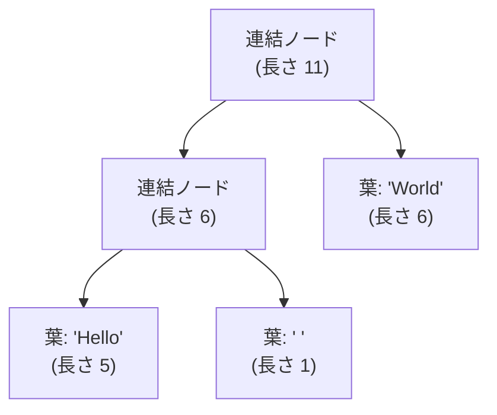

# 文字列型：文字の列をどう持つか

## 文字列はバイトの列である

文字列は「文字が並んだもの」ですが、コンピュータのメモリには文字そのものは
入りません。入るのは数（バイト）です。したがって文字列は、内部的には
**バイトの配列**として表現されます。最も素朴な実装は、文字コードを並べた
配列に長さを添えたものです。

```ruby
# 概念図：文字列を「バイト配列＋長さ」で表す
class MyString
  def initialize(bytes)
    @bytes  = bytes          # 整数（バイト値）の配列
    @length = bytes.size
  end

  def byte_at(i) = @bytes[i]
  attr_reader :length
end

s = MyString.new("ABC".bytes)   # => [65, 66, 67]
p s.length    # => 3
p s.byte_at(0) # => 65  ('A' の文字コード)
```

C 言語の文字列は、これに「終端を表す `\0` バイトで終わる」という規約を
加えたものです。一方 Ruby や多くの近代的な言語は、長さを別に持つことで、
途中に `\0` を含む文字列も正しく扱えます。「バイトの配列」という土台を
押さえると、文字列処理の難しさの正体が見えてきます —— それは
**「1文字」とは何か**という問いです。

## 文字とは何か：文字符号化の話

英語だけなら話は簡単で、1 バイト＝1 文字とみなせます（ASCII）。しかし
世界には数万種類の文字があり、1 バイト（256 通り）にはとても収まりません。
そこで、世界中の文字に通し番号を与える国際標準 **Unicode** が定められて
います [](#cite:unicode2023)。この通し番号を**コードポイント**
（code point）と呼びます。たとえば「あ」は U+3042、「🍣」は U+1F363 です。

問題は、このコードポイントをバイトの列にどう変換するかです。この変換規則を
**文字符号化方式**（character encoding）と呼び、複数の方式があります。
現在最も広く使われるのが **UTF-8** で、1 文字を 1〜4 バイトの
**可変長**で表します。ASCII の範囲（英数字）は 1 バイトのままで、
日本語や絵文字は複数バイトになります。

```ruby
s = "あ"
p s.bytes        # => [227, 129, 130]  UTF-8 では 3 バイト
p s.bytesize     # => 3   バイト数
p s.length       # => 1   文字数（コードポイント数）
```

ここで重要なのは、**バイト数と文字数が一致しない**ことです。`"あ"` は
3 バイトだけれど 1 文字。この食い違いが、文字列実装に大きな影響を与えます。

> [!IMPORTANT]
> 「N 文字目を取り出す」操作を考えてみてください。固定長（1文字＝1バイト）
> なら添字計算一発で O(1) です。しかし UTF-8 のような可変長符号化では、
> 先頭から何バイトずつ進むかを数えながら N 文字目まで歩く必要があり、
> 素朴には O(N) かかります。文字列の実装は、この「ランダムアクセスの
> しにくさ」とどう折り合うかが腕の見せどころなのです。

Ruby は文字列が自分の符号化方式（エンコーディング）を**属性として持つ**
設計を採っています。同じバイト列でも、UTF-8 として見るか別の方式として
見るかで「何文字か」が変わるため、文字列オブジェクトに符号化方式の情報を
くっつけているのです。

```ruby
p "あ".encoding   # => #<Encoding:UTF-8>
```

## 不変性と共有：コピーを減らす工夫

文字列をたくさん作るプログラムでは、文字列の**コピー**が性能のボトルネックに
なります。`a = b` のたびに中身を丸ごと複製していたら、長い文字列ほど高く
つきます。そこで多くの処理系は、文字列を**不変**（immutable、作った後は
変更できない）に設計します。一度作ったら変わらないと保証できれば、
**実体を安全に共有**できるからです。

JavaScript や Python、Java の文字列は不変です。`s2 = s1` としても中身は
コピーされず、同じ実体を二つの変数が指すだけです。変更操作（たとえば
大文字化）は、元を書き換えるのではなく**新しい文字列を作って返します**。

Ruby の文字列は歴史的に**可変**（mutable）ですが、`freeze` で不変にでき、
同じ内容の凍結文字列は処理系が一つにまとめます。これは第3章で学んだ
**インターン**そのものです。

```ruby
a = "hello".freeze
b = "hello".freeze
p a.equal?(b)   # => true  （凍結文字列は共有される場合がある）

# frozen_string_literal: true を指定すると、リテラルが自動で凍結・共有される
```

> [!TIP]
> 文字列リテラルを多用するプログラムでは、ファイル先頭に
> `# frozen_string_literal: true` と書くと、同じ内容のリテラル文字列が
> 共有され、無駄なオブジェクト生成が減ってメモリと速度が改善します。
> これは「不変だからこそ共有できる」という設計判断を、利用者が選べる
> ようにした例です。

可変な文字列でも、**コピーオンライト**（copy-on-write、書き込み時複製）という
技法で複製を遅らせられます。`a = b` の時点では実体を共有しておき、
どちらかが**実際に書き換えようとした瞬間**にはじめてコピーを作るのです。
読むだけなら永遠にコピーは起きません。

## 連結に強い文字列：ロープ

不変文字列には弱点があります。**連結**です。`s1 + s2` で新しい文字列を作ると、
両方の中身を新しい領域へコピーするため O(n) かかります。テキストエディタの
ように巨大な文書の途中に文字を挿入する処理では、毎回全体をコピーしていては
話になりません。

この問題への古典的な答えが**ロープ**（rope）です [](#cite:boehm1995)。
ロープは、文字列を一本の連続した配列として持つのをやめ、**短い文字列の断片を
木構造でつなぐ**表現です。連結は、両者をコピーせず、新しい節点でつなぐ
だけで済みます。



各**葉**（leaf、木の末端）が文字列の断片を持ち、**連結ノード**が
左右の部分木と「左部分木の長さ」を持ちます。この長さの情報のおかげで、
「N 文字目はどこか」を木をたどって O(log n) で求められます。
ロープを使うと、連結・挿入・分割が軒並み O(log n) になり、巨大テキストの
編集が現実的になります。Boehm らは、汎用の文字列としてロープが従来の
連続表現より優れる場面が多いと論じています [](#cite:boehm1995)。

> [!NOTE]
> ロープは万能ではありません。短い文字列ばかりを単純にアクセスする用途では、
> 木をたどるオーバーヘッドのぶん、連続した配列のほうが速くキャッシュにも
> 優しいです。だから多くの処理系は、ふつうの文字列は連続配列で持ち、
> 巨大な編集が必要な場面でだけロープ的な構造を使う、と使い分けます。

## 短い文字列を即値で持つ

第4章で整数を即値（オブジェクトを作らずポインタに埋め込む表現）にした話を
思い出してください。文字列にも似た最適化があります。**短い文字列最適化**
（small string optimization）と呼ばれ、ごく短い文字列なら、ヒープに領域を
確保せず、文字列オブジェクトの内部領域に直接バイトを詰め込みます。

たとえば 64 ビット環境で、文字列オブジェクトがポインタや長さを置くために
持っている十数バイトの領域に、短い文字列ならそのまま中身を入れてしまう
わけです。`"ok"` や `"id"` のような短い文字列のために、わざわざ別領域を
確保するメモリ確保のコストを節約できます。CRuby にも、短い文字列を
オブジェクト内に埋め込む同様の最適化（embedded string）があります。

文字列ひとつとっても、

- バイト配列としての基本表現
- 可変長符号化（UTF-8）と文字数の扱い
- 不変性による実体の共有とインターン
- コピーオンライトによる複製の遅延
- 連結に強いロープ
- 短い文字列の即値化

と、用途に応じた多彩なデータ構造の工夫が詰まっています。
「ただの文字の列」が、これほど設計の宝庫なのです。

次の章では、複数の値をまとめて扱う最も基本的な入れ物 —— **配列**を
見ていきます。
