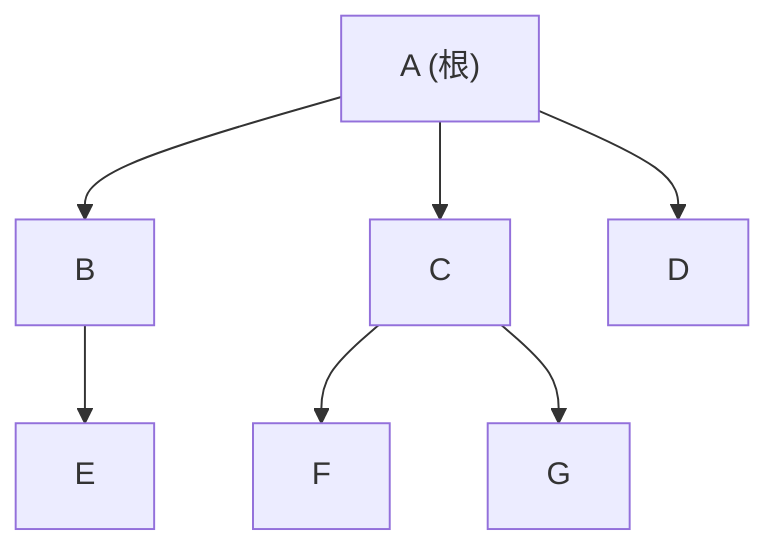

# 簡潔データ構造：理論的下限まで縮める

## 言語処理系がメモリの壁に当たるとき

言語処理系は、その仕事柄、**巨大で・ほとんど書き換わらない構造を
メモリに抱え込み、それを猛烈な回数引く**という場面に何度も出くわします。
本書でここまで作ってきた構造を、思い出しながら並べてみましょう。

- **シンボルテーブルと識別子表**（シンボルテーブルの章・識別子の章）：
  大きなプログラムをコンパイルすると、何十万という名前が表に積み上がる。
  エディタや言語サーバ（LSP）がプロジェクト全体のシンボルを常駐させる
  場面では、この表の大きさがそのままメモリ常駐量になる。
- **構文木**（構文木の章）：IDE や言語サーバは、数千ファイル・数百万行の
  AST をメモリに載せたまま、補完・定義ジャンプ・検索に即応しようとする。
  1 ノードあたりのオーバーヘッドが、そのまま「同時に開けるプロジェクトの
  大きさ」の上限になる。
- **ランタイムに焼き込む静的テーブル**（Unicode の文字属性表、字句解析器が
  持つ予約語・組み込み名の集合など）：処理系のバイナリに同梱され、
  起動から終了まで全プロセスのメモリに居座り続ける。
- **デバッグ情報・行番号表**：コンパイラや VM は「機械語・バイトコードの
  位置 → 元のソース行・桁」という対応表を吐き、例外バックトレースや
  デバッガ・プロファイラがそれを引く。命令の数だけ行が並ぶ、疎で巨大な
  静的表です。

これらに共通するのは、**読み出しは膨大だが書き換えはほとんどない、
静的で巨大な構造**だという点です。ところが、本書がここまで武器にしてきた
道具 —— ポインタでつないだ木やトライ（シンボルテーブルの章・構文木の章）、
ハッシュ表 —— は、この「静的で巨大」という条件のもとでは、
驚くほど無駄が多い。本章は、その無駄を**理論的な下限まで**削り落とす
道具立て、**簡潔データ構造（succinct data structure）** を扱います。

## ポインタはなぜ太るのか

無駄の正体は、ポインタです。たとえば二分木のノードは `left`・`right` の
2本のポインタを持ち、64bit 機ならそれだけで 1 ノード 16 バイト＝
**128 ビット**を、中身の値とは別に消費します。構文木の章で組んだ AST も、
各ノードが子や属性へのポインタを何本も抱える点では同じ。連結リストや
ハッシュ表の鎖も、「要素をつなぐ」ためのアドレスが、データ本体と
同じかそれ以上の場所を食うのが常でした。

ふだんはそれで困りません。しかし前節で挙げた**静的で巨大な**構造では、
この「つなぎのコスト」が主役に躍り出ます。たとえば何十万もの識別子を
素朴なトライで持つと、名前の文字数の何十倍ものメモリを、ポインタが
食い尽くします。そこで問うのです ——
**この構造を表すのに、原理的に最低何ビット必要なのか**、と。

## 情報理論的下限という物差し

答えは数え上げで出ます。n 個のノードを持つ順序木（子に順序がある木）が
何通りあるかは、カタロニア数 $C_n \approx 4^n / (n^{3/2}\sqrt{\pi})$ で
数えられます。その「どれか1つ」を区別するのに要るビット数は対数を
とって $\log_2 C_n \approx 2n$ ビット。つまり **n ノードの木は、理論上
たった 2n ビット —— 1 ノードあたり 2 ビット —— で表せる**はずなのです。
ポインタ表現の 128 ビット/ノードと比べて、実に 60 倍以上の隔たりが
あります。

この「理論的下限 + ちょっとのおまけ」に張り付く表現を **簡潔データ構造**
（succinct data structure）と呼びます。正確には、下限を $L$ ビットと
したとき、

- $L + O(L)$ ビットなら **compact**
- $L + o(L)$ ビット（おまけが下限に対して無視できる）なら **succinct**

と呼び分けます。要は「**情報量ぎりぎりまで縮めながら、しかも木をたどる・
検索するといった操作が（ポインタ版と同じ計算量で）できる**」構造です。
ただ圧縮するだけ（zip のように）なら下限に迫れますが、それでは
「30 番目の子は誰か」を知るのに全体を展開せねばならず使い物に
なりません。簡潔データ構造の妙味は、**圧縮された姿のまま操作できる**
点にあります。この分野の理論的な起点は Jacobson が1989年に示した
木とグラフの簡潔表現で [](#cite:jacobson1989)、実用的な手引きとしては
Navarro の教科書 [](#cite:navarro2016) が決定版です。

## すべての土台：ビットベクトルと rank/select

簡潔データ構造の世界は、たった一つの部品の上に建っています。
長さ n のビット列 $B[0..n)$ に対する、次の2つの操作です。

- $\mathrm{rank}_1(i)$：先頭から位置 i の手前までにある 1 の個数。
- $\mathrm{select}_1(j)$：j 番目の 1 がある位置。

`rank` と `select` は互いの逆向きの問いで、「何個あるか」と「どこに
あるか」を行き来します。これだけ？と思うかもしれませんが、後で見る
ように、木をたどる操作も文字列を検索する操作も、最後はこの2つに
帰着します。**ビットベクトル上の rank/select こそ、簡潔データ構造の
共通語**なのです。

素朴にやれば `rank(i)` は「先頭から i ビット数える」で O(n)、これでは
遅すぎます。鍵は、**わずか o(n) ビットの索引を添えるだけで、本体
n ビットはそのままに、rank を O(1) にできる**ことです。考え方は
二段の積み上げです。

```text
B:        [1011 0010 1110 0001 | 0101 1100 ...]   ← 本体（n ビット）
          └── ブロック(例:64bit)──┘
大ブロック境界ごとの累計   : 0, 37, 71, ...        ← まばらに覚える
小ブロック境界ごとの累計   : 0, 3, 4, 7, ...        ← 大ブロック内の差分
```

`rank(i)` は「i を含む大ブロックの累計」＋「その中の小ブロックの累計」＋
「残りの端数を 1 命令で数える」の足し算で答えが出ます。最後の端数は、
CPU の **popcount 命令**（64bit 中の 1 の個数を 1 命令で数える）一発です。
累計表は本体よりずっと粗く取れるので全体で o(n) ビットに収まり、
`rank` が定数時間になります。Ruby で骨格だけ書くと、二段の事前計算が
そのまま見えます。

```ruby
class BitVector
  WORD = 64

  def initialize(bits)            # bits は 0/1 の配列
    @n = bits.size
    @words = []                   # 64bit ごとに整数へ詰める（本体）
    @cum   = [0]                  # 各ワード境界での 1 の累計（索引）
    bits.each_slice(WORD) do |chunk|
      w = chunk.reverse.reduce(0) { |a, b| (a << 1) | b }
      @words << w
      @cum   << @cum.last + chunk.count(1)
    end
  end

  def rank1(i)                    # B[0..i) の 1 の個数
    w, r = i / WORD, i % WORD
    base = @cum[w]                # ワード境界までの累計（O(1) 参照）
    base + (@words[w] & ((1 << r) - 1)).to_s(2).count("1")  # 端数は popcount
  end

  def select1(j)                  # j 番目(1始まり)の 1 の位置
    lo, hi = 0, @n                # rank が単調なので二分探索で O(log n)
    while lo < hi
      mid = (lo + hi) / 2
      rank1(mid + 1) < j ? lo = mid + 1 : hi = mid
    end
    lo
  end
end

bv = BitVector.new([1,0,1,1,0,0,1,0])
p bv.rank1(4)     # => 3   （先頭4ビット 1,0,1,1 に 1 が3つ）
p bv.select1(3)   # => 3   （3番目の 1 は位置3）
```

ここでは `select` を rank の二分探索（O(log n)）で済ませましたが、
専用の索引を足せば `select` も O(1) にできることが知られています
[](#cite:clark1996)。実用実装（C++ の SDSL、Rust の `sucds`、
Succinct ライブラリ群）は、この rank/select を SIMD と注意深い
ブロック設計で詰めており、圧縮率を犠牲にしない高速な版が
Okanohara と Sadakane によって整理されています [](#cite:okanohara2007)。

> [!NOTE]
> rank/select は、値の章で見たタグ付きポインタ（使われないビットに情報を
> 埋める発想）とは逆を行きます。タグは余ったビットに情報を**足し**ますが、簡潔構造は
> 情報を削った本体に、o(n) の索引で操作性だけを**買い戻す**。
> どちらも「ビットを資源として設計する」点では同じ家系です。

## 木を 2n ビットで：LOUDS と括弧列

土台ができたので、本題の「木を 2n ビットで持つ」に進みます。
代表的な符号化が2つあります。

ひとつは **LOUDS**（Level-Order Unary Degree Sequence）です。木を
幅優先（レベル順）にたどりながら、各ノードを「子の数だけ 1 を並べ、
最後に 0 を置く」という単進（unary）符号で書き下します。根の前に
番兵の `10` を置くのが慣例です。下の木を符号化してみましょう。



レベル順にノードを並べると A, B, C, D, E, F, G。各ノードの子の数は
A:3, B:1, C:2, D:0, E:0, F:0, G:0 なので、

```text
LOUDS:  10 1110 10 110 0 0 0 0 0
        ↑番兵 ↑A  ↑B ↑C ↑D…E…F…G
```

ノード数 n に対して、1 が n 個（各ノードが親から1本の辺で1回数えられる）、
0 が n+1 個。**合計 2n+1 ビット**で木の形がすべて入りました。しかも、
この上で `rank/select` を使うと木をたどれます。たとえば「あるノードの
最初の子」「i 番目の子」「親」が、ビット列上の rank と select の数回の
呼び出しだけで、**ポインタをいっさい持たずに** O(1) で求まります。
ポインタ表現の 128 ビット/ノードが、2 ビット/ノードになった ——
冒頭の「60 倍の隔たり」を、操作性を保ったまま回収したわけです。

もうひとつの符号化が **BP**（Balanced Parentheses、対応の取れた括弧列）
です。木を深さ優先でたどり、ノードに入るとき `(`、出るとき `)` を
書きます。やはり開き括弧・閉じ括弧が n 個ずつで 2n ビット。`(` を 1、
`)` を 0 とみなせばこれもビットベクトルで、「対応する閉じ括弧」
（部分木の終端）を求める操作などが rank/select の親戚で解けます。
LOUDS が「子をたどる」のが得意、BP が「部分木を丸ごと扱う」のが得意、
という性格の違いで使い分けます。

> [!TIP]
> 木を一列のビット列へ符号化するこの発想は、木をファイルや通信路へ
> 送るために並べる**直列化**と地続きです。違いは目的で、直列化が**復元**のために
> 並べるのに対し、簡潔構造は**並べた姿のまま操作する**ために
> 並べます。同じ「木→列」でも、後で展開するかしないかで設計が
> 分かれるのです。

## アルファベットを広げる：ウェーブレット木

ビットベクトルの rank/select は「0/1 の2文字」の世界の話でした。これを
**任意の文字種**（アルファベット）に拡張するのが **ウェーブレット木**
（wavelet tree）です [](#cite:grossi2003)。文字列 $S$（たとえば
ソースコードやゲノム配列）に対して、

- $\mathrm{access}(i)$：i 文字目は何か
- $\mathrm{rank}_c(i)$：先頭から i 文字目までに文字 c が何回出たか
- $\mathrm{select}_c(j)$：j 番目の c の位置

を、文字種数を σ として O(log σ) で答えます。仕掛けは「文字の集合を
半分ずつに分ける二分木」で、各ノードに「この文字は左半分(0)か
右半分(1)か」を表すビットベクトルを 1 本だけ置きます。文字を1段ずつ
ビットに振り分け、各段の rank/select をたどると、上の3操作が
すべて木の高さぶんの rank/select に化けます。文字列そのものを、
$n\log\sigma$ ビット程度（＝ほぼ素の格納量）で持ちながら、任意文字の
rank/select つきで扱えるのです。配列やハッシュが「位置で引く／キーで
引く」のに対し、ウェーブレット木は「**何番目のこの文字はどこか**」という
集計つきの問いに答える、毛色の違う表です。

## 圧縮したまま検索する：FM-index

ウェーブレット木が最も劇的に効くのが、**全文検索の索引**です。
文字列の中をパターンが先頭から舐めていく素朴な検索に対し、
ここでは逆に、巨大なテキストを**前もって索引化**し、任意の部分文字列が
「どこに何回出るか」を瞬時に答えたい —— しかも索引を**圧縮した
まま**。これを実現するのが **FM-index** で、Ferragina と Manzini が
2000年に提案しました [](#cite:ferragina2000)。

土台は **BWT**（Burrows–Wheeler 変換）です [](#cite:burrows1994)。
テキストの全循環シフトを辞書順に並べ、その「末尾の文字」だけを
抜き出した並べ替え列で、同じ文字が固まりやすく**圧縮に向く**性質を
持ちます（bzip2 の心臓部でもあります）。FM-index は、この BWT 列を
ウェーブレット木に載せ、`rank` を使った **後方検索**（backward search）で
パターンを末尾から1文字ずつ照合します。パターン長 m の検索が、
テキスト長によらず O(m log σ) ほどで済み、索引のサイズは
**元テキストの圧縮サイズ程度**に収まります。ゲノム配列の検索
（Bowtie・BWA など、数十億塩基を数ギガバイトに収めて検索する道具）の
基盤技術であり、テキスト検索エンジンにも応用されています。
「圧縮率」と「検索速度」を同時に取る、メモリ階層の時代ならではの
データ構造です。

## 言語処理系の内部での使われ方

簡潔データ構造が言語処理系の内部で最もはっきり顔を出すのは、
**プログラムカウンタ（命令の位置）から情報を引く、疎で巨大なメタデータ
表**です。本章の冒頭で触れた CRuby（MRI）の **`succ_index_table`** が、
まさにその実例でした。CRuby はバイトコード列 `iseq` に付随する
`insns_info` —— 各命令の位置からソース行番号やトレースイベント情報を引く
表 —— を簡潔ビットベクトルで圧縮します（Ruby 2.6 で導入）。隣り合う命令は
たいてい同じ行に属するので、「情報が変わる命令位置」はまばら。そこを 1 の
ビットで印して畳み、PC が与えられたら **rank** でエントリ番号を引く ——
ビットを詰めた即値の小ブロックと、その累積を持つ大ブロックの二段構えと
いう、本章で組んだランク辞書そのものです。例外バックトレース・行カバレッジ・
`set_trace_func` のたびに引かれるこの表を、小さく保つための工夫です。

同じ「命令位置 → ソース行」の表は、ネイティブコンパイラの **DWARF 行番号
情報**や JavaScript の **ソースマップ**にもあります。ただしこれらは簡潔
データ構造ではなく、差分やランレングス（ソースマップなら VLQ）といった
別系統の圧縮で小さくしているのが普通です。CRuby が同じ問題に簡潔ビット
ベクトルを当てたのは選択肢の一つにすぎません —— 「PC で引く疎な表」は
簡潔データ構造がはまりやすい題材ですが、実際にそれを選ぶかは処理系ごとの
判断です。裏を返せば、言語処理系で簡潔データ構造が前面に出る場面は、
この CRuby の例のように**限られている**のが実情です。

簡潔データ構造が効くのは「**読み出しは膨大だが書き換えはほとんどない、
静的で巨大な構造**」という条件のときです。CRuby の行番号表はまさにそれ
—— 一度コンパイルすれば二度と変わらず、実行のたびに何度も引かれる ——
でした。研究の世界では、構文木（構文木の章）そのものを LOUDS/BP で簡潔
表現し、巨大なソースを省メモリで扱う方向も探られています。

> [!NOTE]
> 「トライを LOUDS で畳んで巨大な辞書を小さく持つ」という応用は、
> 形態素解析器（MeCab・Sudachi）や仮名漢字変換（IME。mozc は LOUDS トライ
> を内部に持つ）といった**自然言語処理**の分野でとりわけ有名です。使う
> 技法は本章とまったく同じですが、これらはコンパイラ・インタプリタ ——
> 本書のいう言語処理系 —— ではなく**隣の分野**の話。同じ道具が分野を
> またいで効く好例として、両者を区別したうえで押さえておくとよいでしょう。

> [!WARNING]
> 簡潔データ構造は万能薬ではありません。代償を正直に並べておきます。
> 第一に、**更新が苦手**です。多くは構築時に全体を固める静的構造で、
> 1 要素の挿入・削除に rank/select 索引の作り直しが要ります（動的化の
> 研究はありますが定数項が重い）。第二に、1 操作あたりの**定数項は
> ポインタ追跡より大きい**（rank を数回呼ぶぶん命令数が増える）。
> 効くのは「メモリに載りきらない／キャッシュに収めたい」ほど構造が
> 大きいときで、小さな木をこれで持っても割に合いません。第三に、
> **実装が難しい**。rank/select を正しく速く書くのは骨で、自作より
> 枯れたライブラリ（SDSL など）に乗るのが定石です。
> 「表現を選ぶ」という本書の主題どおり、これも**要求に応じた一つの
> 選択肢**であって、既定値ではありません。

## まとめ

- ポインタ表現は「つなぎ」に大量のビットを使う。巨大で静的な構造では
  これが主コストになり、**情報理論的下限**（n ノードの木なら約 2n ビット）
  まで縮める動機が生まれる
- 下限＋ o(n) に張り付きつつ**操作できる**のが簡潔データ構造。土台は
  ビットベクトル上の **rank/select** で、o(n) の索引と popcount で
  定数時間に解ける
- 木は **LOUDS**／**BP** で 2n ビットに収まり、たどる操作は rank/select に
  帰着する。**ウェーブレット木**は rank/select を多文字に広げ、**FM-index**は
  テキストを圧縮したまま部分文字列検索を可能にする
- 言語処理系で簡潔データ構造が前面に出る場面は限られるが、確かな実例が
  CRuby の **`succ_index_table`**（iseq の行番号表をランク辞書で圧縮）。
  同じ「PC → ソース位置」表でも DWARF やソースマップは別系統の圧縮を使う。
  辞書トライの LOUDS 化が有名なのは、隣接分野の**自然言語処理**のほう
- 代償は更新の難しさ・定数項・実装難度。**静的で巨大**な構造でこそ報われる

ここまでが第I部 —— 処理系が内部で抱えるデータ構造の話でした。次の
第II部からは視点を利用者側へ移し、言語が提供するデータ型（数値・文字列・
配列・ハッシュ…）が、その内側でどんなデータ構造として実装されているかを
見ていきます。
