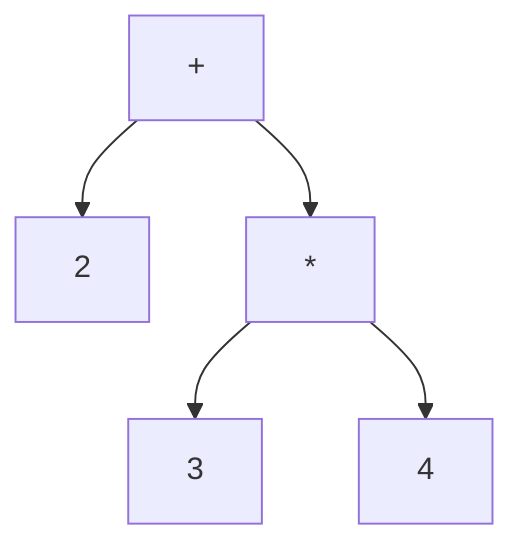

# 構文木と中間表現

## プログラムは木の形をしている

`2 + 3 * 4` という式を考えます。私たちはこれを「3×4 を先に計算して 2 を
足す」と読みます。掛け算が足し算より優先されるからです。この優先順位を
データ構造として表すと、自然に**木**（tree）の形になります。



一番上の `+` から枝が下に伸び、左に `2`、右に `*` がぶら下がり、その `*` から
さらに `3` と `4` が伸びています。この木をたどって計算すると、必ず
`3 * 4` が先に評価され、優先順位が自然に守られます。

このように、プログラムの構造を木で表したものを**抽象構文木**
（Abstract Syntax Tree、略して **AST**）と呼びます。「抽象」というのは、
括弧やセミコロンといった**書き方の都合**を木からそぎ落とし、構造の
**本質**だけを残しているからです。`2 + 3 * 4` も `2 + (3 * 4)` も、同じ
ASTになります。構文解析（parsing）の役割は、トークンの列からこの木を
組み立てることです [](#cite:aho2006)。

## ノードをデータ構造で表す

木を構成する一つひとつの点を**ノード**（node、節点）と呼びます。
AST のノードには「何を表すノードか」という種類があります。足し算のノード、
数値のノード、変数のノード、といった具合です。Ruby でこれを素直に
表現してみましょう。

```ruby
# それぞれのノードを構造体で表す
NumberNode = Struct.new(:value)            # 数値リテラル
VarNode    = Struct.new(:name)             # 変数参照
BinOpNode  = Struct.new(:op, :left, :right) # 二項演算 (+, -, *, /)

# 2 + 3 * 4 に対応する AST を手で組み立てる
tree = BinOpNode.new(:+,
         NumberNode.new(2),
         BinOpNode.new(:*,
           NumberNode.new(3),
           NumberNode.new(4)))
```

`BinOpNode` は子として `left` と `right` という二つのノードへの参照を
持ちます。子が別の `BinOpNode` でも `NumberNode` でも構いません。
この「ノードが子ノードへの参照を持ち、それが再帰的に続く」構造が、
木をデータとして表す核心です。子の個数が決まっていないノード（たとえば
引数が何個あるか分からない関数呼び出し）では、子を配列で持たせます。

## ノード表現は言語ごとの「方言」がある

「種類を持つノードの木」という同じ概念でも、処理系の実装言語によって
表現はかなり違います。代表的な流儀を見比べてみましょう。

- **C：タグ付き共用体**。ノード構造体の先頭に種類を表す整数（タグ）を
  置き、種類ごとに異なる中身を**共用体**（union、同じメモリ領域を
  複数の解釈で使う仕組み）で重ねます。CRuby のパーサが作るノードも
  この流儀です。メモリ効率は良いものの、タグの検査を間違えても
  コンパイラは守ってくれません。
- **OCaml / Haskell / Rust：代数的データ型**。
  `type expr = Num of int | BinOp of op * expr * expr` のように、
  「ノードの種類と中身の組み合わせ」を型として直接書けます。
  パターンマッチで分解でき、**場合分けの漏れをコンパイラが検出**して
  くれるため、コンパイラを書くための言語として愛される理由に
  なっています。
- **Java / C++：クラス階層**。`Expr` を親クラスに、`NumberExpr` や
  `BinaryExpr` を子クラスにします。ノードへの処理は、種類ごとの
  メソッドを呼び分ける**ビジターパターン**（visitor pattern）で
  書くのが定番です。*Crafting Interpreters* の前半の実装（Java）が
  まさにこの構成です [](#cite:nystrom2021)。

どの流儀も「タグで種類を区別し、種類ごとの中身を持つ」点は同じです。
「値の表現」の章で見るタグ付き値表現と同型の問題が、処理系を**書く側**の
言語にも現れている、と言えます。

## アリーナと一括解放

AST のノードは大量に生まれます。数万行のソースファイルなら、ノードは
百万個に達することもあります。これを 1 個ずつ `malloc` で確保すると、
確保のコストも、あとで 1 個ずつ解放するコストも馬鹿になりません。

そこで広く使われるのが**アリーナ**（arena、領域）方式です。大きな
メモリ領域をまとめて確保し、ノードはそこから先頭詰めで切り出します
（「メモリ管理とGC」の章で見るバンプアロケーションです）。そして
コンパイルが終わったら、ノードを個別に解放せず**領域ごと一括で捨て**ます。
AST のノードは「全部いっしょに生まれ、全部いっしょに死ぬ」ので、
一括解放と完璧に相性が良いのです。寿命がそろったデータには、個別管理
ではなく一括管理の構造を選ぶ。これもデータ構造選びの定石の一つです。

## 解析表とメモ表

木を**作る**側、構文解析器そのものにも有名なデータ構造があります。
二つだけ見ておきましょう。

一つ目は **LR 解析表**です。yacc/bison（CRuby の `parse.y` もこの
系譜です）が生成する**ボトムアップ構文解析器**は、実行時には
文法を一切見ません。文法はコンパイラ生成時に**オートマトン**
（[正規表現の章](regexp.md)で詳しく扱う状態機械）へ変換され、その遷移が
二枚の表になります。**ACTION 表**（状態 × 次のトークン → シフト／
還元／エラー）と **GOTO 表**（状態 × 還元した規則 → 次の状態）です。
解析器の本体は、状態を積む**スタック**と、この表を引くループ
だけです。「アルゴリズムを表に焼き込む」古典の代表だと言えます
[](#cite:aho2006)。

実用上の問題は表の大きさです。状態数百 × トークン種数百の二次元
配列は大半が「エラー」の空白で埋まります。そこで yacc の昔から、
**行をずらして重ね合わせる圧縮**（同じ行内の空白に他の行の実エントリを
はめ込み、どの行由来かを check 配列で確かめる、いわゆる
displacement 法）が使われてきました。「疎な二次元表を、二〜三本の
一次元配列に潰す」この技法は、Unicode の文字属性表（正規表現型の
章）など、疎で不変な表の圧縮全般に通用します。

二つ目は **Packrat 構文解析のメモ表**です [](#cite:ford2002)。
PEG（解析表現文法）に基づく再帰下降パーサは、バックトラックを
許すため素朴には指数時間に陥りえますが、「**入力位置 × 規則 →
結果**」を丸ごとメモ化すれば、どの組も一度しか解析しないので
**線形時間**が保証されます。代償は入力長 × 規則数に比例するメモリ。
[正規表現の章](regexp.md)で見る「バックトラック＋メモ化で線形化」（Ruby 3.2 の
正規表現）とまったく同じ構図が、構文解析の世界では 20 年早く
実用化されていたわけです。

## 木をたどる再帰と評価

木の上の処理は、ほとんどが**再帰**（recursion、自分自身を呼び出すこと）で
書けます。あるノードを処理するには「子ノードを処理した結果」を使えばよく、
子ノードの処理もまた同じ手続きで書けるからです。

たとえば、AST をそのまま実行する**ツリーウォーク型インタプリタ**
（tree-walking interpreter）は、木をたどりながら値を計算します。
これはインタプリタの最も素朴な形で、*Crafting Interpreters* でも最初に
登場する実装です [](#cite:nystrom2021)。

```ruby
def evaluate(node, env)
  case node
  when NumberNode
    node.value
  when VarNode
    env.fetch(node.name)          # 変数の値を環境から引く
  when BinOpNode
    l = evaluate(node.left, env)  # 左の子を評価（再帰）
    r = evaluate(node.right, env) # 右の子を評価（再帰）
    l.send(node.op, r)            # l.+(r) のように演算
  end
end

p evaluate(tree, {})   # => 14  （2 + 3 * 4）
```

`evaluate` は自分の中で自分を呼んでいます。`BinOpNode` を評価するために
左右の子を `evaluate` し、その子がまた `BinOpNode` なら…と、木の葉
（一番下の `NumberNode`）に行き着くまで再帰が続きます。
ここで `env`（environment、環境）は、前章までのシンボルテーブルそのもの
です。変数名から値を引くために使われています。プログラムを「環境のもとで
式を評価する」という見方は *SICP* が一貫して採る視点です
[](#cite:abelson1996)。

> [!NOTE]
> ツリーウォーク型は実装が分かりやすい反面、実行のたびに木をたどり直す
> ので速度は出ません。そこで多くの実用処理系は、木を一度だけたどって
> より実行しやすい形（後述のバイトコード）に変換しておきます。

## エラーメッセージを支える位置情報

実用の AST には、計算には不要だがツールには不可欠な情報が載っています。
**ソース位置**（source location）です。「3 行目の 12 文字目で構文エラー」
「この例外はこの行から」。こうした表示はすべて、ノードに記録された
位置情報から来ています。

問題はサイズです。ノードごとに「開始行・開始桁・終了行・終了桁」を
素直に持つと、それだけで 1 ノードあたり十数バイト。ノードが百万個なら
位置情報だけで十数 MB です。そこで実装は工夫します。たとえば
「ファイル先頭からのバイトオフセット」1 個だけを持ち、行・桁は
**行頭位置の整列済み配列を二分探索**して必要なときに復元する、という
方式が広く使われます（Rust コンパイラなどがこの系統です）。
「めったに使わない情報は、引きやすさを捨てて小さく持つ」。
データ構造の選択は使用頻度の見積もりとセットなのです。

## 具象構文木とロスレス構文木

AST は「書き方の都合」をそぎ落とすと言いました。しかし、**そぎ落としては
困る**道具もあります。コードフォーマッタは括弧やコメントの位置を知らねば
ならず、IDE のリファクタリング機能は編集前後でソースを一字一句再現
できなければなりません。

そのための表現が**具象構文木**（concrete syntax tree、parse tree とも）、
さらに進んで**ロスレス構文木**（lossless syntax tree、空白やコメントを
含めソースを完全に復元できる木）です。C# のコンパイラ Roslyn が採用した
**red-green tree** はその代表で、内部（green）の木は位置を相対値で持つ
不変の共有可能なノード、外側（red）の木は絶対位置を遅延計算する軽い
ビューという二層構造になっています。不変な木なので、編集のたびに
**変わっていない部分木を丸ごと共有**して新しい木を安く作れます
（この「不変＋共有」の威力は「配列型」の章の永続データ構造で再登場
します）。Rust の IDE 基盤 rust-analyzer や、エディタ用パーサの
tree-sitter も同系統の設計です。

エディタ用パーサにはもう一つの要求があります。**インクリメンタル
解析**（incremental parsing）です。1 文字打つたびにファイル全体を
解析し直すのではなく、**変更の影響範囲だけ**を再解析することを指します。
理論的基盤は Wagner らが整備し [](#cite:wagner1998)、tree-sitter は
これを GLR 解析と組み合わせて実用化しました。考え方は永続データ
構造と同じで、旧い木のノードに「このノードはソースのこの範囲から
作られた」という情報を持たせておき、編集位置に重ならない部分木は
**そのまま再利用**、重なる経路だけ作り直します。さらに各ノードが
「解析中に先読みした範囲」も記録しておくことで、再利用してよいか
どうかの判定を保守的すぎず行えます。「変更は局所的」という賭けが、
ここでもデータ構造（範囲注釈つきの共有可能な木）の形になっています。

「実行のための木」と「人間の編集を支える木」では、最適なデータ構造が
まるで違います。同じ「構文木」という言葉に騙されてはいけません。

## フラットなAST

ノードをポインタでつなぐ構造には、現代の CPU と相性が悪い面があります。
ノードがヒープのあちこちに散らばるため、木をたどるたびにキャッシュ
ミス（CPU の高速メモリに目的のデータがない状態）が起きやすいのです。
また 64 ビットのポインタはそれ自体が大きい。

そこで近年のコンパイラには、**ノードを 1 本の配列に敷き詰め、子への
参照をポインタではなく配列の添字（32 ビット整数）で持つ**設計が
増えています。Zig のコンパイラや Ruby の新しいパーサである Prism などが
この方向の工夫を取り入れています。利点は三つ。(1) 添字はポインタの
半分のサイズ、(2) ノードが連続メモリに並ぶのでキャッシュに優しい、
(3) 木全体の複製や保存（ファイルへの書き出し）が `memcpy` 同然になる。

「木＝ポインタでつなぐもの」という固定観念を外し、**論理的には木、
物理的には配列**という分離を行ったわけです。この「論理構造と物理表現の
分離」は、本書全体を通じて繰り返し現れる視点です。

## 中間表現

AST は人間にとって分かりやすい構造ですが、実行効率の面では理想的では
ありません。木をたどるたびにノードの種類を判定し、参照をたどってメモリの
あちこちへ飛ぶ必要があるからです。

そこで処理系は、AST を**中間表現**（Intermediate Representation、略して
**IR**）と呼ばれる、より実行に適した形へ変換します。なかでも代表的なのが
**バイトコード**（bytecode）です。バイトコードは、仮想機械向けの単純な
命令を一列に並べたもので、木ではなく**配列**として表現されます。

先ほどの `2 + 3 * 4` をスタックベースのバイトコードに変換すると、
たとえば次のようになります。スタックベースとは、計算の途中結果を
スタック（「スタックとフレーム」の章で詳述）に積んで処理する方式です。

```
push 3      # スタックに 3 を積む           [3]
push 4      # スタックに 4 を積む           [3, 4]
mul         # 上の2つを掛けて結果を積む      [12]
push 2      # スタックに 2 を積む           [12, 2]
add         # 上の2つを足して結果を積む      [14]
```

この命令列を実行する仮想機械は、ただ配列を先頭から順に読み、各命令に従って
スタックを操作するだけです。木をたどる必要も、ノードの種類を毎回
場合分けする必要もありません。Ruby（CRuby）も Python も Java も、ソース
コードをいったんこのようなバイトコードへコンパイルしてから実行しています。

```ruby
# Ruby は自分のバイトコードを見せてくれる
puts RubyVM::InstructionSequence.compile("2 + 3 * 4").disasm
# putobject 2 / putobject 3 / putobject 4 / opt_mult / opt_plus ... のような出力
```

このコンパイラと仮想機械は、自分で書いてみると拍子抜けするほど
小さく作れます。コンパイルとは**木を帰りがけ順（子を先、親を後）に
たどって命令を吐く**ことであり、`evaluate` の再帰とまったく同じ形を
しているからです。違いは「その場で計算する」か「あとで計算する
命令を出す」かだけです。

```ruby
# AST からバイトコードへの最小コンパイラ（前節のノードをそのまま使う）
def compile(node, out = [])
  case node
  when NumberNode then out << [:push, node.value]
  when VarNode    then out << [:load, node.name]
  when BinOpNode
    compile(node.left, out)    # 左の子の命令を先に
    compile(node.right, out)   # 右の子の命令を次に
    out << [:binop, node.op]   # 自分（演算）は最後 —— 帰りがけ順
  end
  out
end

# それを実行するスタック仮想機械
def run(code, env = {})
  stack = []
  code.each do |op, arg|
    case op
    when :push  then stack.push(arg)
    when :load  then stack.push(env.fetch(arg))
    when :binop then b = stack.pop
                     a = stack.pop
                     stack.push(a.send(arg, b))
    end
  end
  stack.pop
end

p compile(tree)       # => [[:push,2],[:push,3],[:push,4],[:binop,:*],[:binop,:+]]
p run(compile(tree))  # => 14   evaluate(tree, {}) と同じ答え
```

「コンパイル時に一度だけ木をたどり、実行時は配列を走るだけ」という
利得が、この 30 行に凝縮されています。条件分岐を足すには、ジャンプ
命令（`[:jump_if_false, 飛び先]`）と「飛び先をあとから埋める」
**バックパッチ**が要りますが、骨格はこのままです。

## スタック機械かレジスタ機械か

バイトコードの設計には大きな流派が二つあります。上で見た**スタック
ベース**（CRuby、CPython、JVM）と、**レジスタベース**（Lua、Dalvik）です。
レジスタベースの命令は「レジスタ 1 とレジスタ 2 を足してレジスタ 0 へ」の
ように、オペランド（操作対象）の置き場所を命令の中に番号で書き込みます。

```
# 同じ 2 + 3 * 4 のレジスタベース版のイメージ
loadk  r1, 3      # r1 = 3
loadk  r2, 4      # r2 = 4
mul    r1, r1, r2 # r1 = r1 * r2
loadk  r2, 2      # r2 = 2
add    r0, r2, r1 # r0 = r2 + r1
```

スタック方式は命令が短く（オペランド指定が要らない）コンパイラも単純、
レジスタ方式は**命令数そのものが減る**（push/pop が消える）ため命令
ディスパッチ（次の命令を取り出して分岐するコスト）の回数を節約できます。
Lua が 5.0 でスタック方式からレジスタ方式へ移行した経緯と設計判断は、
実装論文に詳しく書かれています [](#cite:ierusalimschy2005)。
「命令列」という同じデータ構造でも、何を命令の中に埋め込み、何を
実行時の構造（スタック）に置くか、という配分の問題なのです。

## ディスパッチの技法

バイトコードという配列が決まっても、それを**読むループ**の書き方で
インタプリタの速度は数十パーセント単位で変わります。古典的な技法を
順に見ます。

```c
/* (1) switch ディスパッチ：素朴で移植性が高い */
for (;;) {
  switch (*pc++) {
  case OP_PUSH: ...; break;
  case OP_ADD:  ...; break;
  }
}
```

switch 方式の弱点は、すべての命令が**ループ先頭の一つの分岐**に
合流することです。CPU の分岐予測器は「この分岐は次にどこへ飛ぶか」を
過去の履歴で当てますが、合流地点では履歴が全命令の混合になり、
予測が当たりません。そこで GCC 拡張の **computed goto** を使い、
**各命令の処理の末尾に、それぞれ独立した間接ジャンプ**を置きます。

```c
/* (2) ダイレクトスレッディング：命令ごとに飛び先テーブルを引く */
static void *table[] = { &&L_PUSH, &&L_ADD, ... };
goto *table[*pc++];
L_PUSH: ...; goto *table[*pc++];
L_ADD:  ...; goto *table[*pc++];   /* 分岐点が命令数ぶんに分散する */
```

「ADD の次は比較が来やすい」といった**命令ペアの偏り**を分岐ごとに
学習できるようになり、予測率が上がります。CPython も CRuby も、
コンパイラが対応していればこの方式でビルドされます。Forth の章で
見るスレッデッドコードは、この発想の 1970 年代の祖先です。

さらに進んだ技法が二つあります。**スーパーインストラクション**は、
頻出する命令の並び（`getlocal` + `getlocal` + `opt_plus` など）を
**一つの合成命令**にまとめ、ディスパッチ回数自体を減らします。
**quickening**（命令の置き換え）は、実行中に「この `LOAD_ATTR` は
毎回同じ形だった」と分かった時点で、命令列の中の命令を**より特殊で
速い版に書き換えて**しまいます。CPython 3.11 の特殊化適応型
インタプリタ [](#cite:pep659) はこの quickening を全面採用した
もので、「JITコンパイラ」の章で見る観測・投機の思想を、機械語を
出さずにバイトコード配列の上だけで実現した形と言えます。
**命令列は不変の成果物ではなく、実行中に書き換わる可変のデータ
構造でもあります**。ここでも表現は固定されていません。

## CFGとSSA

本格的なコンパイラは、バイトコードよりさらに解析向きの IR を使います。
二つだけ紹介しておきましょう。

**制御フローグラフ**（Control Flow Graph、**CFG**）は、分岐もループも
ない直線的な命令の並び（**基本ブロック**）を頂点とし、分岐・合流を
辺とした**グラフ**です。プログラムを「木」ではなく「グラフ」として
見ることで、「このループの中で不変な計算はどれか」「この代入は使われて
いるか」といった解析が、グラフのアルゴリズムとして書けるようになります。

**SSA 形式**（Static Single Assignment form、静的単一代入形式）は、
**各変数への代入をプログラム中で一度きり**に変換した表現です。同じ
変数に再代入する代わりに `x1`、`x2`… と新しい名前を振っていきます。
「この値はどこで定義されたか」が名前だけで一意に決まるため、定数伝播や
共通部分式削除といった最適化が劇的に書きやすくなり、LLVM・GCC・V8 など
現代の最適化コンパイラはほぼすべて SSA を採用しています。効率的な
構成アルゴリズムは Cytron らの古典論文で確立されました
[](#cite:cytron1991)。

木 → 命令列 → グラフ → 単一代入。**同じプログラムが、フェーズの目的に
合わせて次々と別のデータ構造に写し替えられていく**。これがコンパイラの
内部で起きていることの正体です。

> [!NOTE]
> 配布のための中間表現という新顔にも触れておきます。
> **WebAssembly** は「Web のためのバイトコード」ですが、その設計は
> 本章の議論の良い演習問題です。命令はスタック型（コンパクトさ優先）、
> ただし任意のジャンプを捨てて**構造化制御フロー**（ブロックと
> ループの入れ子だけ。goto がない！）に限定しました。制御の形が
> 木のままなので、受け取った側の検証（型検査）とコンパイルが
> 一回の線形走査でできます。メモリも生ポインタではなく**線形
> メモリ**（境界検査つきの一本の配列）。「速くコンパイルでき、
> 安全に検証できる」ことを最優先に、表現の自由を意図的に削った
> 設計で、AST・バイトコード・機械語の中間に新しい点を打ちました。

## e-graph

最適化は突き詰めると**書き換え**です。`x * 2` を `x << 1` に、`(a+b)+c` を
`a+(b+c)` に。ところが素朴に書き換えると**順序の呪い**にかかります。ある
規則を当てると別の規則が当たらなくなり、「どの順で書き換えるか」で結果が
変わる（phase ordering 問題）。これを解くのが **e-graph（equality graph、
等価グラフ）**、すなわち**多数の等価なプログラムを一枚のグラフにまとめて持つ**
データ構造です。

部品は三つ。**e-node** は「演算子＋子への参照」ですが、子は直接のノードでは
なく **e-class の id** を指します（`x*2` なら `*`／子＝[x の class, 2 の class]）。
**e-class** は**互いに等しいと証明された e-node の集合**で、`x*2` の class に
あとで `x<<1` の e-node が同居しうる。そして規則が「この二つの class は
等しい」と示すたび **union-find**（[平衡木の章](trees.md)）で class を併合し、同じ
e-node が二度現れないよう **hashcons**（[識別子の章](identifier.md)のインターン）で正規化
します。

```ruby
# e-graph の芯：union-find で class を併合、hashcons で e-node を一意化
class EGraph
  def initialize = (@uf = []; @memo = {})
  def find(c) = @uf[c] == c ? c : (@uf[c] = find(@uf[c]))   # 経路圧縮
  def add(op, *children)
    key = [op, children.map { |c| find(c) }]   # 子を class の代表で正規化
    return @memo[key] if @memo[key]            # hashcons：既出なら使い回す
    id = @uf.size; @uf << id                   # 新しい class
    @memo[key] = id
  end
  def merge(a, b) = (@uf[find(a)] = find(b))   # 二つの class を等しいとする
end

g = EGraph.new
x = g.add(:x); two = g.add(:lit2)
m = g.add(:mul, x, two)               # x * 2
s = g.add(:shl, x, g.add(:lit1))      # x << 1
g.merge(m, s)                         # 規則 x*2 == x<<1 を等式として加える
p g.find(m) == g.find(s)              # => true   同じ class になった
p g.add(:mul, x, two) == m            # => true   同じ e-node は同じ class
```

肝は **合同（congruence）**です。「`f(a)` と `f(b)` があって `a` と `b` の class が
等しくなった」なら `f(a)` と `f(b)` も等しいはずです。この「等しい引数からは
等しい結果」を保つよう、併合のたびにグラフを**再構築**します（上の最小実装は
この再構築を省いています）。これは SMT ソルバの合同閉包と同じ仕掛けです。
進め方が **等式飽和（equality saturation）**で、**すべての**書き換え規則を
繰り返し当て、書き換え後を新しい e-node として**追加して元の class と
union するだけ**。書き換えが決して**破壊しない**ので順序を選ぶ必要が消え、
新しい等式が出なくなったら（飽和）各 class からコスト最小の代表を
**抽出**して最適化結果を取り出します。一枚の e-graph は class による共有で、
**指数的に多くの等価プログラムを多項式サイズ**で持てます。フラットな AST
（前述）や[直列化の章](serialize.md)の共有が、最適化の世界で極まった形です。Rust の egg、
浮動小数点の精度を直す Herbie、テンソルを書き換える ML コンパイラ、
Cranelift の ægraph などが採用しています。「同じプログラムを目的ごとに別の
構造へ写す」と述べましたが、e-graph は**写し替えず、ありうる姿を全部
同時に持つ**という、もう一段過激な選択なのです。

## 木構造の応用は広い

AST に限らず、木は処理系のいたるところに現れます。

- **型の木**：`Array<Hash<String, Integer>>` のような複合的な型も、
  「配列の中にハッシュ、そのキーは文字列、値は整数」という入れ子構造を
  木で表せます。型検査とは、式の木と型の木を突き合わせる作業だと
  言えます。
- **式の最適化**：`x * 1` を `x` に、`2 + 3` を `5` に置き換える
  （**定数畳み込み**、constant folding）といった最適化は、木を書き換える
  操作として実装できます。
- **パターンマッチのコンパイル**：`case` 式の各パターンを**決定木**
  （どの検査をどの順で行うかの木）へ変換することで、無駄のない
  分岐コードを生成できます。たとえば `(Some x, Some y) | (None, _)`
  のような多段のパターン列は、「まずタプルの第 1 要素の構成子を
  検査し、その結果で残りの検査を絞る」決定木に変換すれば、**同じ
  値を二度検査しない**コードになります。検査の順序の選び方
  （どの列から調べるか）で木の大きさが大きく変わるため、良い順序を
  選ぶヒューリスティクスが研究されてきました。OCaml のコンパイラが
  採る手法は Maranget の論文 [](#cite:maranget2008) が読みやすい
  解説です。決定木方式（速いがコード重複の恐れ）と、バックトラック
  方式（コードは小さいが再検査が出る）の二択がここにもあり、
  [正規表現の章](regexp.md)の DFA 対バックトラックと同じ構図が、パターンマッチの
  コンパイルにも現れます。

これらに共通するのは、「**入れ子になった構造は木で表す**」という原則です。
プログラムは本質的に入れ子（式の中に式、ブロックの中にブロック）でできて
いるため、木は処理系の最も基本的な道具立てなのです [](#cite:aho2006)。

ここまでで、処理系がプログラムを**理解する**ためのデータ構造を見て
きました。次の章からは、プログラムを**実行する**ための土台（値の表現、
スタックとフレーム、メモリ管理）に進みます。
