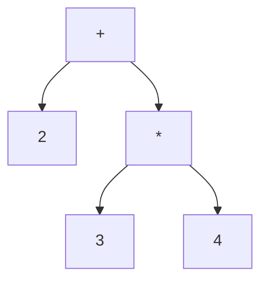

# 構文木と中間表現：プログラムを木にする

## プログラムは木の形をしている

`2 + 3 * 4` という式を考えます。私たちはこれを「3×4 を先に計算して 2 を
足す」と読みます。掛け算が足し算より優先されるからです。この優先順位を
データ構造として表すと、自然に**木**（tree）の形になります。



一番上の `+` から枝が下に伸び、左に `2`、右に `*` がぶら下がり、その `*` から
さらに `3` と `4` が伸びています。この木をたどって計算すると、必ず
`3 * 4` が先に評価され、優先順位が自然に守られます。

このように、プログラムの構造を木で表したものを**抽象構文木**
（Abstract Syntax Tree、略して **AST**）と呼びます。「抽象」というのは、
括弧やセミコロンといった**書き方の都合**を木からそぎ落とし、構造の
**本質**だけを残しているからです。`2 + 3 * 4` も `2 + (3 * 4)` も、同じ
ASTになります。構文解析（parsing）の役割は、トークンの列からこの木を
組み立てることです [](#cite:aho2006)。

## ノードをデータ構造で表す

木を構成する一つひとつの点を**ノード**（node、節点）と呼びます。
AST のノードには「何を表すノードか」という種類があります。足し算のノード、
数値のノード、変数のノード、といった具合です。Ruby でこれを素直に
表現してみましょう。

```ruby
# それぞれのノードを構造体で表す
NumberNode = Struct.new(:value)            # 数値リテラル
VarNode    = Struct.new(:name)             # 変数参照
BinOpNode  = Struct.new(:op, :left, :right) # 二項演算 (+, -, *, /)

# 2 + 3 * 4 に対応する AST を手で組み立てる
tree = BinOpNode.new(:+,
         NumberNode.new(2),
         BinOpNode.new(:*,
           NumberNode.new(3),
           NumberNode.new(4)))
```

`BinOpNode` は子として `left` と `right` という二つのノードへの参照を
持ちます。子が別の `BinOpNode` でも `NumberNode` でも構いません。
この「ノードが子ノードへの参照を持ち、それが再帰的に続く」構造が、
木をデータとして表す核心です。子の個数が決まっていないノード（たとえば
引数が何個あるか分からない関数呼び出し）では、子を配列で持たせます。

## 木をたどる：再帰と評価

木の上の処理は、ほとんどが**再帰**（recursion、自分自身を呼び出すこと）で
書けます。あるノードを処理するには「子ノードを処理した結果」を使えばよく、
子ノードの処理もまた同じ手続きで書けるからです。

たとえば、AST をそのまま実行する**ツリーウォーク型インタプリタ**
（tree-walking interpreter）は、木をたどりながら値を計算します。
これはインタプリタの最も素朴な形で、*Crafting Interpreters* でも最初に
登場する実装です [](#cite:nystrom2021)。

```ruby
def evaluate(node, env)
  case node
  when NumberNode
    node.value
  when VarNode
    env.fetch(node.name)          # 変数の値を環境から引く
  when BinOpNode
    l = evaluate(node.left, env)  # 左の子を評価（再帰）
    r = evaluate(node.right, env) # 右の子を評価（再帰）
    l.send(node.op, r)            # l.+(r) のように演算
  end
end

p evaluate(tree, {})   # => 14  （2 + 3 * 4）
```

`evaluate` は自分の中で自分を呼んでいます。`BinOpNode` を評価するために
左右の子を `evaluate` し、その子がまた `BinOpNode` なら…と、木の葉
（一番下の `NumberNode`）に行き着くまで再帰が続きます。
ここで `env`（environment、環境）は、前章までのシンボルテーブルそのもの
です。変数名から値を引くために使われています。プログラムを「環境のもとで
式を評価する」という見方は *SICP* が一貫して採る視点です
[](#cite:abelson1996)。

> [!NOTE]
> ツリーウォーク型は実装が分かりやすい反面、実行のたびに木をたどり直す
> ので速度は出ません。そこで多くの実用処理系は、木を一度だけたどって
> より実行しやすい形（次節のバイトコード）に変換しておきます。

## 木から命令列へ：中間表現

AST は人間にとって分かりやすい構造ですが、実行効率の面では理想的では
ありません。木をたどるたびにノードの種類を判定し、参照をたどってメモリの
あちこちへ飛ぶ必要があるからです。

そこで処理系は、AST を**中間表現**（Intermediate Representation、略して
**IR**）と呼ばれる、より実行に適した形へ変換します。なかでも代表的なのが
**バイトコード**（bytecode）です。バイトコードは、仮想機械向けの単純な
命令を一列に並べたもので、木ではなく**配列**として表現されます。

先ほどの `2 + 3 * 4` をスタックベースのバイトコードに変換すると、
たとえば次のようになります。スタックベースとは、計算の途中結果を
スタック（第2章で登場した後入れ先出しの構造）に積んで処理する方式です。

```
push 3      # スタックに 3 を積む           [3]
push 4      # スタックに 4 を積む           [3, 4]
mul         # 上の2つを掛けて結果を積む      [12]
push 2      # スタックに 2 を積む           [12, 2]
add         # 上の2つを足して結果を積む      [14]
```

この命令列を実行する仮想機械は、ただ配列を先頭から順に読み、各命令に従って
スタックを操作するだけです。木をたどる必要も、ノードの種類を毎回
場合分けする必要もありません。Ruby（CRuby）も Python も、ソースコードを
いったんこのようなバイトコードへコンパイルしてから実行しています。

```ruby
# Ruby は自分のバイトコードを見せてくれる
puts RubyVM::InstructionSequence.compile("2 + 3 * 4").disasm
# putobject 2 / putobject 3 / putobject 4 / opt_mult / opt_plus ... のような出力
```

> [!TIP]
> AST と バイトコードは、同じプログラムの**別の表現**です。
> AST は「構造を保ったまま解析や変換をしたい」フェーズに向き、
> バイトコードは「とにかく速く実行したい」フェーズに向きます。
> 木（参照でつながったノード）から配列（連続した命令列）へ、という
> データ構造の選び直しが、そのまま設計判断になっているのです。

## 木構造の応用は広い

AST に限らず、木は処理系のいたるところに現れます。

- **構文解析木**（parse tree、具象構文木）：括弧や区切り記号まで含めて
  文法に忠実に対応づけた木。AST はここから不要な飾りを取り除いたものです。
- **型の木**：`Array<Hash<String, Integer>>` のような複合的な型も、
  「配列の中にハッシュ、そのキーは文字列、値は整数」という入れ子構造を
  木で表せます。
- **式の最適化**：`x * 1` を `x` に、`2 + 3` を `5` に置き換える
  （**定数畳み込み**、constant folding）といった最適化は、木を書き換える
  操作として実装できます。

これらに共通するのは、「**入れ子になった構造は木で表す**」という原則です。
プログラムは本質的に入れ子（式の中に式、ブロックの中にブロック）でできて
いるため、木は処理系の最も基本的な道具立てなのです [](#cite:aho2006)。

ここまでで、処理系の内部を支えるデータ構造 —— 名前を引く表、識別子の管理、
そして構造を表す木 —— を見てきました。第II部からは視点を変え、
処理系が利用者に**提供する**データ構造の実装へと進みます。
まずはあらゆる計算の土台となる**数値**からです。
