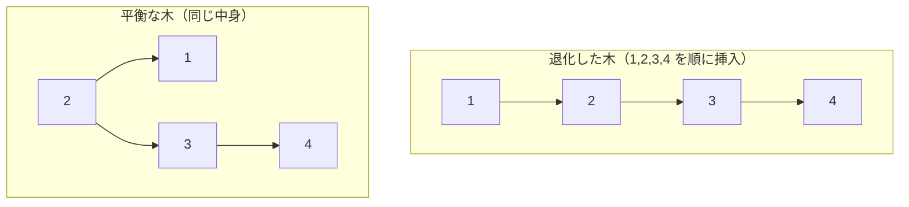

# 平衡木：順序を保つコレクション

## ハッシュにできないこと

ハッシュの章で見たとおり、「キーで引く」だけならハッシュ表が平均 O(1) で
最速です。しかしハッシュ値はキーの順序を破壊するので、次の要求には
まったく応えられません。

- **整列順の反復**：「全エントリをキーの昇順で」
- **範囲検索**：「10 以上 20 未満のキーをすべて」
- **近傍検索**：「x 以上で最小のキーは？」（データベースの索引、
  タイマーの「次に発火するのはどれ？」）
- **最悪時間の保証**：衝突攻撃（ハッシュの章）の心配がない O(log n)

これらを引き受けるのが**順序付きの表**であり、その実装の主役が
**平衡二分探索木**（balanced binary search tree、平衡木）です。
C++ の `std::map`、Java の `TreeMap`、OCaml の `Map`、Haskell の
`Data.Map` —— 標準ライブラリの「ソート済みマップ」の正体を、この章で
解剖します。

## なぜ「平衡」が要るのか

**二分探索木**（BST）は「左の部分木は自分より小さく、右は大きい」と
いう規律で並べた木です。検索・挿入は根から左右に降りるだけ、計算量は
**木の高さ**に比例します。問題は、素朴な BST の高さが**挿入順に
依存する**ことです。ソート済みのキーを順に挿入すると、木は一度も
枝分かれせず、**一本の鎖**に退化します。高さ n、すべての操作が O(n)。
連結リストと同じです。



「ソート済みの入力」は現実に頻出します（ID 順のレコード、時刻順の
ログ）。つまり素朴な BST は、**最も自然な入力で最悪になる**データ
構造なのです。そこで、挿入・削除のたびに木の形を直して高さを
O(log n) に**保ち続ける**仕組み —— 平衡化 —— が必要になります。

形を直す基本操作が**回転**（rotation）です。親子の上下関係を
入れ替え、ぶら下がる部分木をつなぎ直す、ポインタ数本の付け替えで
済むローカルな手術で、BST の規律（左小・右大）を壊しません。
あらゆる平衡木は「いつ・どこで回転するか」の規則の違いです。

AVL 木なら、回転を含めた挿入が 40 行で書けます。

```ruby
# AVL 木：高さの差が 2 になったら回転で直す
AVLNode = Struct.new(:key, :left, :right, :height)

def h(n) = n ? n.height : 0
def renew(n) = (n.height = 1 + [h(n.left), h(n.right)].max; n)
def bal(n) = h(n.left) - h(n.right)

def rot_right(y)             #     y          x
  x = y.left                 #    x ?   =>   ? y
  y.left = x.right           #   ? ?           ? ?
  x.right = renew(y)
  renew(x)
end

def rot_left(x)              # rot_right の鏡像
  y = x.right
  x.right = y.left
  y.left = renew(x)
  renew(y)
end

def avl_insert(n, key)
  return AVLNode.new(key, nil, nil, 1) unless n
  if    key < n.key then n.left  = avl_insert(n.left, key)
  elsif key > n.key then n.right = avl_insert(n.right, key)
  else  return n
  end
  renew(n)
  if bal(n) > 1                                   # 左が重すぎる
    n.left = rot_left(n.left) if bal(n.left) < 0  # 左の右が原因なら一捻り（LR）
    rot_right(n)
  elsif bal(n) < -1                               # 右が重すぎる（鏡像）
    n.right = rot_right(n.right) if bal(n.right) > 0
    rot_left(n)
  else
    n
  end
end

root = nil
(1..1023).each { |k| root = avl_insert(root, k) }  # 整列済みの最悪入力
p h(root)   # => 10〜のはず（素朴な BST なら高さ 1023 の鎖になる）
```

挿入で再帰から戻りながら各ノードの高さを更新し、差が 2 になった
最初の場所で 1〜2 回回転する —— それだけで、整列済み入力という
最悪ケースでも高さが対数に保たれます。LR・RL の「一捻り」が
必要になる理由は、紙にケースを 4 つ描いてみるのが一番早いです。

## AVL と赤黒木：規律の厳しさという設計判断

最古の平衡木が **AVL 木**（1962 年）です。「どのノードでも左右の
部分木の高さの差は 1 以内」という厳格な規律を、挿入・削除のたびに
回転で回復します。規律が厳しいぶん木は低く、**検索は最速**です。

対して、標準ライブラリの定番になったのは**赤黒木**（red-black tree）
でした [](#cite:guibas1978)。各ノードを赤か黒に塗り、「赤の親子は
禁止」「根から葉までの黒の数はどの経路でも同じ」という規律を保ち
ます。許される高さは AVL よりゆるい（最悪で約 2 倍）代わりに、
**挿入・削除時の回転回数が少なくて済みます**。

- **AVL**：木が低い → 検索が速い／更新時の手直しが多い
- **赤黒木**：木はやや高い → 検索はやや遅い／更新が軽い

C++ `std::map`・Java `TreeMap`・.NET `SortedDictionary` が赤黒木を
選んだのは、汎用コンテナでは更新も検索も来るため、更新の軽さを
取ったということです。一方 OCaml の標準 `Map`/`Set` は AVL を
採っています。どちらも O(log n) という同じ看板の下で、定数項の
配分が違う —— ハッシュの章の「負荷率をどこに置くか」と同種の、
細かいが効く設計判断です。

> [!NOTE]
> 「リスト・タプル・集合」の章で見たスキップリストも、この一族の
> 代替案です [](#cite:pugh1990)。回転という繊細なポインタ手術の
> 代わりに乱数で高さを決めるため実装が単純で、ロックなし並行化とも
> 相性がよく、Java の `ConcurrentSkipListMap` が「並行な順序付き
> マップ」の座を平衡木からさらっていきました。

## 関数型言語の平衡木：永続化との相性

平衡木が最も輝くのは、実は関数型言語です。配列の章で見た
**経路コピー**（変更箇所から根までだけ作り直し、残りは共有）が、
木構造である平衡木にはそのまま適用できます。挿入のたびに O(log n)
個のノードを新調するだけで、**変更前の版が丸ごと生き残る**
永続マップになるのです。

- **OCaml** の `Map`/`Set`：永続 AVL 木。関数型プログラミングの
  日常の道具です。
- **Haskell** の `Data.Map`：**重み平衡木**（weight-balanced tree、
  高さではなく部分木の**要素数**の比で平衡を測る方式
  [](#cite:adams1993)）。サイズを各ノードに持つので、「k 番目に
  小さい要素」も O(log n) で引けるおまけ付きです。ちなみに当初の
  平衡係数には誤りが潜んでおり、発見されたのは形式的検証による
  解析でした —— 平衡条件の証明がいかに微妙かを物語る逸話です。
- **Clojure / Scala** の `sorted-map`：永続赤黒木。

ハッシュの章の HAMT が「順序なし永続マップ」の解だとすれば、
永続平衡木は「順序つき永続マップ」の解です。可変の世界では
ハッシュ表と平衡木が並び立つように、不変の世界でも HAMT と
永続平衡木が並び立つ —— きれいな対応です。

## キャッシュの時代の答え：B木

赤黒木には現代的な弱点があります。ノードが 1 要素ずつヒープに
散らばるため、根から葉までの **O(log₂ n) 回のポインタ追跡が全部
キャッシュミス**になりがちなのです（リストの章で見た連結リストの
弱点と同じです）。

Rust が標準の順序付きマップとして赤黒木ではなく **B木**
（`BTreeMap`）を選んだのは、この弱点への正面回答です。B木は
データベースとファイルシステムの索引のために生まれた多分木で
[](#cite:bayer1972)、1 ノードに**多数のキーを配列で**詰め込みます
（Rust は 1 ノードあたり最大 11 キー）。木の高さは log₆ n 程度まで
潰れ、ノード内はキャッシュに載った配列の線形・二分探索で済みます。
ポインタ追跡を減らし、連続メモリの走査に置き換える ——
ハッシュの章の SwissTable とまったく同じ「メモリ階層が古典を
作り直させた」物語です。

> [!TIP]
> 「ディスクのためのデータ構造」だった B木が「キャッシュのための
> データ構造」として言語ランタイムに入ってきたように、記憶階層の
> 段差（ディスク／RAM／キャッシュ）はどこも同じ形の問題を生みます。
> 平衡木を学ぶことは、データベースの索引（B+木）やストレージ
> エンジン（LSM 木）を学ぶ入口でもあります。

## ヒープ：配列に隠れた平衡木

平衡木の親戚として、**二分ヒープ**（binary heap）にも触れておき
ます。「親は子より小さい」だけを保つ完全二分木で、**最小値の取得が
O(1)、取り出しと挿入が O(log n)** の優先度付きキューになります。
完全二分木は形が一意に決まるため、ポインタを使わず**配列に埋め込め**
ます（i 番のノードの子は 2i+1 と 2i+2 番）。回転もポインタも
ない、「形そのもので平衡を保証する」最軽量の木です。

言語処理系の中での出番は**タイマー**です。`setTimeout`（JavaScript）、
`sleep` する数万のゴルーチン（Go）、イベントループのタイムアウト
管理 —— 「次に発火すべき最小の時刻はどれか」はまさに優先度付き
キューの問いで、Go のランタイムは各 P（スケジューラの実行単位）に
タイマーの**4 分ヒープ**（分岐を 4 にしてさらにキャッシュ効率を
上げた変種）を持っています。時間型の章で見た「時刻の数直線」が、
ここでヒープの順序として実を結ぶわけです。

タイマーにはヒープと並ぶもう一つの古典があります。**タイミング
ホイール**（timing wheel）です [](#cite:varghese1987)。時計の文字盤の
ように固定数のスロットを円環に並べ（たとえば 1 スロット 1ms ×
256 個）、タイマーを「発火時刻 mod スロット数」のスロットに
連結リストでぶら下げます。時間の進行とともに針を進め、いま指して
いるスロットのリストを発火させるだけ —— 挿入・削除・発火がすべて
O(1) です。一周を超える未来は、粗いスロットの**上位ホイール**に
置いておき、針が進んでその粗いスロットの番が来たら、中身を下位の
細かいスロットへ配り直します（**カスケード**。時・分・秒の針の
関係そのものです）。Linux カーネル、Netty、Rust の Tokio など、
大量のタイムアウトを抱えるシステムの定番です。

ただし、階層化した瞬間に O(1) の看板には**ただし書き**が付きます。
一個のタイマーは階層の数だけ引っ越す可能性があり、カスケードの
瞬間にはスロット一個分のタイマーが一斉に移動するため、針送りの
最悪コストに瘤ができるのです。実際 Linux カーネルの旧タイマー
ホイールはこの一斉移動がレイテンシの問題になり、バージョン 4.8 の
作り直しで**カスケードを廃止**しました [](#cite:corbet2015)。遠い
未来のタイマーは粗い上位ホイールに置いた**まま**、その粗さの精度で
（つまり多少遅れて）発火させてしまうのです。

具体的な数字で見ましょう。現行の Linux のホイールは 64 スロット×
9 段で、一段上がるごとに 1 スロットが 8 倍粗くなります
（1 tick = 1 ms の設定の場合）。

| 段 | 1 スロットの粗さ | 受け持つ未来 |
|---|---|---|
| 0 | 1 ms | 〜63 ms |
| 1 | 8 ms | 〜511 ms |
| 2 | 64 ms | 〜約 4 秒 |
| 3 | 512 ms | 〜約 32 秒 |
| 4 | 約 4 秒 | 〜約 4.4 分 |
| ⋮ | ×8 ずつ | （第 8 段は粒度約 4.7 時間で〜約 12 日） |

たとえば 30 秒のネットワークタイムアウトは第 3 段に入ります。
旧設計では、このタイマーは発火までに第 3 段 → 第 2 段 → 第 1 段と
**2 回引っ越し**ました —— ほぼ確実に途中でキャンセルされる運命
なのに、です。新設計では第 3 段に置かれた**まま一度も動かず**、
キャンセルならリストから O(1) で外れて終わり、万一発火するなら
最大 512 ms（粒度ぶん）遅れます。30 秒の約束が 30.5 秒になる ——
タイムアウト用途なら誰も困りません。遅れが最大になるのは各段の
受け持ち範囲の下端で、相対誤差は約 12.5% に達しますが、それでも
「タイムアウトが少し延びる」だけです。カーネルのタイマーの大半は
こうした I/O のタイムアウトで、**ほとんどが発火前にキャンセル
される**——この観察が、精度を捨てる判断を正当化しています。

同じホイールでも、粒度の切り方は処理系ごとに違います。Rust の
Tokio は 64 スロット× 6 段（最下段 1 ms）で、30 秒のタイマーは
第 2 段から 2 回繰り下ろされてミリ秒精度で発火します —— こちらは
精度を取ってカスケードを払い続ける設計です。Netty の
`HashedWheelTimer` は既定で 100 ms × 512 スロットの**一段だけ**
（一周 51.2 秒）で、一周を超える未来は「あと何周」のカウンタで
表します。30 秒なら引っ越しはゼロ。代わりに、針が通るたびに
スロット内の全タイマーの周回数を確かめる線形走査を払います。

そして Linux には、精度を妥協できないタイマー（`nanosleep` や
高精度タイマー）のために **hrtimer** という別系統があり、その中身は
本章前半の主役 —— 赤黒木です。発火順・発火時刻が厳密にほしい
（木・ヒープ）か、ほぼ全部キャンセルされる大量のタイムアウトを
O(1) で出し入れしたい（ホイール。ただし精度は妥協）か —— 一つの
カーネルの中にすら、要求ごとに両方の構造が同居しているのです。

## 処理系の足元の平衡木

言語が**提供する**側だけでなく、処理系が**自分のために**平衡木を
使う場面も挙げておきます。

- **ハッシュ表の救命ボート**：Java の `HashMap` は、衝突攻撃などで
  一つのバケットに 8 個以上が溜まると、その鎖を赤黒木に組み替えて
  最悪 O(log n) を保証します（ハッシュの章）。
- **メモリアロケータ**：「指定サイズ以上で最小の空き块」（best-fit）を
  探す問題は近傍検索そのもので、汎用アロケータの空き領域管理に
  赤黒木やそれに類する順序構造が使われてきました（メモリ管理の
  章のフリーリストの、サイズ可変版の答えです）。
- **ロープの再平衡**：文字列の章のロープは、偏った連結が続くと
  深くなるため、実装は適宜回転・再構築して高さを保ちます。
  「文字列の中に平衡木が住んでいる」例です。
- **レジスタ割り付け・解析**：コンパイラ内部でも、生存区間の管理など
  「整列した区間への近傍質問」に順序構造（整列配列、区間木）が
  顔を出します。

ハッシュ全盛の言語ランタイムにおいて、平衡木は「順序」と「最悪
保証」が要る局面の控え選手として、確実に出番を持ち続けています。

## まとめ

- 素朴な BST は自然な入力（整列済み）で退化する。**回転**による
  平衡化が O(log n) を守る
- AVL（検索寄り）と赤黒木（更新寄り）は規律の厳しさのトレードオフ。
  スキップリストとB木という別解もあり、**B木はキャッシュ時代の
  再発見**（Rust `BTreeMap`）
- 木構造ゆえに**経路コピーで永続化**でき、関数型言語の順序付き
  マップ（OCaml AVL、Haskell 重み平衡木、Clojure 赤黒木）の標準解に
- 配列に埋め込んだ**ヒープ**は最軽量の平衡木で、タイマー管理の主役

次の章では、コレクションを束ねて「もの」を表す仕組み ——
オブジェクトの実装に進みます。
