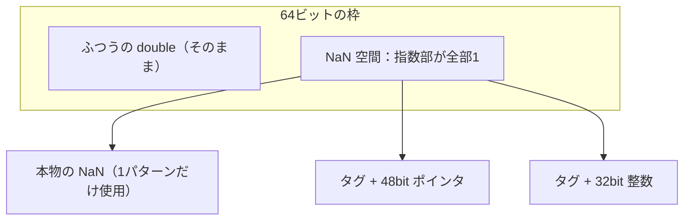

# 値の表現：値をビット列にする設計

## すべての型に共通する根本問題

第II部で見ていく整数・文字列・配列などの「型」の話に入る前に、それらすべての
土台となる設計判断を先に押さえておきます。**値の表現**（value
representation）、すなわち「変数に入っている値を、メモリ上のどんなビット列で
持ち運ぶか」という問題です。

静的型付け言語の C では、`int` の変数には 32 ビットの整数がそのまま入り、
`double` の変数には 64 ビットの浮動小数点数がそのまま入ります。変数ごとに
型が決まっているので、コンパイラは「この 4 バイトは整数として読む」と
あらかじめ決め打ちできます。これが値表現の出発点です。

ところが、この決め打ちができない場面が二つあります。一つは Ruby や
Python、JavaScript のような**動的型付け言語**。同じ変数に整数も文字列も
配列も入ります。

```ruby
x = 42        # 整数
x = "hello"   # 同じ変数に文字列
x = [1, 2]    # 配列も入る
```

もう一つは静的型付け言語の**多相性**（polymorphism、いろいろな型を
同じコードで扱う仕組み）です。`List<T>` のような汎用のコンテナや、
どんな型でも受け取れる関数を一つの機械語コードで動かすには、やはり
「どんな型の値も同じ大きさの『枠』で持ち運ぶ」必要が出てきます。

つまり問題は共通です。**どんな型の値も一様に持ち運べるようにし、
必要なら実行時に「この枠に入っているのは何型か」を判別できるようにする**。
この問題への解答群が本章の主題です。動的型付け言語の値表現は古くから
研究・分類されており、Gudeman の技術報告が代表的な整理を与えています
[](#cite:gudeman1993)。静的型付け言語には、後で見るように「一様表現を
そもそも不要にする」という別の道もあります。

## 最も素朴な解：すべてをポインタにする（ボックス化）

一番単純な答えは、**すべての値をヒープ上のオブジェクトにして、変数には
そのポインタだけを持つ**ことです。ポインタはどれも同じ大きさ（64 ビット環境
なら 8 バイト）なので、「同じ枠」の条件は自動的に満たされます。型の判別は、
ポインタの先のオブジェクトの先頭に**ヘッダ**（header、型情報やフラグを
収めた領域）を置いておけばできます。値を箱（オブジェクト）に詰めることから、
この方式を**ボックス化**（boxing）と呼びます。

```ruby
# 概念図：ボックス化された値。すべての値がヘッダ付きのヒープオブジェクト
Boxed = Struct.new(:type, :payload)   # type がヘッダに相当

x = Boxed.new(:integer, 42)
y = Boxed.new(:string, "hello")

def type_of(v) = v.type   # 型の判別はヘッダを見るだけ
```

初期の Lisp 処理系や、現在でも CPython は基本的にこの方式です。CPython の
あらゆる値は `PyObject` 構造体（参照カウンタ `ob_refcnt` と型への
ポインタ `ob_type` を持つヘッダ）で始まるヒープオブジェクトで、
整数 `42` ですら例外ではありません。

この方式は一様で美しいのですが、性能上の代償が深刻です。

- 整数を一つ作るたびに**メモリ確保**（アロケーション）が走る
- 整数を一つ読むたびに**ポインタの参照外し**（メモリアクセス）が要る
- 小さな値のために**ヘッダのぶんメモリが膨らむ**（CPython の整数は
  64 ビット環境で 28 バイト程度を占めます。値そのものの数倍です）

ループカウンタのような頻出の値でこれが起きると、処理系全体が遅くなります。
CPython が小さな整数（-5 から 256）をあらかじめ作り置きして使い回すのは、
この痛みを緩和するためです（詳しくは「数値型」の章で見ます）。

## タグ付きポインタ：ポインタの隙間にタグを入れる

そこで多くの処理系は、**ポインタとして使われない無駄なビット**に注目します。
ヒープ上のオブジェクトは、通常 8 バイトや 16 バイトの境界に**整列**
（align）して配置されます。つまり、正当なポインタの**下位 3〜4 ビットは
必ず 0** です。この常に 0 のビットを**タグ**（tag、値の種類を示す印）に
流用するのが**タグ付きポインタ**（tagged pointer）です
[](#cite:gudeman1993)。

CRuby（Ruby の標準処理系）の 64 ビット環境での値（`VALUE` 型）は、
おおよそ次のように区別されます。

| 下位ビットのパターン | 意味 |
|---|---|
| `...000`（下位3ビットが0） | ヒープ上のオブジェクトへのポインタ |
| `...1`（最下位が1） | 埋め込み整数（Fixnum） |
| `...10`（下位2ビットが10） | 埋め込み浮動小数点数（Flonum、後述） |
| 特定の小さな定数 | `nil`・`true`・`false`・`undef` |
| 特定のパターン | 静的シンボル（ID を埋め込んだ即値） |

このように、ヒープにオブジェクトを置かず値そのものをポインタの位置に
埋め込んだ表現を**即値**（immediate value）と呼びます。`nil` や `true` の
判定はビットパターンの比較一発、整数の足し算もビット操作と整数加算だけで
済み、メモリアクセスがまったく発生しません。

```ruby
# CRuby は ObjectSpace でオブジェクトのアドレスらしき値を覗ける
# （即値はアドレスではなく、値そのものがエンコードされている）
p 42.object_id      # 即値由来の規則的な値（85 = 42*2+1）
p nil.object_id     # nil は固定の小さな値
p Object.new.object_id  # ヒープオブジェクトは毎回違う
```

タグ付きポインタの貪欲さでは、Apple の 64 ビット Objective-C
ランタイムが群を抜いています。`NSNumber` だけでなく**短い文字列**
（`NSString`）まで、条件が合えばオブジェクトを確保せずポインタの
ビット内にエンコードします。短い ASCII 文字列は文字を 5〜6 ビットに
詰める専用アルファベットまで使い、最大 11 文字程度を**ポインタ
1 個に収納**します。メソッド送信の冒頭でタグを検査し、タグ付きなら
専用の小さなクラス表を引く —— 「即値」の発想を文字列にまで広げた
執念の設計で、モバイル機器のメモリ事情がそれを正当化しました。

> [!NOTE]
> 「埋め込み整数のビット幅は 1 ビット減る」ことに注意してください。
> 64 ビットのうち 1 ビットをタグに使うので、Fixnum は 63 ビット。
> はみ出す整数は自動的に多倍長整数（ヒープオブジェクト）へ切り替わります。
> この切り替えの仕組みは「数値型」の章で詳しく扱います。

## Flonum：浮動小数点数まで即値にする

整数はビット数を 1 つ削っても実害が少ないのですが、浮動小数点数
（IEEE 754 倍精度、64 ビット）は**64 ビット全部を使い切っている**ため、
同じ手がそのままでは使えません。タグを置く隙間がないのです。

CRuby は 2.0 から、**Flonum** と呼ばれる工夫でこの問題を部分的に解決して
います。鍵は「実際のプログラムに現れる浮動小数点数の指数部は、ごく狭い
範囲に偏っている」という観察です。`3.14` や `0.5` のような日常的な数の
指数部のビットパターンは限られています。そこで、よく使われる指数範囲の
double だけを対象に、**ビットを回転させて下位 2 ビットに `10` という
タグを作り出し**、64 ビットの枠に押し込みます。範囲外の値（極端に
大きい・小さい数や NaN の一部）は、従来どおりヒープ上の Float
オブジェクトになります。

```ruby
# Flonum の効果：ふつうの浮動小数点数はオブジェクトを生成しない
p 1.5.object_id == 1.5.object_id   # => true（即値なので常に同じ）
# 多くの数値計算で Float の生成・回収コストが消える
```

「ほとんどの場合に効く高速な表現」と「すべてを表せる遅い表現」を併用し、
利用者には一枚の `Float` として見せる —— 即値とヒープの二段構えという、
本書で繰り返し現れるパターンの好例です。

## NaN ボクシング：浮動小数点数の「隙間」にすべてを入れる

JavaScript 処理系は逆転の発想を採りました。JavaScript の数値は仕様上
すべて倍精度浮動小数点数です。ならば**値の基本表現を double にして、
double の中の使われていないビットパターンに、ポインタや整数を埋め込めば
よい**。これが **NaN ボクシング**（NaN boxing）です [](#cite:wingo2011)。

IEEE 754 の **NaN**（Not a Number、0/0 などの結果を表す特別な値）は、
指数部のビットがすべて 1 で仮数部が 0 でないパターン、と定義されています。
仮数部は 52 ビットありますから、**NaN を表すビットパターンは 2⁵² 通り
以上ある**のに、計算で必要な NaN は実質 1 個だけ。残りは全部空き地です。
現代の 64 ビット CPU のポインタが実質 48 ビット程度しか使わないことも
あわせると、この空き地に「ポインタ＋型タグ」や「32 ビット整数＋型タグ」を
丸ごと埋め込めます。



ビット操作の中身は、Ruby の整数を 64 ビットの箱に見立てれば
そのまま実験できます。

```ruby
# NaN ボクシングの encode / decode
QNAN = 0x7ff8_0000_0000_0000      # quiet NaN の基本ビットパターン
TAGS = { int: 1, ptr: 2 }         # NaN 空間の中の種別（ビット48-49を使う）

def box_double(f) = [f].pack("D").unpack1("Q")   # double はビットそのまま
def box_int(i)    = QNAN | (TAGS[:int] << 48) | (i & 0xffff_ffff)
def box_ptr(a)    = QNAN | (TAGS[:ptr] << 48) | a   # 下位48bitに収まる前提

def kind(v)
  return :double if (v & QNAN) != QNAN   # NaN 空間の外 → ふつうの数
  case (v >> 48) & 0x3
  when TAGS[:int] then :int
  when TAGS[:ptr] then :ptr
  else :double                            # タグなし＝本物の NaN
  end
end

def unbox_double(v) = [v].pack("Q").unpack1("D")
def unbox_int(v)    = (i = v & 0xffff_ffff) >= 1 << 31 ? i - (1 << 32) : i

v = box_double(3.14)
p [kind(v), unbox_double(v)]      # => [:double, 3.14]  変換コストゼロ
w = box_int(-42)
p [kind(w), unbox_int(w)]         # => [:int, -42]
p kind(box_double(0.0 / 0.0))     # => :double  本物の NaN は数のまま
```

double の照合（`kind` の 1 行目）が**マスクと比較だけ**で済むこと、
本物の NaN がタグなし領域に自然に落ちることを確かめてください。
NaN ボクシングは SpiderMonkey（Firefox）、JavaScriptCore（Safari）、
LuaJIT などが採用しています。利点は**浮動小数点数の演算が一切の変換なしで
できる**こと。タグ付きポインタ方式（Flonum）が浮動小数点数のために
ビット回転を要するのと対照的です。欠点は、ポインタを取り出すのに
マスク操作が要ること、そして将来ポインタが 48 ビットに収まらなくなったら
破綻することです。

## SMI とポインタ圧縮：V8 の選択

同じ JavaScript でも V8（Chrome、Node.js）は NaN ボクシングを採らず、
タグ付きポインタ系の設計です。V8 の値は基本的にポインタで、最下位
ビットが 0 なら **SMI**（SMall Integer、小さい整数の即値）、1 なら
ヒープポインタです（CRuby とタグの割り当てが逆なのが面白いところです）。
浮動小数点数や SMI に収まらない整数は、ヒープ上の「ボックス化された
double」になります。

さらに V8 は 2020 年から**ポインタ圧縮**（pointer compression）を導入
しました [](#cite:v8pointer2020)。64 ビット環境でもヒープを 4GB の領域に
限定し、値を**32 ビットのオフセット**として持つのです。タグ込みで
32 ビットに収まるので、JavaScript の値を保持するメモリが半減します。
SMI は 31 ビットに縮みますが、それでも大半の整数はカバーできます。
「ポインタは 64 ビットであるべき」という思い込みを外し、**基準アドレス
＋32 ビットオフセット**という相対表現を選んだわけです。

> [!TIP]
> Java（HotSpot VM）にも **compressed oops** という同種の技術があります。
> オブジェクトが 8 バイト境界に並ぶことを利用し、「アドレス ÷ 8」を
> 32 ビットで持つことで、32GB までのヒープを 32 ビット参照で扱えます。
> 「整列で空く下位ビット」をタグではなく**表現範囲の拡張**に使った例で、
> 同じ観察から逆向きの応用が生まれています。

## OCaml：63ビット整数という割り切り

静的型付けの関数型言語 OCaml も、多相関数（どんな型でも受け取れる関数）の
ために一様な値表現を必要とし、タグ付きポインタを採用しています。OCaml の
値は最下位ビットが 1 なら整数、0 ならポインタ。その結果、OCaml の `int` は
**63 ビット**です（31 ビット環境では 31 ビット）。「機械の整数と幅が
違う」という驚きを言語仕様レベルで受け入れた、潔い設計です。

一方で OCaml は浮動小数点数の配列だけは特別扱いし、ボックス化を避けて
生の double を敷き詰める専用表現を持っています。数値計算で配列の各要素が
ポインタ参照になっては話にならないからです。一様性と性能の妥協点を
どこに置くか、言語ごとの判断が表れます。

## 静的型付け言語のボックス化：Java と Haskell

静的型付け言語では、原則として値の型がコンパイル時に分かるため、
`int` は生の 32 ビットで持てます（**非ボックス化**、unboxed）。しかし
それでも、ボックス化から完全には逃れられません。

**Java** では、ジェネリクス（`List<Integer>` のような型引数）が参照型しか
受け取れないため、プリミティブの `int` を `Integer` オブジェクトに包む
**オートボクシング**（autoboxing）が起きます。ここに有名な罠があります。

```java
Integer a = 127, b = 127;
System.out.println(a == b);   // true  （キャッシュされた同一オブジェクト）
Integer c = 128, d = 128;
System.out.println(c == d);   // false （別々のオブジェクト！）
```

`Integer.valueOf` は -128〜127 の値を作り置きのオブジェクトで返すため、
この範囲だけ参照比較が「たまたま」成功するのです。ボックス化が
**同一性**（identity）と**等価性**（equality）のずれを生む典型例で、
値の表現という内部設計が言語の意味論に漏れ出した例でもあります。

**Haskell**（GHC）では事情がさらに興味深く、遅延評価（「遅延評価」の章で
詳述）のために、`Int` ですら既定では「まだ計算されていないかもしれない
値」へのポインタ、つまりボックス化された表現です。性能が必要な場面の
ために、GHC は `Int#` のような**非ボックス型**（unboxed type）を別に用意し、
最適化（正格性解析）によって自動的にボックスを剥がします。

## 一様表現を不要にする：単相化という別解

ここまでの手法はすべて「値を一様な枠に収める」方向の工夫でしたが、
静的型付け言語には根本的に異なる解があります。**単相化**
（monomorphization）—— 多相的なコードを、使われる型ごとに**別々の機械語
コードとして複製してしまう**方法です。

C++ のテンプレートと Rust のジェネリクスがこの代表です。
`Vec<i32>`（32 ビット整数のベクタ）と `Vec<String>` は、コンパイル時に
**まったく別のコード**として生成されます。`Vec<i32>` のコードは要素が
生の 4 バイト整数だと知っているので、タグもボックスも参照外しも一切
不要です。一様表現の実行時コストを、コンパイル時間とコードサイズの
増加（いわゆるコード膨張）で買い取った形です。

中間を選んだ言語もあります。**Swift** のジェネリクスは、既定では
コードを複製せず、型ごとの操作（サイズ・コピー・破棄の方法）をまとめた
**witness table**（証拠表）を関数に渡して一つのコードで動かし、
最適化が効く場面では単相化もする、という併用方式です。**Java** は前述の
とおり型消去とボックス化で一様化し、**C#** は値型に対しては実行時に
単相化（型ごとの JIT コンパイル）します。「同じジェネリクス」という
顔をした機能の足元で、これだけ表現戦略が分かれているのです。

## 直和型のレイアウト：判別子をどこに置くか

ここまでは「どんな型の値も一様な枠に」という横断的な話でしたが、個々の
複合型のレイアウトにも表現の設計があります。とりわけ面白いのが**直和型**
（sum type、タグ付きユニオン、バリアント、enum とも）── 「いくつかの形の
**どれか一つ**を取る値」です。`Result` は成功か失敗のどちらか、構文木の
ノードは整数か二項演算か（構文木の章）、というあれです。直和型を表すには、
「いまどの形か」を示す**判別子**（discriminant、タグ）と、その形に応じた
**中身**（payload）の二つが要ります。

素朴な実装は C の「タグ＋共用体」です。

```c
struct Node {
  enum { NUM, BINOP } tag;   /* いまどの形か */
  union {                    /* 中身は重ね置き（同時にはどれか一つ） */
    int num;
    struct { char op; struct Node *l, *r; } binop;
  } u;
};
```

`union` は最大の枝のぶんだけ場所を取り、複数の枝が**同じ領域に重なって**
います。問題は、C ではタグと共用体の対応を**誰も強制しない**こと ──
`tag` が `NUM` なのに `u.binop` を読んでも止められません。Rust・Swift の
`enum`、ML・Haskell の代数的データ型は、これを**コンパイラ管理の直和型**に
し、タグと中身の対応を型で保証して、`match`／`case` のパターンマッチで
しか中身を取り出せなくします。安全性は型システムが、レイアウトは処理系が
受け持つわけです。

レイアウトには大きく二系統あります。

- **インライン（非ボックス）**：Rust の `enum` は、判別子と「最大の枝が
  収まる領域」を**その場に並べて**持ちます。サイズは概ね *最大の枝＋判別子*
  （整列のための詰め物込み）。ポインタもヒープ確保も挟まず、値がそのまま
  詰まります。読むときはまず判別子を見て、枝に応じて中身を解釈する ──
  パターンマッチは本質的に「判別子による分岐（switch）」です。
- **ボックス（タグはヘッダに）**：OCaml や Haskell は、引数のあるバリアントを
  **ヒープ上のブロック**として表し、判別子をそのブロックの**ヘッダ**に
  収めます（「オブジェクトヘッダ」節とつながります）。OCaml は引数のない
  バリアント（`None` や列挙の各値）を小さな**即値の整数** 0,1,2… で表し、
  引数のあるものだけタグ付きブロックにする、という巧みな使い分けをします。

「サイズは最大の枝で決まる」というインライン直和型の性質は、ときに無駄を
生みます。`enum E { A(u8), B([u8; 1000]) }` は、たとえ中身が `A` でも
1000 バイトぶんの場所を要求します。この無駄を別の角度から削るのが、次に
見るニッチ最適化です。

## 詰め物の隙間を使う：Rust のニッチ最適化

直和型のレイアウトをもう一歩進めると、Rust の**ニッチ最適化**
（niche optimization）です。Rust の `Option<T>` は「値があるかないか」を
表す直和型（タグ付きの選択肢）で、素朴に実装すればタグ 1 バイト＋値の
領域が要ります。しかし `Option<&T>`（参照を包んだ Option）は、参照が
**決して 0 にならない**ことをコンパイラが知っているため、`None` を
ビットパターン 0 で表現し、**タグの領域を完全に消して**しまいます。
`Option<&T>` のサイズは `&T` と同じ 8 バイトです。

「この型には決して現れないビットパターン（ニッチ＝隙間）があるなら、
そこに別の情報を埋め込む」—— これは本章で見てきたタグ付きポインタや
NaN ボクシングとまったく同じ発想です。動的言語はポインタの整列の隙間に
型タグを入れ、Rust は参照の非ゼロ性の隙間に `None` を入れる。
言語は違っても、ビットの隙間を見つけて情報を詰める技は共通なのです。

## 直積型のレイアウト：パディングと整列、そして AoS／SoA

直和型が「いくつかの形の**どれか一つ**」だったのに対し、構造体・レコード・
タプル、そしてオブジェクトのフィールド群は **直積型**（product type、
全部のフィールドを**まとめて**持つ）です。オブジェクトの章のシェイプが
「どのフィールドが何番目か」を決めると述べましたが、その「何番目」が
メモリ上の**何バイト目**になるかを決めるのが、ここで見る**レイアウト**です。

鍵は **整列（alignment）** です。CPU は多くの型を「サイズの倍数の番地」に
置くことを要求・優先します（8 バイトの整数は 8 の倍数の番地に、など）。
そのため各フィールドを整列した位置へ置くと、フィールドの間に**詰め物
（パディング）**の穴が空きます。構造体全体の整列は最も厳しいフィールドに
合わせ、サイズはその倍数へ切り上げます（配列に並べても各要素が整列を
保つように）。

```text
struct { u8 a; u64 b; u8 c }   ← 宣言順に置くと
  a@0 [1] ………7バイトの穴……… b@8 [8]  c@16 [1] …7バイトの穴…
  = 24 バイト（14 バイトが穴）

struct { u64 b; u8 a; u8 c }   ← 大きいフィールドを先にすると
  b@0 [8]  a@8 [1] c@9 [1] …6バイトの穴…
  = 16 バイト
```

同じ三つのフィールドが、並べる順で 24 バイトにも 16 バイトにもなります。
C・C++ は**宣言順を守る**（ABI として固定し、予測可能にする）ので、穴を
減らすにはプログラマが手で並べ替えるしかありません。一方 Rust・Swift・
Zig は、既定でコンパイラが**フィールドを自動で並べ替えて**パディングを
最小化します（`repr(C)` などを付けたときだけ宣言順に固定）。「フィールドの
順序」という見えない自由度が、メモリ効率を左右するのです。オブジェクトの
章のヘッダ＋フィールド列も、結局はこの直積型レイアウトに header を一枚
足したものです。

そして、**同じ型を大量に並べる**ときには、もう一段大きな選択が現れます。

- **AoS（Array of Structs、構造体の配列）**：`[{x,y,z}, {x,y,z}, …]` と、
  1 個ぶんを丸ごと連続させる。1 個のオブジェクトの全フィールドを触る
  処理に強い（局所性が良い）。素直な既定の配置です。
- **SoA（Struct of Arrays、配列の構造体）**：`{[x,x,…], [y,y,…], [z,z,…]}`
  と、フィールドごとに別の配列へ縦に割る。「全要素の `x` だけ合計する」
  ような**列方向**の処理でキャッシュに載る量が増え、SIMD（一度に複数
  要素を処理する命令）とも相性が抜群です。

列指向データベースや Apache Arrow（直列化の章）、ゲームの ECS、NumPy の
構造化配列、APL 系（APL の章）の列の世界は、いずれも SoA 側に振った
設計です。中身は同じデータなのに、AoS と SoA で性能が桁違いに変わる ──
ハッシュの章の SwissTable や平衡木の章の B木と同じく、**メモリ階層が
レイアウトの良し悪しを決める**時代を映しています。配列の章で見た
「同じ列でも要素の置き方で速さが変わる」話の、構造体版です。

## 構造体に型タグを並べる：Lua の「太った値」

タグをポインタに埋め込む代わりに、**「タグ＋値」の構造体を値として
持ち運ぶ**設計もあります。Lua（標準実装）の値 `TValue` は、型タグの
整数と、値本体（double・ポインタなどの共用体）を並べた構造体で、
64 ビット環境では 16 バイトになります [](#cite:ierusalimschy2005)。

```ruby
# 概念図：Lua の TValue 方式。タグと値を構造体で並べて持つ
TValue = Struct.new(:tag, :raw)   # tag: :number, :string, :table, ...

v = TValue.new(:number, 3.14)     # double をそのまま入れられる
w = TValue.new(:table, some_ref)  # ポインタも入れられる
```

ビット操作が一切不要で実装が素直、double も無加工で入る、タグのビット数の
制約もない —— 代わりに値のコピーが 16 バイトになりメモリも倍増します。
LuaJIT が NaN ボクシングで 8 バイトに圧縮し直したのは、この代償が
JIT コンパイラの性能目標に合わなかったからです。小さく速い処理系を
目指した Lua と、極限性能を目指した LuaJIT で、同じ言語の値表現が
分かれたのは示唆的です。

## Erlang：タグの階層

Erlang の仮想機械 BEAM は、ワードの下位 2 ビットを**一次タグ**として
「即値・リスト（cons セル）・ボックス化オブジェクト」を区別し、即値は
さらに追加のタグビットで小整数・アトム・プロセス ID などに分かれる、
階層的なタグ体系を持ちます [](#cite:stenman2024)。リスト（cons セル）に
専用タグを一つ割り当てているのは、関数型言語である Erlang では
リスト操作が圧倒的に多く、ヘッダなしの 2 ワードでセルを表現したい
からです（cons セルの話は「リスト・タプル・集合」の章で扱います）。
**言語で何が頻出するかが、ビットの割り当てを決める**わけです。

## オブジェクトヘッダ：ヒープ側の型情報

即値にできない値はヒープ上のオブジェクトになり、先頭の**ヘッダ**が型情報を
担います。ヘッダの中身も処理系ごとの設計の見せ場です。

- **CRuby**：全オブジェクトは `RBasic`（2 ワード）で始まります。1 ワード目
  `flags` には型（T_STRING、T_ARRAY など 5 ビット）、凍結フラグ、GC 用の
  各種ビットが詰め込まれ、2 ワード目 `klass` がクラスへのポインタです。
- **HotSpot（Java）**：マークワード（ハッシュ値・ロック状態・GC 情報）と
  クラスポインタ（compressed oops なら 32 ビット）の構成です。
- **CPython**：参照カウンタと型オブジェクトへのポインタ。参照カウント
  方式の GC を採るため、カウンタがヘッダの主役です（「メモリ管理とGC」の
  章で詳述します）。

ヘッダはすべてのオブジェクトが背負う固定費なので、ここを 1 ワード削れると
ヒープ全体が目に見えて縮みます。各処理系がビット単位の節約に血道を上げる
理由です。

## 値表現は処理系全体を規定する

本章を閉じるにあたり、値表現がただの「節約テクニック」ではないことを
強調しておきます。値の表現は、処理系のあらゆる部分と結びついています。

- **GC**：どのビットパターンがポインタかを GC が判別できなければ、
  オブジェクトの生死を追跡できません（「メモリ管理とGC」の章）。
- **JIT コンパイラ**：タグの検査・付け外しは JIT が生成するコードの
  いたるところに現れ、表現の選択が生成コードの質を直接決めます。
- **C 拡張・FFI**：CRuby の `VALUE` のように、値表現は C 拡張 API の
  一部として外部に約束されてしまい、後から変えにくくなります。
- **意味論**：Java の `Integer` キャッシュのように、表現の都合が言語の
  観察可能な振る舞いに漏れることがあります。

64 ビットという限られた枠に、整数・浮動小数点数・ポインタ・特殊値を
どう同居させるか。タグ付きポインタ、Flonum、NaN ボクシング、ポインタ圧縮、
太った値、単相化、ニッチ最適化 —— どれも同じ問いへの異なる解であり、
言語の性格（動的か静的か、数値計算が多いか、リスト処理が多いか、
メモリが厳しいか）が解を選ばせています。

次の章では、こうして表現された値が実際に計算される現場 ——
関数呼び出しを支える**スタックとフレーム**を見ていきます。
